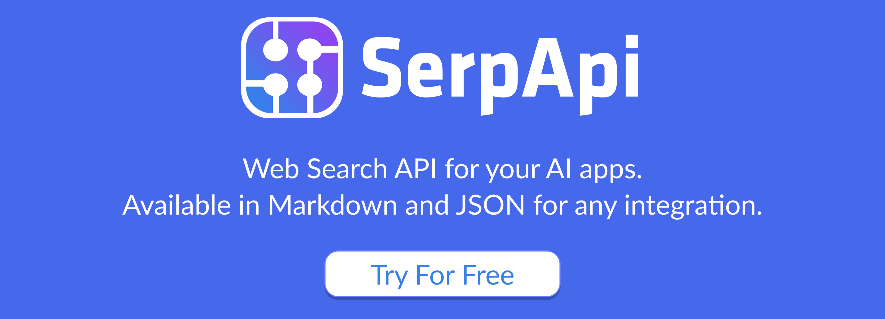
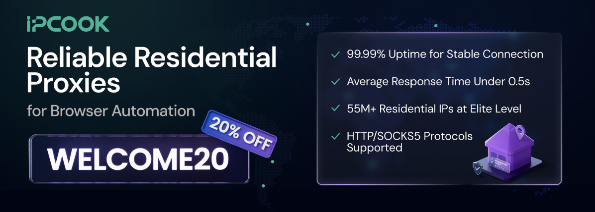
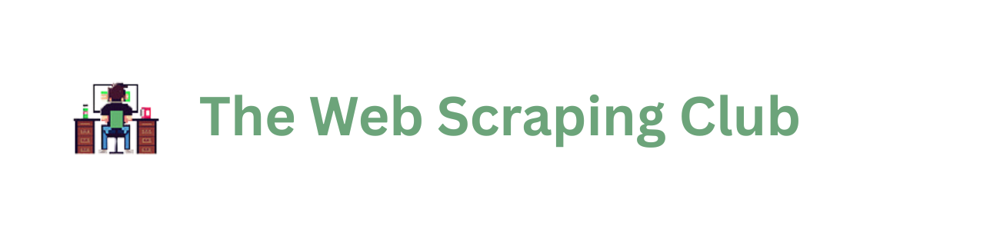
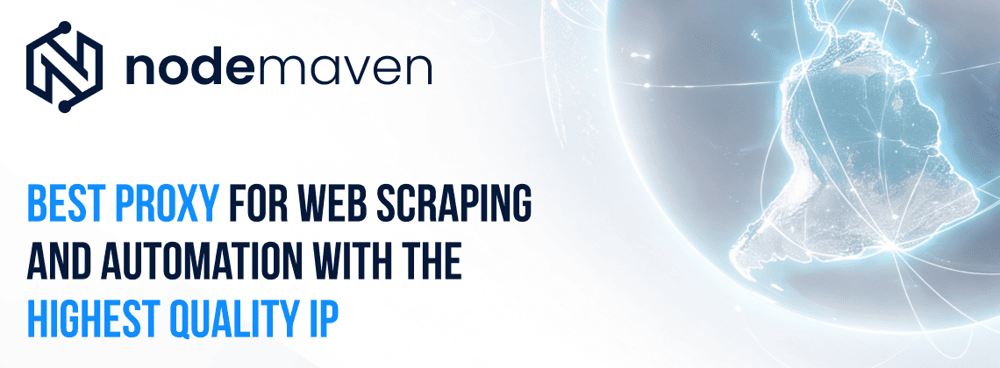
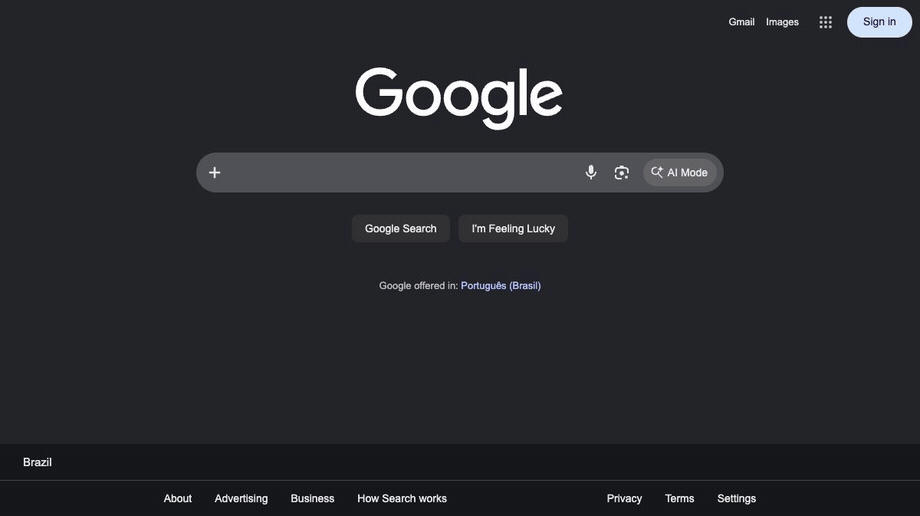

<p align="center">
     <br>
</p>
<p align="center">The stealth-first browser automation library for Python.<br>No WebDriver, no <code>navigator.webdriver</code> flag, humanized clicks and typing.</p>

<p align="center">
    <a href="https://github.com/autoscrape-labs/pydoll/stargazers"></a>
    <a href="https://codecov.io/gh/autoscrape-labs/pydoll" >
        
    </a>
    
    
    
    = 3.10">
    <a href="https://deepwiki.com/autoscrape-labs/pydoll"></a>
</p>

<p align="center">
    <a href="https://pydoll.tech/">Documentation</a> &middot;
    <a href="#getting-started">Getting Started</a> &middot;
    <a href="#features">Features</a> &middot;
    <a href="#support">Support</a>
</p>


You have probably watched a scraper work on your machine, then hit a wall of captchas and Cloudflare challenges the moment it ran for real. That wall is what Pydoll is built around. It drives Chrome directly over the DevTools Protocol, so there is no WebDriver binary and no `navigator.webdriver` flag to give you away, and it clicks, types, and scrolls like a real person. That is often enough to get past the bot protection that stops ordinary automation, all behind an async, fully typed API.

### Why Pydoll?

- **Fingerprint injection**: Make the browser report a fully consistent identity with [`tab.apply_fingerprint()`](#2-fingerprint-injection): User-Agent, Client Hints, `navigator`, WebGL, canvas, screen, fonts, timezone and locale, all aligned. The injected overrides survive `toString` and prototype introspection and propagate into Web Workers, so lie-detection checks like CreepJS's don't flag them.
- **Humanized interactions**: [Mouse movement](https://pydoll.tech/docs/guides/mouse/) along Bezier curves, realistic typing, and scroll physics. Often enough to pass behavioral challenges like Cloudflare Turnstile or reCAPTCHA v3, depending on your browser and IP reputation.
- **Zero WebDrivers**: A direct CDP connection over WebSocket. No driver binary, no `navigator.webdriver` flag, no version-matching headaches.
- **Async and typed**: Built on `asyncio`, type-checked with `mypy`. Full IDE autocompletion and static error checking.
- **Network control**: [Intercept](https://pydoll.tech/docs/guides/request-interception/) requests to block ads/trackers, [monitor](https://pydoll.tech/docs/guides/network-monitoring/) traffic for API discovery, and make [authenticated HTTP requests](https://pydoll.tech/docs/guides/http-requests/) that inherit the browser session.
- **Shadow DOM and iframes**: Full support for [shadow roots](https://pydoll.tech/docs/guides/dom-traversal/#shadow-dom) (including closed) and cross-origin iframes. Discover, query, and interact with elements inside them using the same API.
- **Structured extraction**: Define a [Pydantic](https://docs.pydantic.dev/) model, call `tab.extract()`, and get typed, validated data back. No manual element-by-element querying.

> [!NOTE]
> **A word from the maintainer.** Pydoll is currently maintained by a single person, and I'm a bit stretched at the moment, so new releases and replies to issues may take a little longer than usual. To be clear: **the project is not dead, and it is not going anywhere.** Development continues; it's just moving at a calmer pace for now.
>
> **A goal to aim for:** once the project reaches **10k stars**, I plan to ship **Firefox support**, a big step that opens up a whole new range of possibilities for the library. Momentum like that is exactly the kind of incentive that makes a feature this large worth taking on, so if you'd like to see it happen, that's the push it needs.

### Top Sponsors

<table>
  <tr>
    <td width="300" align="center" valign="middle">
      <a href="http://serpapi.com/?utm_source=github_sponsorship&utm_campaign=pydoll"></a>
    </td>
    <td valign="middle">
      <b><a href="http://serpapi.com/?utm_source=github_sponsorship&utm_campaign=pydoll">SerpApi</a></b><br />
      <sub>Web Search API for your AI apps. Available in Markdown and JSON for any integration.</sub>
    </td>
  </tr>
  <tr>
    <td width="300" align="center" valign="middle">
      <a href="https://www.ipcook.com/?ref=16NLS&utm_source=github&utm_medium=referral&utm_campaign=pydoll"></a>
    </td>
    <td valign="middle">
      <b><a href="https://www.ipcook.com/?ref=16NLS&utm_source=github&utm_medium=referral&utm_campaign=pydoll">IPCook</a></b><br />
      <sub>Residential proxies for stealth browser automation: 55M+ IPs in 185+ locations, rotating &amp; sticky sessions, city-level targeting, HTTP &amp; SOCKS5, 99.99% uptime, sub-0.5s responses, pay-as-you-go traffic that never expires. Use <code>WELCOME20</code> for 20% off.</sub>
    </td>
  </tr>
  <tr>
    <td width="300" align="center" valign="middle">
      <a href="https://substack.thewebscraping.club/p/pydoll-webdriver-scraping?utm_source=github&utm_medium=repo&utm_campaign=pydoll"></a>
    </td>
    <td valign="middle">
      <b><a href="https://substack.thewebscraping.club/p/pydoll-webdriver-scraping?utm_source=github&utm_medium=repo&utm_campaign=pydoll">The Web Scraping Club</a></b><br />
      <sub>The #1 newsletter dedicated to web scraping. Read their full, independent review of Pydoll.</sub>
    </td>
  </tr>
  <tr>
    <td width="300" align="center" valign="middle">
      <a href="https://go.nodemaven.com/pydollaugust"></a>
    </td>
    <td valign="middle">
      <b><a href="https://go.nodemaven.com/pydollaugust">NodeMaven</a></b><br />
      <sub>The most efficient proxy provider for web scraping and automation: ZIP targeting, 99.9% uptime, filtered high-quality IPs, no KYC. Use <code>PYDOLL35</code> for 35% off Mobile &amp; Residential, or <code>PYDOLL40</code> for 40% off ISP (Static) proxies.</sub>
    </td>
  </tr>
  <tr>
    <td width="300" align="center" valign="middle">
      <a href="https://niuproxy.com/?utm_source=pydoll&utm_medium=pydoll&ref=pydoll"></a>
    </td>
    <td valign="middle">
      <b><a href="https://niuproxy.com/?utm_source=pydoll&utm_medium=pydoll&ref=pydoll">NiuProxy</a></b><br />
      <sub>Rotating residential proxies with a special deal for Pydoll users: 10TB at &#36;0.35/GB or 1TB at &#36;0.50/GB. Use <code>PAY2</code> for 10% off your recharge.</sub>
    </td>
  </tr>
</table>

### Sponsors

<table>
  <tr>
    <td align="center" valign="middle" width="20%">
      <a href="https://proxy-seller.com/?partner=8DES01TZ1QGWR3"></a>
      <br />
      <sub><code>PYDOLL</code> 15% off</sub>
    </td>
    <td align="center" valign="middle" width="20%">
      <a href="https://www.thordata.com/?ls=github&lk=pydoll"></a>
      <br />
      <sub><b>1GB free</b> via our link</sub>
    </td>
    <td align="center" valign="middle" width="20%">
      <a href="https://www.testmuai.com/?utm_medium=sponsor&utm_source=pydoll"></a>
      <br />
      <sub>AI-native testing cloud</sub>
    </td>
    <td align="center" valign="middle" width="20%">
      <a href="https://www.swiftproxy.net/?ref=pydoll"></a>
      <br />
      <sub>Proxies for automation</sub>
    </td>
    <td align="center" valign="middle" width="20%">
      <a href="https://github.com/sponsors/thalissonvs"><b>➕ Your logo here</b></a>
      <br />
      <sub>Become a sponsor</sub>
    </td>
  </tr>
</table>

<sub>[Learn more about our sponsors](SPONSORS.md) &middot; [Become a sponsor](https://github.com/sponsors/thalissonvs)</sub>

## Installation

```bash
pip install pydoll-python
```

No WebDriver binaries or external dependencies required.

## Getting Started

### 1. Stealthy Automation

The imperative API handles the basics: start a browser, navigate, find elements, and interact with them. Pass `humanize=True` to add human-like timing for anti-bot evasion.

```python
import asyncio

from pydoll.browser import Chrome
from pydoll.constants import Key

async def google_search(query: str):
    async with Chrome() as browser:
        tab = await browser.start()
        await browser.set_window_maximized()
        tab.mouse.debug = True
        await tab.go_to('https://www.google.com')
        # Find elements and interact with human-like timing
        search_box = await tab.find(tag_name='textarea', name='q')
        await search_box.type_text(query, humanize=True)
        await tab.keyboard.press(Key.ENTER)

        first_result = await tab.find(
            tag_name='h3',
            text='autoscrape-labs/pydoll',
            timeout=10,
        )
        await first_result.click(humanize=True)
        await asyncio.sleep(5)
        print(f"Page loaded: {await tab.title}")

asyncio.run(google_search('pydoll site:github.com'))
```

<p align="center">
  
</p>

### 2. Fingerprint Injection

Pydoll can also make the browser *report* a different identity. `tab.apply_fingerprint()` overrides the surface that fingerprinting scripts read (User-Agent and Client Hints, `navigator`, WebGL, canvas, screen, fonts, timezone and locale) and keeps those values consistent with each other.

Spoofing a fingerprint is less about changing the values than about not getting caught changing them. Modern anti-bot scripts inspect *how* a property was defined: a naive `Object.defineProperty` leaves a fake `toString`, an own-property where a prototype getter should be, or an override that a phantom `iframe` or a Web Worker can see straight through. Pydoll handles this: injected getters read as native under `toString` and prototype introspection, and the same identity is replayed inside dedicated, shared and service workers.

It also neutralizes the **headless** tells, chiefly the SwiftShader WebGL renderer that gives away a GPU-less browser, so `headless=True` is no longer an automatic giveaway. That is what lets a plain Google search run in headless mode. (Cloudflare Turnstile in headless is still under study.)

```python
import asyncio

from pydoll.browser.chromium import Chrome

from examples.fingerprints import FINGERPRINTS

async def spoof_fingerprint():
    async with Chrome() as browser:
        tab = await browser.start()

        # Apply before navigating: the JS overrides register on every new document.
        await tab.apply_fingerprint(FINGERPRINTS['windows11_rtx3060_nyc'])

        await tab.go_to('https://abrahamjuliot.github.io/creepjs/')
        print('Fingerprint applied.')
        await asyncio.sleep(5)

asyncio.run(spoof_fingerprint())
```

In our testing it passed each of these fingerprint and bot-detection suites without being flagged:

| Test site | What it checks | Result |
| --- | --- | --- |
| [CreepJS](https://abrahamjuliot.github.io/creepjs/) | Lie detection, prototype / `toString` tampering, workers, fonts | No detection |
| [SannySoft](https://bot.sannysoft.com/) | Headless and bot signals | No detection |
| [BrowserScan](https://www.browserscan.net/bot-detection) | Bot-detection suite | No detection |
| [BrowserLeaks WebGL](https://browserleaks.com/webgl) | WebGL vendor / renderer / hash | No detection |
| [BrowserLeaks JavaScript](https://browserleaks.com/javascript) | `navigator` / JS environment | No detection |
| [BrowserLeaks Canvas](https://browserleaks.com/canvas) | Canvas fingerprint | No detection |
| [BrowserLeaks WebRTC](https://browserleaks.com/webrtc) | WebRTC IP leak | No detection |

**A fingerprint is only as strong as its weakest layer.** Anti-bot systems correlate signals across all of them. A browser that renders as macOS while its `Accept-Language` says Brazilian Portuguese, its timezone says Tokyo, and its IP geolocates to Germany is *more* suspicious than a browser you never touched. `apply_fingerprint()` keeps the layers it controls consistent, but you own the rest: the profile must match the real Chrome binary you drive (the network-layer TLS / HTTP2 fingerprint is authentic and cannot be spoofed) and the geography of your egress IP or proxy. The deep dive on [browser fingerprinting](https://pydoll.tech/docs/deep-dive/fingerprinting/) and the [Timezone and Locale Consistency](https://pydoll.tech/docs/stealth/evasion-techniques/) section explain why a locale that contradicts the IP gets you blocked.

> [!IMPORTANT]
> **Pydoll does not generate or ship fingerprints.** The profiles in [`examples/fingerprints.py`](examples/fingerprints.py) exist only as a reference for how coherent a profile has to be and the shape of the [`FingerprintConfig`](pydoll/protocol/fingerprint/types.py) you inject. Bring your own.

[Fingerprint Injection Docs](https://pydoll.tech/docs/stealth/fingerprint-injection/)

### 3. Getting past Cloudflare Turnstile

Pydoll gets you past Cloudflare Turnstile the same way a person does: by placing a realistic, humanized click on the widget. It simulates a real user (humanized clicks and movements) and works to make the browser look genuine, so Turnstile assigns a high enough trust score to accept the click. Whether it succeeds depends on your browser and IP reputation.

```python
import asyncio

from pydoll.browser.chromium import Chrome

async def solve_turnstile():
    async with Chrome() as browser:
        tab = await browser.start()

        # Waits for the Turnstile widget, performs a realistic click,
        # and continues once it settles.
        async with tab.expect_and_bypass_cloudflare_captcha():
            await tab.go_to('https://site-with-turnstile.com')

        print('Turnstile handled, continuing...')

asyncio.run(solve_turnstile())
```

<p align="center">
  
</p>
<p align="center"><sub>Pydoll getting past a Cloudflare Turnstile challenge with a realistic, humanized click.</sub></p>

> [!NOTE]
> Despite the method name, this isn't a magic bypass. Pydoll performs the same click a real user would; whether it passes depends on your environment (browser fingerprint and IP reputation). See the [Turnstile docs](https://pydoll.tech/docs/stealth/captcha-bypass/) for details.

## Features

The section above covers the three flows most people start with. The rest of what Pydoll does is below: click any item to expand a short explanation, a runnable example, and a link to its full guide.

<details>
<summary><b>Structured Data Extraction (Pydantic)</b></summary>
<br>

Define what you want with a [Pydantic](https://docs.pydantic.dev/) model and Pydoll maps the DOM straight into typed, validated Python objects, no manual element-by-element querying. Models support CSS/XPath auto-detection, HTML attribute targeting, custom transforms, and nested models.

```python
import asyncio

from pydoll.browser.chromium import Chrome
from pydoll.extractor import ExtractionModel, Field

class Quote(ExtractionModel):
    text: str = Field(selector='.text', description='The quote text')
    author: str = Field(selector='.author', description='Who said it')
    tags: list[str] = Field(selector='.tag', description='Tags')


async def extract_quotes():
    async with Chrome() as browser:
        tab = await browser.start()
        await tab.go_to('https://quotes.toscrape.com')

        quotes = await tab.extract_all(Quote, scope='.quote', timeout=5)

        for q in quotes:
            print(f'{q.author}: {q.text}')  # fully typed, IDE autocomplete works
            print(q.model_dump_json())       # pydantic serialization built-in

asyncio.run(extract_quotes())
```
</details>

<details>
<summary><b>Humanized Mouse Movement</b></summary>
<br>

Mouse operations can produce human-like cursor movement when you pass `humanize=True`:

- **Bezier curve paths** with asymmetric control points
- **Fitts's Law timing**: duration scales with distance
- **Minimum-jerk velocity**: bell-shaped speed profile
- **Physiological tremor**: Gaussian noise scaled with velocity
- **Overshoot correction**: ~70% chance on fast movements, then corrects back

```python
await tab.mouse.move(500, 300, humanize=True)
await tab.mouse.click(500, 300, humanize=True)
await tab.mouse.drag(100, 200, 500, 400, humanize=True)

button = await tab.find(id='submit')
await button.click(humanize=True)

# Default is fast, non-humanized movement
await tab.mouse.click(500, 300)
```

[Mouse Control Docs](https://pydoll.tech/docs/guides/mouse/)
</details>

<details>
<summary><b>Shadow DOM Support</b></summary>
<br>

Full Shadow DOM support, including closed shadow roots. Because Pydoll operates at the CDP level (below JavaScript), the `closed` mode restriction doesn't apply.

```python
shadow = await element.get_shadow_root()
button = await shadow.query('.internal-btn')
await button.click()

# Discover all shadow roots on the page
shadow_roots = await tab.find_shadow_roots()
for sr in shadow_roots:
    checkbox = await sr.query('input[type="checkbox"]', raise_exc=False)
    if checkbox:
        await checkbox.click()
```

Highlights:
- Closed shadow roots work without workarounds
- `find_shadow_roots()` discovers every shadow root on the page
- `timeout` parameter for polling until shadow roots appear
- `deep=True` traverses cross-origin iframes (OOPIFs)
- Standard `find()`, `query()`, `click()` API inside shadow roots

[Shadow DOM Docs](https://pydoll.tech/docs/guides/dom-traversal/#shadow-dom)
</details>

<details>
<summary><b>HAR Network Recording</b></summary>
<br>

Record network activity during a browser session and export as HAR 1.2. Replay recorded requests to reproduce exact API sequences.

```python
from pydoll.browser.chromium import Chrome

async with Chrome() as browser:
    tab = await browser.start()

    async with tab.request.record() as capture:
        await tab.go_to('https://example.com')

    capture.save('flow.har')
    print(f'Captured {len(capture.entries)} requests')

    responses = await tab.request.replay('flow.har')
```

[HAR Recording Docs](https://pydoll.tech/docs/guides/network-recording/)
</details>

<details>
<summary><b>Page Bundles</b></summary>
<br>

Save the current page and all its assets (CSS, JS, images, fonts) as a `.zip` bundle for offline viewing. Optionally inline everything into a single HTML file.

```python
await tab.save_bundle('page.zip')
await tab.save_bundle('page-inline.zip', inline_assets=True)
```

[Screenshots, PDFs & Bundles Docs](https://pydoll.tech/docs/guides/screenshots-and-pdfs/)
</details>

<details>
<summary><b>Hybrid Automation (UI + API)</b></summary>
<br>

Use UI automation to pass login flows (CAPTCHAs, JS challenges), then switch to `tab.request` for fast API calls that inherit the full browser session: cookies, headers, and all.

```python
# Log in via UI
await tab.go_to('https://my-site.com/login')
await (await tab.find(id='username')).type_text('user')
await (await tab.find(id='password')).type_text('pass123')
await (await tab.find(id='login-btn')).click()

# Make authenticated API calls using the browser session
response = await tab.request.get('https://my-site.com/api/user/profile')
user_data = response.json()
```
[Hybrid Automation Docs](https://pydoll.tech/docs/guides/http-requests/)
</details>

<details>
<summary><b>Network Interception and Monitoring</b></summary>
<br>

Monitor traffic for API discovery or intercept requests to block ads, trackers, and unnecessary resources.

```python
import asyncio
from pydoll.browser.chromium import Chrome
from pydoll.protocol.fetch.events import FetchEvent, RequestPausedEvent
from pydoll.protocol.network.types import ErrorReason

async def block_images():
    async with Chrome() as browser:
        tab = await browser.start()

        async def block_resource(event: RequestPausedEvent):
            request_id = event['params']['requestId']
            resource_type = event['params']['resourceType']

            if resource_type in ['Image', 'Stylesheet']:
                await tab.fail_request(request_id, ErrorReason.BLOCKED_BY_CLIENT)
            else:
                await tab.continue_request(request_id)

        await tab.enable_fetch_events()
        await tab.on(FetchEvent.REQUEST_PAUSED, block_resource)

        await tab.go_to('https://example.com')
        await asyncio.sleep(3)
        await tab.disable_fetch_events()

asyncio.run(block_images())
```
[Network Monitoring](https://pydoll.tech/docs/guides/network-monitoring/) | [Request Interception](https://pydoll.tech/docs/guides/request-interception/)
</details>

<details>
<summary><b>Browser Fingerprint Control</b></summary>
<br>

Granular control over [browser preferences](https://pydoll.tech/docs/guides/browser-preferences/): hundreds of internal Chrome settings for building consistent fingerprints.

```python
options = ChromiumOptions()

options.browser_preferences = {
    'profile': {
        'default_content_setting_values': {
            'notifications': 2,
            'geolocation': 2,
        },
        'password_manager_enabled': False
    },
    'intl': {
        'accept_languages': 'en-US,en',
    },
    'browser': {
        'check_default_browser': False,
    }
}
```
[Browser Preferences Guide](https://pydoll.tech/docs/guides/browser-preferences/)
</details>

<details>
<summary><b>Concurrency, Contexts and Remote Connections</b></summary>
<br>

Manage [multiple tabs](https://pydoll.tech/docs/guides/tabs/) and [browser contexts](https://pydoll.tech/docs/guides/browser-contexts/) (isolated sessions) concurrently. Connect to browsers running in Docker or remote servers.

```python
async def scrape_page(url, tab):
    await tab.go_to(url)
    return await tab.title

async def concurrent_scraping():
    async with Chrome() as browser:
        tab_google = await browser.start()
        tab_ddg = await browser.new_tab()

        results = await asyncio.gather(
            scrape_page('https://google.com/', tab_google),
            scrape_page('https://duckduckgo.com/', tab_ddg)
        )
        print(results)
```
[Multi-Tab Management](https://pydoll.tech/docs/guides/tabs/) | [Remote Connections](https://pydoll.tech/docs/guides/remote-connections/)
</details>

<details>
<summary><b>Retry Decorator</b></summary>
<br>

The `@retry` decorator supports custom recovery logic between attempts (e.g., refreshing the page, rotating proxies) and exponential backoff.

```python
from pydoll.decorators import retry
from pydoll.exceptions import ElementNotFound, NetworkError

@retry(
    max_retries=3,
    exceptions=[ElementNotFound, NetworkError],
    on_retry=my_recovery_function,
    exponential_backoff=True
)
async def scrape_product(self, url: str):
    # scraping logic
    ...
```
[Retry Decorator Docs](https://pydoll.tech/docs/guides/retrying/)
</details>

---

## Contributing

Contributions are welcome, whether that is a bug report, a docs fix, or a new feature. If you are not sure where to start, open an issue and we can figure it out together. [CONTRIBUTING.md](CONTRIBUTING.md) has the dev setup, how to run the tests, and the code style and commit conventions. With one maintainer right now, a clear reproduction or a focused pull request genuinely helps.

## Support

A few ways to help Pydoll:

- Star the repo so more people find it (yes, the joke at the top still stands).
- [Report a bug](https://github.com/autoscrape-labs/pydoll/issues) or a rough edge you hit. A good issue is worth a lot.
- Improve a docs page, or answer someone else's question in the issues.
- [Sponsor the project on GitHub](https://github.com/sponsors/thalissonvs) if it saves you time at work.

Any of these keeps the project moving.

## License

Pydoll is released under the [MIT License](LICENSE). Use it in personal or commercial projects, as long as you keep the copyright notice.
