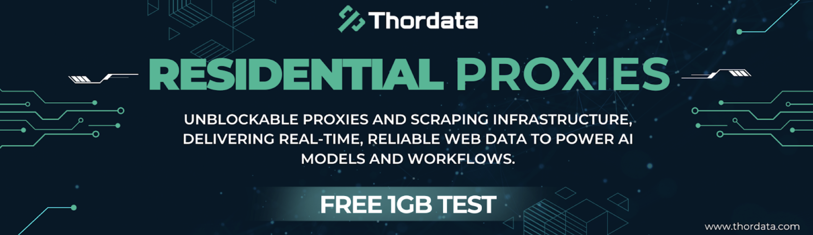
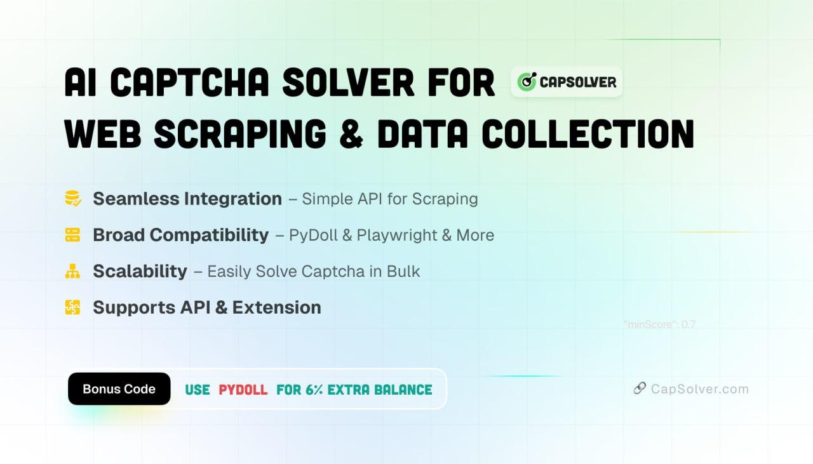

# Sponsors

Pydoll is supported by these amazing sponsors. Their contributions help keep the project maintained and growing.

## Top Sponsors

Read a full review of Pydoll on **[The Web Scraping Club](https://substack.thewebscraping.club/p/pydoll-webdriver-scraping?utm_source=github&utm_medium=repo&utm_campaign=pydoll)**, the #1 newsletter dedicated to web scraping.

---

## Sponsors

Pydoll is proudly sponsored by **[Thordata](https://www.thordata.com/?ls=github&lk=pydoll)**: a residential proxy network built for serious web scraping and automation. With **190+ real residential and ISP locations**, fully encrypted connections, and infrastructure optimized for high-performance workflows, Thordata is an excellent choice for scaling your Pydoll automations.

**[Sign up through our link](https://www.thordata.com/?ls=github&lk=pydoll)** to support the project and get **1GB free** to get started.

---

Pydoll excels at behavioral evasion, but it doesn't solve captchas. That's where **[CapSolver](https://dashboard.capsolver.com/passport/register?inviteCode=WPhTbOsbXEpc)** comes in. An AI-powered service that handles reCAPTCHA, Cloudflare challenges, and more, seamlessly integrating with your automation workflows.

**[Register with our invite code](https://dashboard.capsolver.com/passport/register?inviteCode=WPhTbOsbXEpc)** and use code **PYDOLL** to get an extra **6% balance bonus**.

---

Interested in sponsoring Pydoll? [Become a sponsor](https://github.com/sponsors/thalissonvs).
