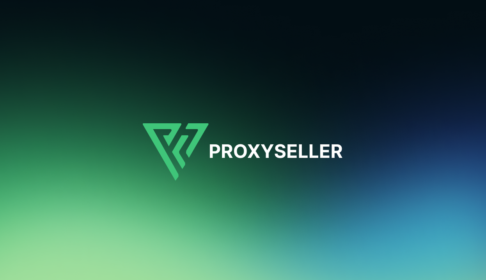
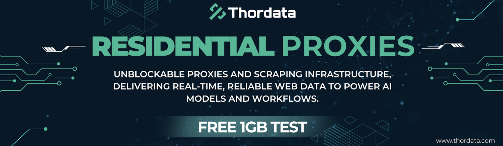
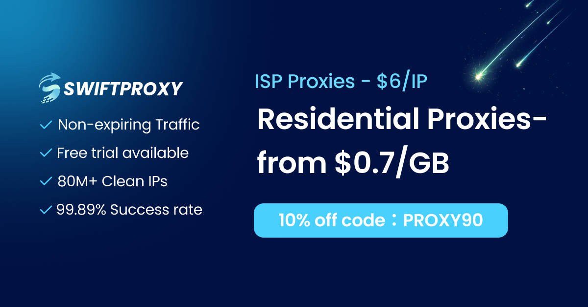

# Sponsors

Pydoll is supported by these amazing sponsors. Their contributions help keep the project maintained and growing.

## Top Sponsors

**[SerpApi](http://serpapi.com/?utm_source=github_sponsorship&utm_campaign=pydoll)** is a Web Search API for your AI apps. Available in Markdown and JSON for any integration.

---

**[IPCook](https://www.ipcook.com/?ref=16NLS&utm_source=github&utm_medium=referral&utm_campaign=pydoll)** provides residential proxies for stealth browser automation with Pydoll. Access 55M+ residential IPs across 185+ locations, with flexible rotating and sticky sessions, city-level geo-targeting, and HTTP & SOCKS5 support. Get 99.99% uptime and average response times under 0.5s for stable, location-consistent browser sessions at scale. Pay as you go with traffic that never expires. Use code **WELCOME20** for 20% OFF.

---

Read a full review of Pydoll on **[The Web Scraping Club](https://substack.thewebscraping.club/p/pydoll-webdriver-scraping?utm_source=github&utm_medium=repo&utm_campaign=pydoll)**, the #1 newsletter dedicated to web scraping.

---

**[NodeMaven](https://go.nodemaven.com/pydollaugust)** is the most efficient proxy provider for web scraping and automation, with the highest quality IPs on the market: ZIP targeting, 99.9% uptime, IP filtering (every proxy has a fraud score below 97%), no KYC required, and unique free tools like the Proxy Bandwidth Checker, Meta Tag Checker and IP Lookup. Pydoll users get exclusive discounts: use code **PYDOLL35** for 35% off Mobile and Residential proxies, or **PYDOLL40** for 40% off ISP (Static) proxies.

---

**[NiuProxy](https://niuproxy.com/?utm_source=pydoll&utm_medium=pydoll&ref=pydoll)** offers rotating residential proxies with a special deal for Pydoll users: 10TB at &#36;0.35/GB or 1TB at &#36;0.50/GB. Use code **PAY2** for 10% off your recharge.

---

## Sponsors

**[Proxy-Seller](https://proxy-seller.com/?partner=8DES01TZ1QGWR3) - Premium Proxies for AI Agents, Scraping & Automation** 🎁 Use code **PYDOLL** for **15% OFF** IPv4, IPv6, ISP & Residential proxies + **10% OFF** Mobile

**Why Choose Proxy-Seller?**

- 🌍 40M+ IPs across 220+ countries with city/ISP-level targeting
- 📶 Residential, ISP, Datacenter (IPv4/IPv6) & 4G/5G Mobile proxies
- ⚡ Up to 1 Gbps speed with 99% uptime
- 🔄 Flexible rotation: time-based, request-based, or sticky sessions
- 🛠️ Ready-made API for Python, Node.js, PHP, Java & Golang
- 🔒 SOCKS5 & HTTP(S) with login/pass or IP whitelisting
- 🎭 Perfect pairing with Camoufox for stealth automation
- 🕐 24/7 support + 24-hour refund & replacement policy

Trusted by 500,000+ clients since 2014. Built for scraping, AI agents, ad verification, and SEO automation.

---

Pydoll is proudly sponsored by **[Thordata](https://www.thordata.com/?ls=github&lk=pydoll)**: a residential proxy network built for serious web scraping and automation. With **190+ real residential and ISP locations**, fully encrypted connections, and infrastructure optimized for high-performance workflows, Thordata is an excellent choice for scaling your Pydoll automations.

**[Sign up through our link](https://www.thordata.com/?ls=github&lk=pydoll)** to support the project and get **1GB free** to get started.

---

Pydoll is also sponsored by **[Swiftproxy](https://www.swiftproxy.net/?ref=pydoll)**: a proxy provider for web scraping and automation.

**[Sign up through our link](https://www.swiftproxy.net/?ref=pydoll)** to support the project.

---

Interested in sponsoring Pydoll? [Become a sponsor](https://github.com/sponsors/thalissonvs).
