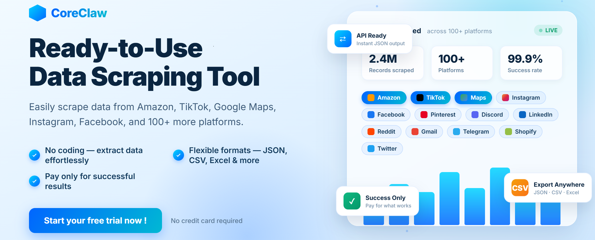
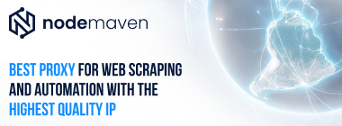

# Sponsors

Pydoll is supported by these amazing sponsors. Their contributions help keep the project maintained and growing.

## Top Sponsors

Read a full review of Pydoll on **[The Web Scraping Club](https://substack.thewebscraping.club/p/pydoll-webdriver-scraping?utm_source=github&utm_medium=repo&utm_campaign=pydoll)**, the #1 newsletter dedicated to web scraping.

---

**[CoreClaw](https://www.coreclaw.com/?utm_source=github&utm_medium=referral&utm_campaign=pydoll&utm_term=&utm_id=pydoll)** turns Amazon, TikTok, Google Maps, Instagram & 100+ more sites into clean, structured data, ready for your leads, dashboards, or API. No maintenance. No broken scrapers. Just clean data, on demand.

---

## Sponsors

**[Proxy-Seller](https://proxy-seller.com/?partner=8DES01TZ1QGWR3) - Premium Proxies for AI Agents, Scraping & Automation** 🎁 Use code **PYDOLL** for **15% OFF** IPv4, IPv6, ISP & Residential proxies + **10% OFF** Mobile

**Why Choose Proxy-Seller?**

- 🌍 40M+ IPs across 220+ countries with city/ISP-level targeting
- 📶 Residential, ISP, Datacenter (IPv4/IPv6) & 4G/5G Mobile proxies
- ⚡ Up to 1 Gbps speed with 99% uptime
- 🔄 Flexible rotation: time-based, request-based, or sticky sessions
- 🛠️ Ready-made API for Python, Node.js, PHP, Java & Golang
- 🔒 SOCKS5 & HTTP(S) with login/pass or IP whitelisting
- 🎭 Perfect pairing with Camoufox for stealth automation
- 🕐 24/7 support + 24-hour refund & replacement policy

Trusted by 500,000+ clients since 2014. Built for scraping, AI agents, ad verification, and SEO automation.

---

Pydoll is proudly sponsored by **[Thordata](https://www.thordata.com/?ls=github&lk=pydoll)**: a residential proxy network built for serious web scraping and automation. With **190+ real residential and ISP locations**, fully encrypted connections, and infrastructure optimized for high-performance workflows, Thordata is an excellent choice for scaling your Pydoll automations.

**[Sign up through our link](https://www.thordata.com/?ls=github&lk=pydoll)** to support the project and get **1GB free** to get started.

---

[NodeMaven](https://go.nodemaven.com/pydollaugust): The most efficient proxy provider for Web Scraping and Automation with the Highest Quality IP on the market.

Why [NodeMaven](https://go.nodemaven.com/pydollaugust)?

- ZIP targeting
- 99.9% uptime
- IP filtering: all proxies have fraud score <97%
- No KYC required
- Unique free tools: Proxy Bandwidth Checker, Meta Tag Checker, IP Lookup and others!

Special codes for Pydoll users:
  - PYDOLL35 - 35% off to Mobile and Residential Proxies
  - PYDOLL40 - 40% off to ISP (Static) Proxies

---

Pydoll is also sponsored by **[Swiftproxy](https://www.swiftproxy.net/?ref=pydoll)**: a proxy provider for web scraping and automation.

**[Sign up through our link](https://www.swiftproxy.net/?ref=pydoll)** to support the project.

---

Interested in sponsoring Pydoll? [Become a sponsor](https://github.com/sponsors/thalissonvs).
