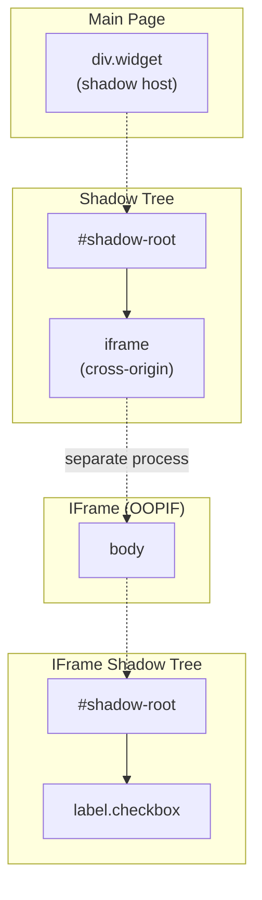

# Shadow DOM Architecture

The Shadow DOM is one of the most challenging aspects of modern web automation. Elements inside shadow trees are invisible to regular DOM queries, which breaks traditional automation approaches. This document explains how Shadow DOM works at the browser level, why conventional tools fail with closed shadow roots, and how Pydoll bypasses these restrictions through direct CDP access.

!!! info "Practical Usage Guide"
    For usage examples and quick-start patterns, see the [Element Finding Guide — Shadow DOM section](../../features/element-finding.md#shadow-dom-support).

## What is Shadow DOM?

Shadow DOM is a web standard that enables **DOM encapsulation**. It allows a component to have its own isolated DOM tree (the "shadow tree") attached to a regular DOM element (the "shadow host"). Elements inside a shadow tree are hidden from the main document's queries.


### Shadow Root Modes

When a component creates a shadow root via `attachShadow()`, it specifies a **mode**:

| Mode | JavaScript Access | CDP Access | Common Usage |
|------|-------------------|------------|--------------|
| `open` | `element.shadowRoot` returns the root | Full access via `backendNodeId` | Custom web components (Lit, Stencil) |
| `closed` | `element.shadowRoot` returns `null` | Full access via `backendNodeId` | Security-sensitive components, payment forms |
| `user-agent` | Not accessible via JS | Limited access | Browser-internal UI (input placeholders, video controls) |

This distinction is critical: **JavaScript-level access is restricted by mode, but CDP-level access is not.**

### Why Regular Automation Fails

Traditional automation tools rely on JavaScript execution in the page context:

```javascript
// WebDriver / Selenium approach
document.querySelector('#my-component')        // ✓ Finds the host
document.querySelector('#my-component button') // ✗ Cannot cross shadow boundary
element.shadowRoot                             // ✗ Returns null for closed roots
```

The shadow boundary is enforced by the browser's JavaScript engine. Any automation tool that executes JavaScript to find elements will hit this wall. This includes Selenium, Playwright's `page.evaluate()`, and any tool using `Runtime.evaluate()` with `document.querySelector()` at the document level.

## How Pydoll Bypasses Shadow Boundaries

Pydoll's approach works at a layer **below JavaScript**: the Chrome DevTools Protocol. CDP has direct access to the browser's internal DOM representation, which ignores shadow mode restrictions entirely.

### The CDP Advantage


The key insight is in **how the shadow root object is obtained** and **how queries are executed against it**:

1. **Discovery**: `DOM.describeNode` with `pierce=true` returns shadow root nodes with their `backendNodeId`, regardless of mode
2. **Resolution**: `DOM.resolveNode` converts a `backendNodeId` to a JavaScript `objectId` that references the shadow root directly
3. **Querying**: `Runtime.callFunctionOn` executes `this.querySelector()` on the shadow root's `objectId`; this works because the call is made **on the shadow root object itself**, not from the document context

### Step-by-Step: Shadow Root Access


#### Step 1: Describe the Host Node

```python
# Pydoll sends this CDP command:
{
    "method": "DOM.describeNode",
    "params": {
        "objectId": "<host-element-object-id>",
        "depth": 1,
        "pierce": true  # ← This is the key flag
    }
}
```

The `pierce` parameter tells CDP to traverse shadow boundaries when describing the node. The response includes shadow root information regardless of the shadow root mode:

```json
{
    "result": {
        "node": {
            "nodeName": "DIV",
            "shadowRoots": [
                {
                    "nodeId": 0,
                    "backendNodeId": 5,
                    "shadowRootType": "closed",
                    "childNodeCount": 4
                }
            ]
        }
    }
}
```

!!! warning "nodeId vs backendNodeId"
    When the DOM domain is not explicitly enabled (which is Pydoll's default to minimize overhead), `nodeId` is always `0`. The `backendNodeId` is the stable, always-available identifier. Pydoll uses `backendNodeId` exclusively for shadow root resolution, which is why it works without requiring `DOM.enable()`.

#### Step 2: Resolve to JavaScript Object

```python
# Convert backendNodeId to a usable objectId:
{
    "method": "DOM.resolveNode",
    "params": {
        "backendNodeId": 5
    }
}
```

The response provides an `objectId`, a handle to the shadow root in JavaScript's object space:

```json
{
    "result": {
        "object": {
            "objectId": "-2296764575741119861.1.3"
        }
    }
}
```

#### Step 3: Query Within the Shadow Root

With the shadow root's `objectId`, Pydoll leverages `FindElementsMixin`'s existing relative search mechanism:

```python
# When ShadowRoot.find(class_name='btn') is called:
{
    "method": "Runtime.callFunctionOn",
    "params": {
        "functionDeclaration": "function() { return this.querySelector(\".btn\"); }",
        "objectId": "-2296764575741119861.1.3"
    }
}
```

The function runs with `this` bound to the shadow root object. Since shadow roots implement the `querySelector()` and `querySelectorAll()` interfaces natively, CSS selectors work naturally within the shadow boundary.

## ShadowRoot Architecture

### Design Decision: Reuse FindElementsMixin

The most critical architectural decision was making `ShadowRoot` inherit from `FindElementsMixin`:

```python
class ShadowRoot(FindElementsMixin):
    def __init__(self, object_id, connection_handler, mode, host_element):
        self._object_id = object_id               # Shadow root CDP reference
        self._connection_handler = connection_handler  # For CDP communication
        self._mode = mode                          # ShadowRootType enum
        self._host_element = host_element          # Back-reference to host
```

**Why this works**: `FindElementsMixin._find_element()` checks `hasattr(self, '_object_id')`. When present, it uses `RELATIVE_QUERY_SELECTOR`, which calls `this.querySelector()` on the referenced object. Since shadow roots support `querySelector()` natively, the entire element-finding API works automatically without any shadow-specific code.

```python
# This single line in FindElementsMixin enables shadow root searches:
elif hasattr(self, '_object_id'):
    command = self._get_find_element_command(by, value, self._object_id)
```

This means `ShadowRoot` inherits `find()`, `query()`, `find_or_wait_element()`, and all selector strategies (CSS, XPath, ID, class name, tag name, attributes) for free.

!!! tip "Architectural Consistency"
    This is the same mechanism that makes `WebElement.find()` search within an element's children: the `_object_id` attribute signals "search relative to me" rather than "search the whole document." `ShadowRoot`, `WebElement`, and `Tab` all share identical element-finding behavior through `FindElementsMixin`.

### Class Relationships

| Class | Has `_object_id` | Has `_connection_handler` | Find Scope |
|-------|:-:|:-:|---|
| `Tab` | No | Yes | Entire document |
| `WebElement` | Yes | Yes | Within element's subtree |
| `ShadowRoot` | Yes | Yes | Within shadow tree |

All three inherit from `FindElementsMixin`. The presence or absence of `_object_id` determines whether searches are document-global or scoped to a specific node.

### Resolving Shadow Roots: backendNodeId Strategy

Pydoll deliberately uses `backendNodeId` instead of `nodeId` for shadow root resolution:

| Property | `nodeId` | `backendNodeId` |
|----------|----------|-----------------|
| Requires `DOM.enable()` | Yes | No |
| Stable across describe calls | No (0 when DOM not enabled) | Yes |
| Works for shadow root resolution | Only when DOM enabled | Always |
| Performance overhead | Higher (DOM domain tracking) | None |

By relying on `backendNodeId`, Pydoll avoids the overhead of enabling the DOM domain while maintaining reliable shadow root access. This is a pragmatic choice: most automation scenarios don't need the DOM domain's event stream, and enabling it adds memory and processing overhead for tracking every DOM mutation.

## Closed Shadow Roots: Why CDP Access Works

This is the most commonly asked question: **if `element.shadowRoot` returns `null` for closed shadow roots in JavaScript, how can CDP access them?**

The answer lies in understanding the browser's architecture:


**JavaScript access** goes through the Web API layer, which enforces the shadow mode restriction. When `mode='closed'`, the API returns `null`; this is an intentional access control boundary for web page code.

**CDP access** operates below the Web API layer. It communicates directly with the browser's internal DOM representation. The `closed` mode restriction is a **JavaScript-level policy**, not a **DOM-level restriction**. The shadow tree still exists in the DOM; it's just hidden from JavaScript's view.

!!! info "Security Implications"
    This is by design in the DevTools Protocol. CDP is intended for debugging and automation tools that need full DOM access. The `closed` mode protects shadow contents from other scripts on the same page (e.g., third-party scripts), not from the browser's debugging interface. This is the same reason browser DevTools can inspect closed shadow roots in the Elements panel.

### Practical Verification

You can verify this behavior yourself:

```python
import asyncio
from pydoll.browser.chromium import Chrome
from pydoll.protocol.dom.types import ShadowRootType

async def verify_closed_access():
    async with Chrome() as browser:
        tab = await browser.start()
        await tab.go_to('about:blank')

        # Create a closed shadow root via JavaScript
        await tab.execute_script("""
            const host = document.createElement('div');
            host.id = 'test-host';
            document.body.appendChild(host);
            const shadow = host.attachShadow({ mode: 'closed' });
            shadow.innerHTML = '<p class="secret">Hidden content</p>';
        """)

        # JavaScript cannot access it:
        result = await tab.execute_script(
            "return document.getElementById('test-host').shadowRoot",
            return_by_value=True,
        )
        js_value = result['result']['result'].get('value')
        print(f"JS shadowRoot: {js_value}")  # None

        # But Pydoll can:
        host = await tab.find(id='test-host')
        shadow = await host.get_shadow_root()
        print(f"Shadow mode: {shadow.mode}")  # ShadowRootType.CLOSED

        secret = await shadow.find(class_name='secret')
        text = await secret.text
        print(f"Content: {text}")  # "Hidden content"

asyncio.run(verify_closed_access())
```

## Nested Shadow Roots

Web components frequently compose other web components, creating multi-level shadow trees:


Pydoll handles this naturally by chaining `get_shadow_root()` calls. Each `ShadowRoot` produces `WebElement` instances that can themselves have shadow roots:

```python
outer_host = await tab.find(tag_name='outer-component')
outer_shadow = await outer_host.get_shadow_root()        # open

inner_host = await outer_shadow.find(tag_name='inner-component')
inner_shadow = await inner_host.get_shadow_root()        # closed, still works

deep_button = await inner_shadow.find(class_name='deep-btn')
await deep_button.click()
```

Each level follows the same CDP resolution flow: `describeNode` then `resolveNode` then `ShadowRoot` with `_object_id` then `querySelector` via `callFunctionOn`.

## Shadow Roots Inside IFrames

A common real-world scenario involves shadow roots inside cross-origin iframes — for example, Cloudflare Turnstile captchas. This combines two isolation mechanisms: the iframe boundary and the shadow boundary.



Pydoll handles this transparently through **iframe context propagation**. When a `ShadowRoot` is created, it inherits the iframe routing context from its host element:

```python
# The full chain: main page → shadow root → iframe → shadow root → element
shadow_host = await tab.find(id='widget-container')
first_shadow = await shadow_host.get_shadow_root()

iframe = await first_shadow.find(tag_name='iframe')
body = await iframe.find(tag_name='body')
second_shadow = await body.get_shadow_root()

# click() works correctly — mouse events route through the OOPIF session
button = await second_shadow.query('label.checkbox')
await button.click()
```

### How Context Propagation Works

Cross-origin iframes run in a separate browser process (Out-of-Process IFrame, or OOPIF). CDP commands for these iframes must be routed through a dedicated `sessionId`. Pydoll propagates this routing context automatically through the entire chain:

1. **IFrame resolves its context**: `iframe.find()` establishes an `IFrameContext` with `session_id` and `session_handler` for the OOPIF
2. **Child elements inherit context**: Elements found inside the iframe receive the `IFrameContext`
3. **Shadow roots inherit from host**: `ShadowRoot` copies its host element's `_iframe_context`
4. **Elements in shadow inherit from shadow root**: Elements found via `shadow.find()` receive the propagated context
5. **Commands route correctly**: `_execute_command()` detects the inherited context and routes CDP commands (including `Input.dispatchMouseEvent` for `click()`) through the OOPIF session

This means coordinates from `DOM.getBoxModel` (which are relative to the iframe viewport) are correctly paired with mouse events dispatched to the same OOPIF session.

## Finding Shadow Roots: find_shadow_roots()

`Tab.find_shadow_roots()` traverses the entire DOM tree to collect all shadow roots found on the page.

### How It Works

```
Tab.find_shadow_roots()
  ├─ DOM.getDocument(depth=-1, pierce=true)
  │   └─ Returns full DOM tree with shadowRoots arrays
  ├─ Recursive tree walk: _collect_shadow_roots_from_tree()
  │   ├─ Collects shadowRoots entries with host backendNodeId
  │   ├─ Traverses children recursively
  │   └─ Traverses contentDocument (same-origin iframes)
  ├─ For each shadow root entry:
  │   ├─ DOM.resolveNode(backendNodeId) → objectId
  │   └─ Resolve host element (best-effort)
  └─ Returns list[ShadowRoot] with host references
```

### Timeout: Waiting for Shadow Roots

Shadow hosts are often injected asynchronously. `Tab.find_shadow_roots()` accepts a `timeout` parameter that polls every 0.5s until at least one shadow root is found or the timeout expires (raises `WaitElementTimeout`). Similarly, `WebElement.get_shadow_root()` also supports `timeout` for waiting on a specific element's shadow root:

```python
# Wait up to 10 seconds for shadow roots to appear
shadow_roots = await tab.find_shadow_roots(timeout=10)

# Wait for a shadow root on a specific element
shadow = await element.get_shadow_root(timeout=5)
```

### Key Details

- **`pierce=True`** in `DOM.getDocument` causes the browser to include `shadowRoots` arrays in node descriptions, allowing discovery of all shadow roots without navigating to each host individually.
- **Same-origin iframe content** is included in the tree via `contentDocument` nodes. The traversal handles these.
- Each returned `ShadowRoot` has a reference to its `host_element` (resolved best-effort via `DOM.resolveNode`).

### Deep Traversal: Cross-Origin IFrames (OOPIFs)

By default, cross-origin iframes (OOPIFs) are **not** included in the DOM tree — their content lives in a separate browser process. Pass `deep=True` to also discover shadow roots inside OOPIFs:

```python
shadow_roots = await tab.find_shadow_roots(deep=True, timeout=10)
```

When `deep=True` is set, the method performs additional steps:

```
Tab.find_shadow_roots(deep=True)
  ├─ ... (main document traversal as above) ...
  └─ _collect_oopif_shadow_roots()
      ├─ Browser-level ConnectionHandler (no page_id → browser endpoint)
      ├─ Target.getTargets() → filter type='iframe'
      └─ For each iframe target:
          ├─ Target.attachToTarget(targetId, flatten=True) → sessionId
          ├─ DOM.getDocument(depth=-1, pierce=True) with sessionId
          ├─ _collect_shadow_roots_from_tree() on OOPIF DOM
          └─ For each shadow root found:
              ├─ DOM.resolveNode(backendNodeId) with sessionId
              ├─ Resolve host element (best-effort) with sessionId
              ├─ Create IFrameContext(frame_id, session_handler, session_id)
              └─ Set IFrameContext on host element (or ShadowRoot directly)
```

The returned `ShadowRoot` objects carry the OOPIF routing context (`IFrameContext`), so elements found via `shadow_root.find()` will automatically route CDP commands through the correct OOPIF session. This is critical for scenarios like Cloudflare Turnstile captchas, where the checkbox lives inside a closed shadow root within a cross-origin iframe.

## Limitations and Edge Cases

### Selector Strategies Inside Shadow Roots

!!! warning "Prefer CSS Selectors Inside Shadow Roots"
    Always use `query()` or CSS-based `find()` methods (`id`, `class_name`, `tag_name`) inside shadow roots. XPath-based searches may find elements but return them with incomplete attribute metadata.

Shadow roots natively implement `querySelector()` and `querySelectorAll()`, making CSS selectors the natural and reliable choice:

| Method | Inside Shadow Root | Notes |
|--------|:--:|---|
| `query('css-selector')` | Fully supported | Recommended approach |
| `find(id='...')` | Fully supported | Converted to CSS `#id` internally |
| `find(class_name='...')` | Fully supported | Converted to CSS `.class` internally |
| `find(tag_name='...')` | Fully supported | Tag names are valid CSS selectors |
| `find(xpath='...')` | Unreliable | Elements found but attributes may be incomplete |
| `find(name='...')` | Not supported | Does not work inside scoped searches |

```python
shadow = await host.get_shadow_root()

# ✓ Recommended: CSS selectors
button = await shadow.query('button.submit')
email = await shadow.find(id='email-input')
items = await shadow.find(class_name='item', find_all=True)

# ✗ Avoid: XPath inside shadow roots
button = await shadow.find(xpath='.//button')  # May have empty attributes
```

### XPath Cannot Cross Shadow Boundaries

XPath expressions from the document root cannot traverse shadow boundaries. This is a fundamental limitation of XPath, which was designed before Shadow DOM existed:

```python
# Won't find shadow content: document-level XPath cannot cross the boundary
element = await tab.find(xpath='//div[@id="host"]//button')
```

### User-Agent Shadow Roots

Browser-internal shadow roots (e.g., `<input>` placeholder styling, `<video>` controls) are of type `user-agent`. These are accessible via CDP but their internal structure varies across browser versions and is not part of any web standard.

```python
input_element = await tab.find(tag_name='input')
try:
    ua_shadow = await input_element.get_shadow_root()
    # ua_shadow.mode == ShadowRootType.USER_AGENT
    # Internal structure is browser-specific
except ShadowRootNotFound:
    pass  # Not all inputs have user-agent shadow roots
```

!!! warning "User-Agent Shadow Root Stability"
    Do not build automation logic that depends on the internal structure of user-agent shadow roots. Their DOM structure is an implementation detail that can change between browser versions without notice.

### Stale Shadow Root References

If the host element is removed from the DOM and re-added (common in single-page applications), the shadow root's `objectId` becomes stale. The solution is to re-acquire the shadow root:

```python
# After a page navigation or DOM rebuild:
host = await tab.find(id='my-component', timeout=5)  # Re-find the host
shadow = await host.get_shadow_root()                 # Fresh shadow root
```

## Key Takeaways

- **Shadow DOM encapsulation** hides elements from document-level `querySelector()`, breaking traditional automation
- **CDP operates below the JavaScript API layer**, bypassing shadow mode restrictions entirely
- **`backendNodeId`** is the stable identifier used for shadow root resolution, avoiding the need to enable the DOM domain
- **`ShadowRoot` inherits `FindElementsMixin`**, gaining `find()`, `query()`, and all selector strategies automatically through the `_object_id` mechanism
- **Closed shadow roots** are fully accessible because the `closed` mode is a JavaScript-level policy, not a DOM-level restriction
- **Nested shadow roots** work naturally by chaining `get_shadow_root()` calls at each level
- **Shadow roots inside iframes** work transparently through automatic iframe context propagation
- **Use CSS selectors** (`query()`, `find(id=...)`, `find(class_name=...)`) inside shadow roots; avoid XPath
- **`find_shadow_roots()`** discovers all shadow roots on the page; supports `timeout` for polling and `deep=True` for cross-origin iframes (OOPIFs)
- **`get_shadow_root(timeout)`** waits for a shadow root to appear on a specific element

## Related Documentation

- **[Element Finding Guide](../../features/element-finding.md)**: Practical usage of `find()`, `query()`, and shadow root access
- **[IFrames & Contexts](../fundamentals/iframes-and-contexts.md)**: How Pydoll resolves and routes commands to iframes, including OOPIF handling
- **[FindElements Mixin Architecture](./find-elements-mixin.md)**: How the `_object_id` mechanism enables scoped searches
- **[WebElement Domain](./webelement-domain.md)**: How elements interact with CDP
- **[Connection Layer](../fundamentals/connection-layer.md)**: WebSocket communication with the browser
