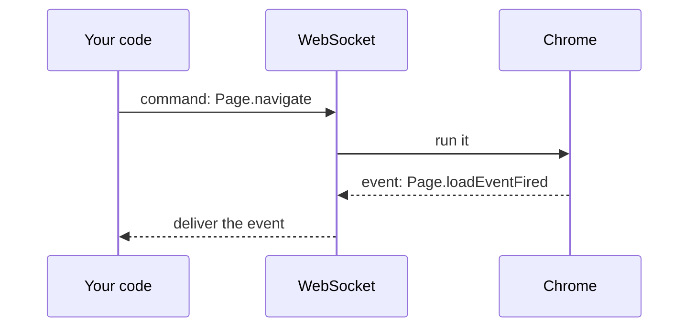
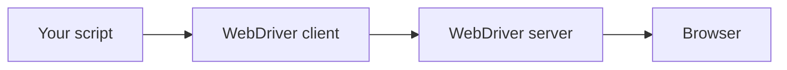
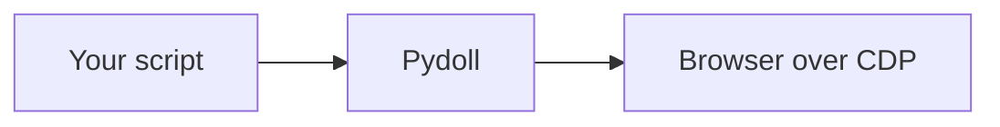

# Chrome DevTools Protocol

The Chrome DevTools Protocol (CDP) is the interface Pydoll uses to control the browser. It is the same protocol Chrome DevTools speaks when you inspect a page, exposed as a programmable API. Understanding it explains where Pydoll's capabilities come from and why there is no webdriver in the picture.

## What CDP is

CDP is a protocol for controlling Chromium-based browsers programmatically. Messages are JSON, sent over a WebSocket, and organized into domains that each cover one area of the browser: `Page` for navigation and lifecycle, `DOM` for page structure, `Network` for traffic, `Runtime` for JavaScript, `Input` for mouse and keyboard, `Fetch` for request interception, `Target` for tabs and contexts, and more.

Google maintains CDP and extends it with each Chrome release. Because it was built to drive Chrome's own DevTools, it reaches deep into the browser, which is why it became the foundation for automation tools like Puppeteer, Playwright, and Pydoll.

Pydoll speaks CDP directly, so its capabilities are whatever CDP exposes. There is no separate automation layer deciding what you can and cannot do.

## How the connection works

Start a Chromium browser with the remote debugging flag and it opens a WebSocket server on that port:

```
chrome --remote-debugging-port=9222
```

Pydoll connects to that WebSocket and holds the connection open for the whole session. The channel is bidirectional: your code sends commands to the browser, and the browser pushes events back as they happen, over the same connection.



A persistent WebSocket suits automation better than the request/response HTTP endpoints older protocols used: the browser notifies you the moment something happens, instead of you polling to find out.

## Domains

CDP groups its methods and events into domains. The ones you meet most in automation:

| Domain | Covers | Example uses |
|--------|--------|--------------|
| Browser | the browser application | window management, creating browser contexts |
| Page | the page lifecycle | navigation, running JavaScript, frames |
| DOM | page structure | querying elements, reading and setting attributes |
| Network | traffic | watching requests and responses, caching |
| Runtime | the JavaScript engine | evaluating expressions, calling functions |
| Input | user input | mouse movement, keyboard, touch |
| Target | tabs and contexts | opening tabs, reaching iframes, handling popups |
| Fetch | low-level interception | modifying requests, mocking responses, auth |

Pydoll maps these domains to a friendlier API, so `tab.go_to(...)` sends a `Page.navigate` command and `tab.find(...)` uses `DOM` queries, without you assembling the raw messages.

## Commands and events

Every CDP interaction is one of two message types.

A **command** is a request you send: a domain method with parameters. The browser runs it and replies with a result, matched to your message by an id. `Page.navigate`, `DOM.getDocument`, and `Input.dispatchMouseEvent` are commands.

An **event** is a notification the browser sends on its own, once you enable its domain. `Page.loadEventFired`, `Network.requestWillBeSent`, and `Fetch.requestPaused` are events. You subscribe with a callback and react when it fires:

```python
from functools import partial

from pydoll.protocol.network.events import NetworkEvent


async def on_request(tab, event):
    url = event['params']['request']['url']
    print(f'request to: {url}')


await tab.enable_network_events()
await tab.on(NetworkEvent.REQUEST_WILL_BE_SENT, partial(on_request, tab))
```

Events are why automation over CDP can react the instant the browser changes state, instead of sleeping and hoping. See [Events](../guides/events.md) for the working guide.

## Targets and sessions

CDP calls each thing you can attach to a **target**: the browser itself, every tab, and out-of-process iframes are separate targets. Attaching to a target opens a **session**, and commands for that target carry its `sessionId` so the browser knows where to route them.

This is how one WebSocket connection drives many tabs at once, and how commands reach an element inside a cross-origin iframe. Pydoll handles the target and session routing for you, so a `Tab` object just works without you tracking session ids.

## Why there is no webdriver

Traditional webdriver tools put a translation server between your code and the browser:



The server translates the WebDriver protocol into the browser's native calls, which is the piece you have to install and version-match to your browser. Pydoll talks to the browser directly:



There is no separate driver to download or keep in sync, and the connection is the same event-driven channel the browser uses internally. See [Core concepts](../guides/core-concepts.md) for what that means when you write scripts.

## Related

- [Deep Dive overview](index.md): the other background subjects.
- [Core concepts](../guides/core-concepts.md): the tab and browser model at a working level.
- [Events](../guides/events.md): subscribing to CDP events in practice.
- [CDP specification](https://chromedevtools.github.io/devtools-protocol/): the full domain and method reference.
