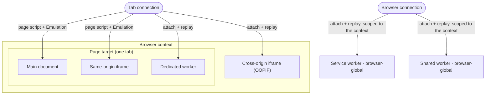

# Workers and cross-origin iframes

A fingerprinting script does not read your identity once. It re-reads it inside every iframe and Web Worker the page can spawn, and each of those is a separate JavaScript realm with its own `navigator`. If the page reports the injected Windows identity but a worker reports the real macOS, that disagreement is the tell.

So an injected identity has to hold in *every* realm, not just the top document. This page is the mechanism behind the [Fingerprint injection](../../stealth/fingerprint-injection.md) note that overrides are "replayed in workers", and the general form of the [Cloudflare](cloudflare-challenge.md) cross-origin screen leak. It covers what a realm is, why some overrides reach every realm for free while others reach only one, and how Pydoll replays the identity into the realms it must reach by hand.

## A realm is a fresh copy of the browser environment

A realm is an independent JavaScript global: its own `window` or `self`, its own `navigator`, its own prototype chain. The main document is one realm. Every iframe is another. Every Web Worker is another. A getter you redefine on `Navigator.prototype` in the main page does not exist in a worker or a cross-origin iframe, because that realm was built from a fresh copy of the prototypes.

Detection systems use this directly. They read the fingerprint in the page, spawn a second realm, read the whole fingerprint again there, and compare the two. [CreepJS](https://abrahamjuliot.github.io/creepjs/) runs its entire fingerprint a second time inside a Web Worker. Cloudflare runs its challenge inside a cross-origin iframe. An override installed only in the main realm leaks the real values in that second realm, and the mismatch is what gets scored.

  

CreepJS reads the fingerprint a second time inside a worker. Here it reports the injected identity, not the real Mac.

The interactive map below applies a Windows profile on a real Mac and reads `navigator.platform` in each realm. Toggle between a naive top-page hook and Pydoll's per-realm replay:

<iframe scrolling="no" src="/docs/resources/visuals/realm-coverage.html" aria-label="A Windows profile applied on a Mac; navigator.platform read in the main document, a same-origin iframe, a cross-origin OOPIF, and dedicated, shared and service workers. A top-page hook matches only the main document; Pydoll's replay matches every realm." style="width: 100%; height: 430px; border: 0;" loading="lazy"></iframe>

## Two overrides reach every same-process realm for free

Two of Pydoll's mechanisms cross realm boundaries on their own, but only within a single process:

- **CDP `Emulation` overrides** (`setUserAgentOverride`, `setHardwareConcurrencyOverride`, `setTimezoneOverride`, `setLocaleOverride`, `setDeviceMetricsOverride`, `setEmulatedMedia`) are applied by the browser at the target level, below JavaScript. They cover the main document and every frame in the same process.
- **`Page.addScriptToEvaluateOnNewDocument`** runs a script in every frame of the page target before that frame's own scripts run. It covers the main realm and every same-origin (in-process) iframe.

Together these cover the main document and same-origin iframes with no extra work. A same-origin child iframe reads the injected `platform`, `hardwareConcurrency`, and User-Agent, not the host machine's.

What they do not reach is a realm that lives in its **own target**. A Web Worker and a cross-origin iframe each have a separate CDP session, and neither mechanism above crosses that boundary.

| Realm | Reached by the page script | Reached by an Emulation override | Its own CDP target |
|---|---|---|---|
| Main document | yes | yes | no |
| Same-origin iframe | yes | yes | no |
| Cross-origin iframe (OOPIF) | no | no | yes |
| Web Worker (any kind) | no | no | yes |

## Web Workers run in a realm with their own navigator

A Web Worker is a background script with no DOM and its own global, `self`. There are three kinds:

- **Dedicated worker** (`new Worker(...)`): owned by one document, dies with it.
- **Shared worker** (`new SharedWorker(...)`): one instance shared by every same-origin document.
- **Service worker**: a background worker that can control an origin's network and outlives the page that registered it.

Each exposes a `WorkerNavigator` with its own `userAgent`, `platform`, `hardwareConcurrency`, `deviceMemory`, and `languages`. A detector spins up a worker, re-reads those, and compares them to the page. If the worker reports the real machine, the session is flagged.

Pydoll reaches a worker by attaching to it before it runs. It enables `Target.setAutoAttach` with `waitForDebuggerOnStart`, so every worker attaches **paused** on creation. On attach, Pydoll replays the User-Agent and `hardwareConcurrency` CDP overrides and evaluates the worker fingerprint script on that session, then resumes the worker. It starts already wearing the identity, so its first read is already the injected one.

## Tab scope and browser scope

Not every worker answers over the same CDP connection, and that split is why Pydoll sets them up in two places.

- A **dedicated worker** is a child of the page target. Its session is reachable over the tab's own connection, so Pydoll sets it up once per tab.
- A **service or shared worker** is a browser-global target. It is not owned by any single page, and its session answers only over the browser-level connection, not a tab's. Pydoll registers that handler once per browser context, on the browser connection, and scopes it by `browserContextId` so a worker in one context never receives another context's identity.

Because service and shared workers are shared by every tab in a context, a browser context holds a single identity. Applying a second, different fingerprint to a context that already has one raises `FingerprintContextConflict` (see [Multiple fingerprints across contexts](../../stealth/fingerprint-injection.md#multiple-fingerprints-across-contexts)).

## Cross-origin iframes run in another process

A same-origin iframe shares the page's process and target, so it is already covered, and so is a cross-origin iframe on the same site, because Chrome's site isolation splits by registrable domain, not by origin. A **cross-site** iframe is different: Chrome renders it in a **separate process** with its own target and CDP session, an out-of-process iframe (OOPIF). The page script and the page's Emulation overrides stop at the process boundary, so the OOPIF reads the real identity: the real User-Agent, timezone, hardware, and GPU.

This is a detector's opening. It can host its probe in a cross-origin iframe precisely because a top-page hook cannot reach it. Cloudflare's managed challenge runs inside `challenges.cloudflare.com`; in headless it read the raw `800x600` screen there while the page reported the profile's screen, and the two disagreed (see [Cloudflare's managed challenge](cloudflare-challenge.md)).

Pydoll reaches an OOPIF with the same attach-and-replay it uses for workers, applied to iframe targets over the tab connection. An OOPIF is a child of the page target, so it attaches there, paused, not on the browser connection. The browser-global virtual screen is already made coherent for every frame, OOPIFs included, through `Emulation.updateScreen` (see [Headless mode](../../stealth/fingerprint-injection.md#headless-mode)). Reaching the per-OOPIF `navigator` and WebGL identity means replaying the full override set on the iframe's own session (User-Agent, `hardwareConcurrency`, timezone, locale, geolocation, media features, and, after enabling the Page domain on that session, the page script), then resuming the target last so nothing runs before the identity is in place.

!!! note "OOPIF injection is scoped, not blanket"
    A page can embed dozens of third-party iframes for ads and analytics. Attaching to and injecting into every one is expensive and can stall the page, so OOPIF identity coverage is aimed at the frames that actually read a fingerprint, such as a challenge or captcha widget, rather than applied to every cross-origin frame.

## Always resume an attached realm

`waitForDebuggerOnStart` pauses every attached target before its first line, which is exactly what lets Pydoll install the identity in time. It carries one hard rule: a target that is attached but never resumed hangs forever, and for an iframe that stalls the whole embedding page.

!!! warning "Resume every attached target, injected or not"
    Pydoll resumes every attached worker and iframe in a `finally`, whether or not it injected into it. A skipped third-party iframe is still resumed; only its injection is skipped. A single missed resume is enough to freeze the page on a blank captcha or a spinning challenge.

## Every realm, and how Pydoll reaches it

| Realm | Own CDP session | How Pydoll reaches it | Set up per |
|---|---|---|---|
| Main document | no | page script + Emulation | tab |
| Same-origin iframe | no | page script + Emulation | tab |
| Dedicated worker | yes | attach + replay | tab |
| Cross-origin iframe (OOPIF) | yes | attach + replay | tab |
| Shared worker | yes | attach + replay | browser context |
| Service worker | yes | attach + replay | browser context |

The rule underneath the table: an override reaches a realm for free only while it shares the page's process. Every realm in its own target has to be attached, replayed, and resumed, and service and shared workers are the two that answer over the browser connection instead of the tab's.

## Related

- [Fingerprint injection](../../stealth/fingerprint-injection.md): applying a coherent identity, and the worker-replay checklist item.
- [Browser fingerprinting](browser-fingerprinting.md): the `navigator`, WebGL, and screen signals each realm exposes.
- [Cloudflare's managed challenge](cloudflare-challenge.md): the OOPIF realm as a live case study.
- [Browser contexts](../../guides/browser-contexts.md): why one context holds one identity.
