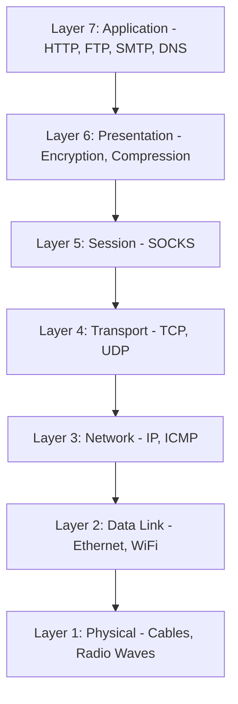
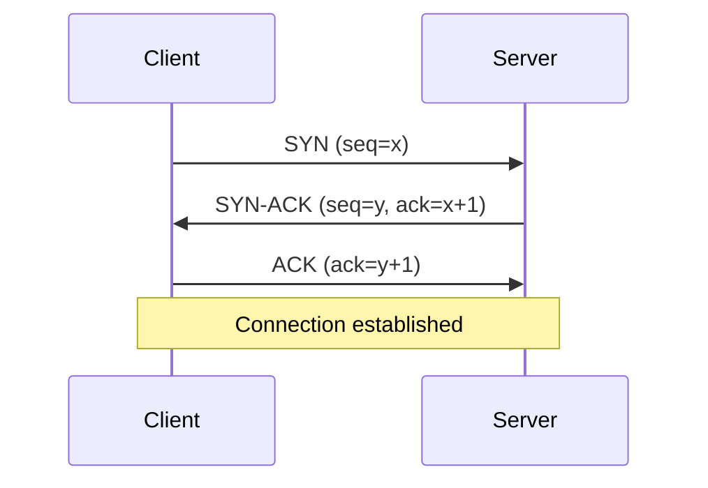
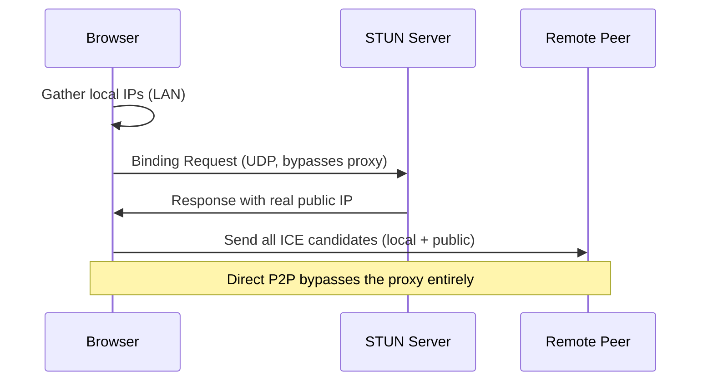

# Network fundamentals

Every request your browser makes travels through a layered network stack, and each layer decides what a proxy can see, change, or hide, and what can still leak your real identity. Understanding the stack is what makes proxy behavior predictable instead of mysterious. This page walks the layers, the TCP and UDP protocols, and WebRTC, the most common source of IP leaks in proxied automation.

For the practical setup, see [Proxies](../../guides/proxies.md). For how these lower layers are turned into a fingerprint, see [Network fingerprinting](../fingerprinting/network-fingerprinting.md).

## The network stack

Proxies operate at different layers, and the layer determines their reach. Lower-layer characteristics can fingerprint your real system even through a flawless higher-layer proxy, so it helps to see where each protocol sits.

The OSI model (7 layers) is a teaching reference; real networks run the TCP/IP model (4 layers). OSI terminology is still how people describe where a proxy operates, so it is worth knowing.



The layers that matter for automation:

- **Layer 7, Application.** HTTP, HTTPS, FTP, SMTP, DNS. The actual data your code cares about. HTTP proxies sit here with full visibility into requests and responses.
- **Layer 6, Presentation.** Encryption and compression. TLS is associated with this layer, though in practice it straddles Layers 4 to 6.
- **Layer 5, Session.** SOCKS proxies sit here, below the application layer, which makes them protocol-agnostic.
- **Layer 4, Transport.** TCP (reliable) and UDP (fast). Ports, flow control, error correction. Every proxy relies on this layer to move data.
- **Layer 3, Network.** IP addressing and routing. Your real IP lives here, and it is what a proxy substitutes.
- **Layer 2, Data Link.** Ethernet and Wi-Fi, MAC addresses. Visible only on the local segment, not to remote servers (though IPv6 SLAAC can embed the MAC in the address).
- **Layer 1, Physical.** Cables and radio. Rarely relevant to automation.

### How the layer decides what a proxy can do

An HTTP/HTTPS proxy at Layer 7 understands HTTP, so it can read and rewrite URLs, headers, cookies, and bodies, cache by HTTP semantics, and inject headers. In exchange it only speaks HTTP, and inspecting HTTPS means terminating TLS (decrypt, re-encrypt).

A SOCKS proxy at Layer 5 sits below the application, so it is protocol-agnostic: it forwards any Layer 7 protocol untouched, passes HTTPS through encrypted end to end, and SOCKS5 can also carry UDP. The cost is no application-layer visibility: it can filter by IP and port, not by URL or content.

!!! note "The tradeoff"
    Higher layers give more content control but less protocol flexibility; lower layers give the reverse. Choose an HTTP proxy for content control, a SOCKS proxy for protocol flexibility or end-to-end encryption.

### The layer-leak problem

Even a perfect Layer 7 proxy cannot change what lower layers reveal. Your operating system's TCP stack at Layer 4 has a fingerprint (window size, options order, TTL), and IP header fields at Layer 3 reveal OS and topology. If you present a Windows User-Agent while your Linux kernel's TCP fingerprint says otherwise, a system that correlates the two flags the mismatch. This is why [network fingerprinting](../fingerprinting/network-fingerprinting.md) is dangerous: it operates below the proxy.

## TCP and UDP

At Layer 4, two protocols dominate, with opposite priorities: reliability versus speed.

TCP is connection-oriented, like a phone call: you establish a connection, exchange data with every byte acknowledged and ordered, then close it. UDP is connectionless: you send a datagram and hope it arrives, with no handshake and no guarantees, for minimal overhead.

| Feature | TCP | UDP |
|---------|-----|-----|
| Connection | Connection-oriented (handshake) | Connectionless (no handshake) |
| Reliability | Guaranteed, ordered | Best-effort, may drop |
| Speed | Slower (reliability overhead) | Faster (minimal overhead) |
| Use cases | Web, file transfer, email | Streaming, DNS, gaming, WebRTC |
| Header size | 20 bytes (up to 60) | 8 bytes fixed |
| Flow/congestion control | Yes | No |
| Ordering / retransmission | Yes | No |

All proxy protocols (HTTP, HTTPS, SOCKS4, SOCKS5) use TCP for their control channel, because authentication and command sequences need guaranteed delivery. SOCKS5 additionally can proxy UDP, which SOCKS4 and HTTP proxies cannot.

### The TCP three-way handshake

Before any data moves, TCP performs a three-way handshake to synchronize sequence numbers and connection state.



The client sends a SYN with a random Initial Sequence Number and its TCP options (window size, MSS, timestamps, SACK). The server replies with a SYN-ACK: its own random ISN plus an acknowledgment of the client's. The client sends a final ACK, and the connection is open in both directions. The ISN is randomized (RFC 6528) to prevent an attacker from injecting packets by guessing sequence numbers.

### TCP fingerprinting

The handshake exposes OS-specific values: initial window size, options order, TTL, and window scale. The kernel sets these, not the browser, so a proxy cannot change them. Illustrative defaults (they vary by version and tuning):

```
Windows 10/11:  Window 65535,  TTL 128,  Options: MSS, NOP, WS, NOP, NOP, SACK_PERM
Linux 5.x+:     Window 29200,  TTL 64,   Options: MSS, SACK_PERM, TS, NOP, WS
macOS:          Window 65535,  TTL 64
```

!!! warning "A proxy cannot hide your TCP fingerprint"
    HTTP and SOCKS proxies sit above TCP, so your OS's TCP fingerprint reaches the proxy and any observer between you and it. Only VPN-level routing or OS-level stack tuning changes it. The TLS handshake right after adds another fingerprint (JA3/JA4); see [Network fingerprinting](../fingerprinting/network-fingerprinting.md).

### UDP, DNS, and QUIC

UDP is fire-and-forget: an 8-byte header, no connection, no reliability. It fits real-time media (WebRTC, VoIP), gaming, and DNS, where the application handles any retries. DNS uses UDP because queries are small and benefit from zero handshake overhead.

The automation concern is that most proxies only carry TCP, so UDP traffic can bypass the proxy and expose your real IP:

| Proxy type | UDP support |
|------------|-------------|
| HTTP / HTTPS (CONNECT) | No (TCP tunnels only) |
| SOCKS4 | No |
| SOCKS5 | Yes (via `UDP ASSOCIATE`) |
| VPN | Yes (tunnels all IP traffic) |

Modern Chrome also uses QUIC (RFC 9000), the UDP-based transport behind HTTP/3, which shares the same bypass risk and has its own fingerprint. In automation you can force HTTP/2 over TCP with `--disable-quic` so all web traffic follows your proxy.

## WebRTC and IP leakage

WebRTC enables peer-to-peer audio, video, and data directly between browsers. It optimizes for low latency over privacy, and it is the single most common source of IP leaks in proxied automation: it can reveal your real IP even when every HTTP layer is proxied correctly.

To set up a P2P connection, WebRTC discovers your public IP through STUN servers over UDP. Those queries bypass a TCP-only proxy, the IP ends up in the connection's ICE candidates, and JavaScript on the page can read the candidates and send your real IP to a server.

### ICE, STUN, and the candidates that leak

WebRTC uses ICE (RFC 8445) to gather possible connection paths, called candidates, and this gathering is what exposes your network.



Three candidate types are gathered:

- **Host candidates**: your local LAN IPs. Chrome 75+ replaces these with ephemeral mDNS names (`a1b2c3d4.local`) unless camera/microphone permission is granted, so this leak is mostly mitigated.
- **Server-reflexive candidates**: your public IP as a STUN server sees it. This is the leak everyone means: the proxy shows one IP, WebRTC reveals your real one.
- **Relay candidates**: a TURN relay address used when direct P2P fails; the `raddr` field may still carry your real IP.

STUN (RFC 8489) is a simple request/response over UDP: the client asks "what IP do you see," and the server returns the public IP and port in an `XOR-MAPPED-ADDRESS` (XOR'ed with a fixed magic cookie for NAT compatibility, not security). Browsers ship with public STUN servers such as `stun.l.google.com:19302`.

A proxy cannot stop this because WebRTC uses UDP (which most proxies do not carry), operates below the HTTP layer against the OS network stack directly, and enumerates every interface. Any page can trigger it and read the result:

```javascript
const pc = new RTCPeerConnection({ iceServers: [{ urls: 'stun:stun.l.google.com:19302' }] });
pc.createDataChannel('');
pc.createOffer().then(offer => pc.setLocalDescription(offer));
pc.onicecandidate = (event) => {
  if (!event.candidate) return;
  const ip = event.candidate.candidate.match(/([0-9]{1,3}(\.[0-9]{1,3}){3})/);
  if (ip) fetch(`/track?real_ip=${ip[1]}`);
};
```

### Preventing WebRTC leaks

The recommended fix is Pydoll's built-in option, which sets the WebRTC IP-handling policy so UDP that would skip the proxy is blocked:

```python
from pydoll.browser.chromium import Chrome
from pydoll.browser.options import ChromiumOptions

options = ChromiumOptions()
options.webrtc_leak_protection = True   # --force-webrtc-ip-handling-policy=disable_non_proxied_udp
```

Alternatives, depending on your needs:

- Set the same policy through `options.browser_preferences = {'webrtc': {'ip_handling_policy': 'disable_non_proxied_udp', 'multiple_routes_enabled': False, 'nonproxied_udp_enabled': False}}`.
- Route WebRTC through a SOCKS5 proxy that supports UDP relay (`--proxy-server=socks5://host:1080`), which not all do.
- Disable WebRTC entirely with `--disable-features=WebRTC` if you never need it (this breaks video conferencing; test the flag name against your Chrome version).

!!! warning "Always verify"
    Never assume the proxy stops WebRTC leaks. Load [browserleaks.com/webrtc](https://browserleaks.com/webrtc) or [ipleak.net](https://ipleak.net) through your setup and confirm only the proxy IP appears. A single leak exposes your real location, ISP, and topology at once.

## Related

- [HTTP/HTTPS proxies](http-proxies.md): application-layer proxying in depth.
- [SOCKS proxies](socks-proxies.md): session-layer, protocol-agnostic proxying (including the SOCKS5 UDP and authentication details).
- [Proxy detection](proxy-detection.md): the signals that give a proxy away.
- [Network fingerprinting](../fingerprinting/network-fingerprinting.md): how TCP/TLS/HTTP2 become a signature.
- [Proxies](../../guides/proxies.md): the practical Pydoll setup.

## References

- RFC 793 (TCP), RFC 768 (UDP), RFC 6528 (ISN randomization)
- RFC 8489 (STUN), RFC 8445 (ICE), RFC 8656 (TURN)
- RFC 9000 (QUIC), W3C WebRTC 1.0
