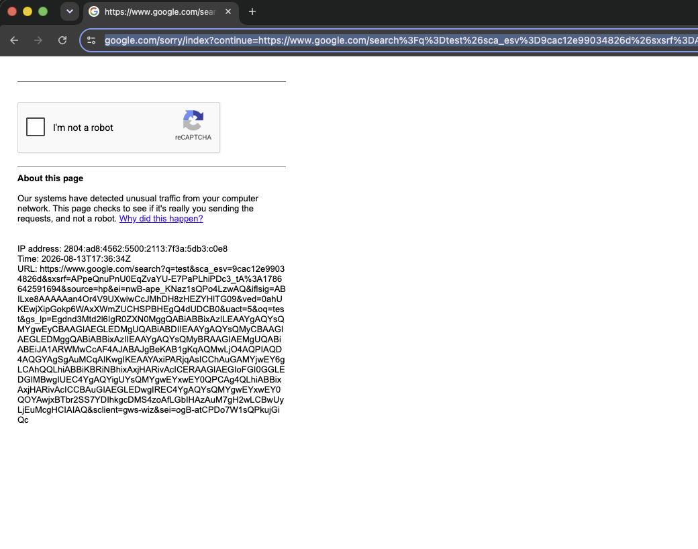

# Fingerprint Injection

`tab.apply_fingerprint()` overrides the browser identity signals that fingerprinting scripts read: User-Agent and Client Hints, `navigator` properties, WebGL, screen metrics, fonts, audio, timezone, and locale. The overridden values have to stay consistent with each other and with the layers `apply_fingerprint()` does not control (see [Cross-layer consistency](#consistency-is-the-whole-game)). An inconsistent fingerprint is more detectable than an unmodified browser.

This is identity substitution, not anonymity: it does not change the network-layer fingerprint or the egress IP.

## Quick Start

Call `apply_fingerprint()` before the first navigation. The JavaScript overrides are registered with `Page.addScriptToEvaluateOnNewDocument`, so they only apply to documents loaded after the call.

```python
import asyncio

from pydoll.browser.chromium import Chrome

from examples.fingerprints import FINGERPRINTS

async def spoof_fingerprint():
    async with Chrome() as browser:
        tab = await browser.start()

        # Apply before the first navigation.
        await tab.apply_fingerprint(FINGERPRINTS['windows11_rtx3060_nyc'])

        await tab.go_to('https://abrahamjuliot.github.io/creepjs/')
        print('Fingerprint applied.')
        await asyncio.sleep(5)

asyncio.run(spoof_fingerprint())
```

`FingerprintConfig` (from `pydoll.protocol.fingerprint.types`) is a typed dictionary. Only the fields present are overridden; the rest keep the real browser values. The profiles in `examples/fingerprints.py` are complete, internally consistent references for the config shape (see [Providing your own profiles](#bring-your-own-fingerprints)).

## Checklist

Rules for a profile that is not detected. Most describe a layer `apply_fingerprint()` cannot control, so the profile has to be chosen to match it rather than fight it.

- Profile OS = host OS. Do not run a Windows profile on macOS or the reverse; the kernel TCP/IP stack and GPU/text rendering expose the real OS in layers CDP does not reach ([OS mismatch](#case-study-an-os-mismatch-triggering-cloudflares-managed-challenge)).
- User-Agent Chrome version = real binary version. Keep `CHROME_DESKTOP` / `CHROME_MOBILE` equal to the major from `browser.get_version()`, and update them on every Chrome upgrade ([Chrome version mismatch](#case-study-a-chrome-version-mismatch-triggering-cloudflares-challenge)).
- Locale, timezone, and geolocation = egress IP country. `Accept-Language` and timezone are cross-referenced against the IP ([Locale/IP mismatch](#case-study-a-locale-mismatch-triggering-googles-captcha)).
- WebGL vendor/renderer = host GPU family (an Apple renderer on Apple hardware, and so on). The rendered pixels come from the real GPU and cannot be forged.
- Apply the fingerprint before the first navigation.
- One identity per browser context; use separate contexts for different identities ([Multiple fingerprints across contexts](#multiple-fingerprints-across-contexts)).
- Do not combine the `--user-agent` option with `apply_fingerprint()`; the fingerprint owns the User-Agent.
- Use a clean residential IP. Injection does not change IP reputation.

## Overrides

Overrides are applied through two mechanisms.

### CDP overrides

Signals Chrome can override itself are set through the DevTools Protocol `Emulation` domain. The browser applies these below the JavaScript layer, so the getter a detection script reads remains the native one and there is no JavaScript wrapper to inspect. When a CDP override exists for a signal, it is used instead of a JavaScript override.

| Signal | CDP command |
|--------|-------------|
| User-Agent, `navigator.platform` / `vendor` / `appVersion`, Client Hints (`Sec-CH-UA*`) | `Emulation.setUserAgentOverride` |
| Timezone (`Intl`, `Date`) | `Emulation.setTimezoneOverride` |
| Geolocation | `Emulation.setGeolocationOverride` |
| Screen size, `devicePixelRatio`, viewport, orientation | `Emulation.setDeviceMetricsOverride` |
| Locale (`Intl` formatting) | `Emulation.setLocaleOverride` |
| `navigator.hardwareConcurrency` | `Emulation.setHardwareConcurrencyOverride` |

`hardwareConcurrency` illustrates the difference: a JavaScript getter is detectable (see below), while `Emulation.setHardwareConcurrencyOverride` changes the value with the getter staying native.

### JavaScript overrides

Signals CDP cannot reach are set by a script injected before any page script on every new document, and replayed in Web Workers. This covers:

- `navigator` extras: `deviceMemory`, `maxTouchPoints`, `doNotTrack`, `pdfViewerEnabled`
- `screen.availWidth` / `availHeight` (CDP forces these equal to the screen size, a headless signal), `colorDepth`, `pixelDepth`, and `window.outerWidth` / `outerHeight`
- WebGL vendor, renderer, and parameter/precision values
- `navigator.mediaDevices`, Web Audio, `speechSynthesis` voices
- Font availability (`document.fonts.check` / `FontFace.load`)
- `navigator.connection` (Network Information API)
- `navigator.permissions` query results
- WebRTC IP handling policy

Canvas and WebGL readback are not modified. Detection systems request the fingerprint repeatedly, so a value that changes between reads is itself an automation signal; the canvas of a real Chrome is stable. The WebGL vendor and renderer strings are overridden to match the claimed platform, but the rendered pixels are left unchanged.

## Detecting JavaScript overrides

Fingerprinting scripts do not only read a property value; they inspect how it was defined and whether the surrounding objects were modified. Three checks are standard, and a naive override fails all three. CreepJS is the reference implementation.

Own-property vs prototype accessor. On a real browser, `hardwareConcurrency` is an accessor on `Navigator.prototype`, not a data property on the `navigator` instance:

```javascript
Object.defineProperty(navigator, 'hardwareConcurrency', { get: () => 8 });
// navigator.hasOwnProperty('hardwareConcurrency') === true   (real Chrome: false)
```

`Object.getOwnPropertyNames(navigator)` or a comparison against the prototype exposes the added own-property.

`toString` of the getter. A native getter reports as native code:

```javascript
Object.getOwnPropertyDescriptor(Navigator.prototype, 'hardwareConcurrency').get.toString();
// real:  "function get hardwareConcurrency() { [native code] }"
// naive: "() => 8"
```

`Function.prototype.toString` returns the JavaScript source of a hand-written getter, so a single call exposes it.

Cross-realm reads. A same-origin `iframe` or a Web Worker is a fresh realm whose `navigator` and prototypes are untouched by a hook installed only in the main realm. A worker's `WorkerNavigator` reporting the real value while the page reports the override is a contradiction.

### How pydoll avoids these signals

- Getters are defined on the prototype (`Navigator.prototype`, `Screen.prototype`), so the instance gains no own-properties.
- Patched getters and methods report as native under `toString`, and the `toString` patch itself does not become a new signal.
- The overrides are replayed in dedicated, shared, and service workers, so the page and the realms it spawns report the same values.

This is why an injected profile passes CreepJS's lie-detection, prototype, worker, and font checks instead of only changing the visible values.

## Headless mode

Headless Chrome exposes signals a headful browser does not, which is why bot checks often failed before fingerprint injection:

- WebGL renderer. Without GPU passthrough, headless Chrome renders through a software rasterizer (SwiftShader). `UNMASKED_RENDERER_WEBGL` reports `ANGLE (Google, Vulkan 1.3.0 (SwiftShader))` or `Google SwiftShader` instead of a real GPU string such as `ANGLE (NVIDIA, NVIDIA GeForce RTX 3060 Direct3D11)` or `Apple M3`. Overriding the string alone is insufficient: the GPU capability surface (supported extensions, shader precision, max texture size) still reflects the software renderer and is cross-checked against the claimed GPU.
- Empty `navigator.plugins` / `mimeTypes`, where headful Chrome exposes the built-in PDF viewer entries.
- `screen.availWidth` / `availHeight` equal to the full screen size (no taskbar or dock gap), and a zeroed outer window.
- Missing media devices, and font/audio rasterization differences from a machine with a display.
- On the old `--headless`, a `HeadlessChrome` token in the User-Agent (removed in `--headless=new`; the rendering signals above remain).

`apply_fingerprint()` overrides the WebGL vendor/renderer and the parameter/precision surface, reports `availWidth`/`availHeight` with a taskbar gap, restores media devices and fonts, and pins the User-Agent through CDP. With a profile applied, the detection sites tested report the browser as headful, and headless no longer changes the result. This allows a Google search to run in headless mode:

```python
import asyncio

from pydoll.browser.chromium import Chrome
from pydoll.constants import Key

from examples.fingerprints import FINGERPRINTS

async def headless_google_search():
    async with Chrome() as browser:
        tab = await browser.start(headless=True)

        # Neutralizes the headless rendering signals before the first navigation.
        await tab.apply_fingerprint(FINGERPRINTS['windows11_rtx3060_nyc'])

        await tab.go_to('https://www.google.com')
        search_box = await tab.find(tag_name='textarea', name='q')
        await search_box.type_text('pydoll', humanize=True)
        await tab.keyboard.press(Key.ENTER)
        await asyncio.sleep(3)
        print('Google search completed in headless mode.')

asyncio.run(headless_google_search())
```

Fingerprint injection removes the headless rendering signals only. It does not change the IP: a datacenter IP with poor reputation is still challenged in headless and headful alike (see [What Determines Success](behavioral-captcha-bypass.md#what-determines-success)).

For Cloudflare Turnstile, the most common failure with a fingerprint applied is a Chrome version mismatch, not headless (see [Chrome version mismatch](#case-study-a-chrome-version-mismatch-triggering-cloudflares-challenge)). Headless Turnstile is still being validated; prefer headful for it.

## Cross-layer consistency {#consistency-is-the-whole-game}

Anti-bot systems correlate signals across layers. `apply_fingerprint()` keeps the layers it controls consistent, but three layers are outside CDP's reach and have to be matched separately:

1. Chrome binary version. The network-layer fingerprint (TLS JA3/JA4, HTTP/2 `SETTINGS`) and the JavaScript engine version come from the real binary and cannot be overridden. A profile claiming Chrome 145 has to run on a Chrome 145 binary (see [Chrome version mismatch](#case-study-a-chrome-version-mismatch-triggering-cloudflares-challenge)).
2. Egress IP geography. The `Accept-Language` header and timezone are checked against the IP's country. A US identity on a Brazilian IP is a contradiction (see [Locale/IP mismatch](#case-study-a-locale-mismatch-triggering-googles-captcha)).
3. Host OS. The kernel TCP/IP stack is a passive OS fingerprint (initial TTL 64 on macOS/Linux, 128 on Windows), and GPU/text rendering also reflects the real OS. Neither is reachable through CDP. A Windows profile on a Mac is an OS contradiction (see [OS mismatch](#case-study-an-os-mismatch-triggering-cloudflares-managed-challenge)).

For the correlation model, see [Browser Fingerprinting](../../deep-dive/fingerprinting/index.md) and [Timezone and Locale Consistency](../../deep-dive/fingerprinting/evasion-techniques.md).

## Locale/IP mismatch (Google) {#case-study-a-locale-mismatch-triggering-googles-captcha}

Applying a US profile caused a plain Google search to return a captcha; removing the `apply_fingerprint()` call removed the block. The profile passed every dedicated fingerprinting site, so the trigger was specific to Google.

The profile declared a US identity (`locale.languages = ['en-US', 'en']`) on a machine behind a Brazilian IP with a Brazilian OS language. Google cross-references the `Accept-Language` header and Client Hints against the IP's country. `en-US` from a São Paulo IP is an unusual combination, and the request headers were inconsistent with the other signals, dropping the trust score below the captcha threshold.

The `locale` field drives:

- the `Accept-Language` HTTP header sent on every request,
- `navigator.language` and `navigator.languages`,
- `Intl` formatting defaults (dates, numbers, currency).

All three are read by anti-abuse systems and have to agree with the timezone and the IP. Setting a Brazilian locale (matching the IP) removed the block with no other change.

<p align="center">
  
</p>
<p align="center"><sub>US locale over a Brazilian IP: Google returns a captcha.</sub></p>

## Chrome version mismatch (Cloudflare Turnstile) {#case-study-a-chrome-version-mismatch-triggering-cloudflares-challenge}

To combine the [Cloudflare Turnstile](behavioral-captcha-bypass.md) interaction with a fingerprint, the advertised Chrome version has to match the real binary. This is the most common cause of Turnstile failure with a fingerprint applied.

Applying the `macos_m3_new_york` profile made Turnstile fail even headful: the page stayed on the "Just a moment…" interstitial, and removing the `apply_fingerprint()` call made it pass. The profile hardcoded Chrome 145 in the User-Agent while the binary was Chrome 151; `apply_fingerprint()` set `navigator.userAgent`, `Sec-CH-UA`, and `navigator.userAgentData` to 145 while the TLS/HTTP2 handshake and the engine stayed 151. A single-variable bisection confirmed it: changing only the advertised major from 145 to 151 turned every failure into a pass.

Two layers report the real version and cannot be overridden through CDP:

- The TLS fingerprint (JA3/JA4) and the HTTP/2 `SETTINGS` frame, produced by the real binary before any JavaScript runs.
- The JavaScript engine surface (available APIs and their behavior), which reflects the real V8/Blink build.

Cloudflare's managed challenge compares the advertised version (User-Agent + Client Hints) against the observed version (handshake and engine). A real browser does not advertise a version it is not running, so 145 over a 151 handshake is an inconsistency and the interstitial does not clear.

Read the binary version and match the profile's User-Agent to it:

```python
async with Chrome() as browser:
    tab = await browser.start()

    version = await browser.get_version()
    print(version['product'])  # e.g. 'Chrome/151.0.7922.137'
```

In `examples/fingerprints.py`, `CHROME_DESKTOP` and `CHROME_MOBILE` set the version in each profile's User-Agent. Set them to the binary's major (the full build feeds `Sec-CH-UA-Full-Version-List`; `navigator.userAgent` is reduced to `Chrome/<MAJOR>.0.0.0`). Update them when Chrome updates.

## OS mismatch (Cloudflare) {#case-study-an-os-mismatch-triggering-cloudflares-managed-challenge}

With the Chrome version aligned, a second profile still failed. On this host (Apple Silicon, Chrome 151, Brazilian IP), `macos_m3_new_york` passes Cloudflare and `windows11_rtx3060_nyc` fails. The versions match (both 151), and the failing profile is the one geographically consistent with the IP, so neither version nor locale is the cause. The difference is the advertised OS.

A single-variable bisection from the passing profile toward the failing one tracked only the OS in the User-Agent:

- User-Agent/platform from Windows to macOS on the failing profile: passes.
- User-Agent/platform from macOS to Windows on the passing profile: fails.
- A Linux User-Agent: fails.
- GPU/WebGL (renderer, params, extensions), canvas, fonts, screen, hardware, audio, voices, geo, locale: no effect.

Any non-macOS OS fails on this macOS host. A macOS profile advertising an NVIDIA GPU passes; a Windows profile advertising the real Apple GPU fails.

Per-layer measurement, both profiles, same Chrome:

- TCP/IP: the server observes the same initial TTL of 64 (macOS/Unix) for both profiles; a Windows host emits 128. Not reachable through CDP.
- TLS (JA3/JA4): varies per connection (Chrome's padding-extension toggle); the fingerprint-free baseline produces both variants. Does not encode the OS.
- HTTP/2 (Akamai): identical between profiles. Does not encode the OS.
- Client Hints: fully overridden to the advertised OS (Windows reports `architecture` `x86`, with no `arm` leak).
- Canvas/WebGL: the rendered-image hash is identical between profiles (real Apple GPU pixels in both). Not the differentiator.

Everything `apply_fingerprint()` controls reports Windows; the kernel TCP/IP stack reports macOS. Cloudflare's managed challenge compares the advertised OS against the passive stack signature and keeps the interstitial when they disagree.

The TTL, window scaling, and TCP option order come from the host kernel, not the browser, and no CDP or JavaScript override reaches them. GPU rendering and text metrics (CoreText on macOS) are also the host's. TLS-forging clients (curl_cffi, tls-client) do not help here: the failure is not in TLS, and they still use the host kernel's TCP/IP stack.

To pass, match the profile OS (and GPU family) to the host: a macOS profile on this Mac, a Windows profile on a Windows host. A forwarding proxy (SOCKS5/HTTP CONNECT) re-originates the TCP connection from the proxy's kernel, so the observed OS becomes the proxy host's; a Windows profile then requires a proxy running on Windows (a Linux proxy gives a Linux signature, still inconsistent with a Windows User-Agent).

## Multiple fingerprints across contexts

Service and shared workers are shared across every tab in a browser context, so a context holds a single identity. Applying a different fingerprint to a context that already has one raises `FingerprintContextConflict`:

```python
from pydoll.exceptions import FingerprintContextConflict

# Same context, two different fingerprints -> conflict
tab_a = await browser.start()
await tab_a.apply_fingerprint(FINGERPRINTS['windows11_rtx3060_nyc'])

tab_b = await browser.new_tab()               # same (default) context
try:
    await tab_b.apply_fingerprint(FINGERPRINTS['macos_m3_new_york'])
except FingerprintContextConflict:
    print('One context holds one identity.')
```

To run different fingerprints concurrently, use a separate browser context per identity:

```python
ctx_id = await browser.create_browser_context()
tab_us = await browser.start()
tab_br = await browser.new_tab(browser_context_id=ctx_id)

await tab_us.apply_fingerprint(FINGERPRINTS['windows11_rtx3060_nyc'])
await tab_br.apply_fingerprint(FINGERPRINTS['android_s24_ultra_sao_paulo'])
```

See [Browser Contexts](../browser-management/contexts.md) for how isolated contexts work.

## Providing your own profiles {#bring-your-own-fingerprints}

Pydoll does not generate or ship fingerprints. The profiles in `examples/fingerprints.py` are a reference for the coherence a profile requires and the `FingerprintConfig` shape; they are not a catalog to deploy as-is.

A profile has to match its environment:

- the Chrome binary in use (the network layer is authentic and cannot be overridden), and
- the egress IP geography (locale, timezone, geolocation).

A public profile reused widely becomes a shared signature rather than a disguise.

## See Also

- [Browser Fingerprinting](../../deep-dive/fingerprinting/index.md) - layer-by-layer detection
- [Evasion Techniques](../../deep-dive/fingerprinting/evasion-techniques.md) - timezone/locale consistency, User-Agent consistency, WebRTC leak protection
- [Browser Fingerprinting (detection surface)](../../deep-dive/fingerprinting/browser-fingerprinting.md) - canvas, WebGL, navigator, and font detection
- [Browser Contexts](../browser-management/contexts.md) - isolated identities
- [Proxy Configuration](../configuration/proxy.md) - matching the egress IP to the profile
