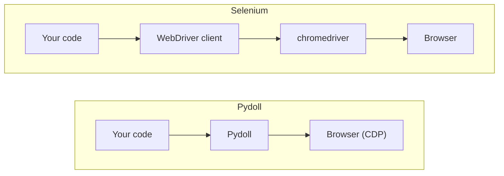

# Core concepts

Pydoll is built on a few design decisions that shape how you write every script: no webdriver, an async API, humanized interactions, and an event system. This page explains each one at a working level, so the task guides that follow make sense.

## No webdriver

Pydoll connects straight to the browser over the Chrome DevTools Protocol (CDP), the same protocol that powers Chrome DevTools when you open the inspector. There is no webdriver executable in between, so there is nothing to download and no "chromedriver only supports Chrome version X" mismatch to debug.



When you start a browser, Pydoll launches the Chrome you already have installed with a remote-debugging port and opens a WebSocket to its CDP endpoint:

```python
import asyncio

from pydoll.browser.chromium import Chrome


async def main():
    async with Chrome() as browser:
        tab = await browser.start()
        await tab.go_to('https://quotes.toscrape.com')

asyncio.run(main())
```

You don't manage the port, the connection, or the browser process; `start()` does it, and the `async with` block stops the browser when you're done.

## The browser and tab objects

Two objects cover most of what you do. The **browser** (`Chrome` or `Edge`) is the process you launch. The **tab**, returned by `browser.start()`, is what you drive: navigation, element finding, screenshots, everything on the page happens through it.

```python
async with Chrome() as browser:
    tab = await browser.start()          # the first tab
    await tab.go_to('https://quotes.toscrape.com')

    second = await browser.new_tab()     # open more tabs from the browser
    await second.go_to('https://books.toscrape.com')
```

See [Tabs](tabs.md) for managing several tabs at once, and [Browser contexts](browser-contexts.md) for isolating sessions.

## Everything is async

Every Pydoll call is a coroutine, so you `await` it inside an `async def` function and start the program with `asyncio.run()`. This is not a compatibility layer bolted on; it is how Pydoll drives many tabs and browsers at once. Because navigation and element waits spend most of their time idle, `asyncio.gather` runs them concurrently instead of one after another:

```python
import asyncio

from pydoll.browser.chromium import Chrome


async def title_of(browser, url):
    tab = await browser.new_tab(url)
    title = await tab.title
    await tab.close()
    return title


async def main():
    urls = [
        'https://quotes.toscrape.com/page/1/',
        'https://quotes.toscrape.com/page/2/',
        'https://quotes.toscrape.com/page/3/',
    ]
    async with Chrome() as browser:
        await browser.start()
        titles = await asyncio.gather(*(title_of(browser, url) for url in urls))
        print(titles)

asyncio.run(main())
```

The three pages load concurrently, so the whole thing takes about as long as the slowest single page, not the sum of all three.

!!! note "New to async Python?"
    If `async`, `await`, and `gather` are unfamiliar, read [Async Python in practice](../basics/async-python.md) first. It covers just enough asyncio to be comfortable with the rest of these guides.

## Humanized interactions

By default a click lands in the center of an element and typing runs at a fixed rhythm. Pass `humanize=True` and Pydoll moves the cursor along a curved path before clicking and types with variable timing, including the occasional corrected typo:

```python
search = await tab.find(id='search')
await search.type_text('web scraping', humanize=True)
await search.click(humanize=True)
```

Humanization is opt-in per interaction, so you use it where a site watches behavior and skip it where raw speed matters. See [Human-like interactions](../stealth/human-like-interactions.md) for the timing model, and [Keyboard](keyboard.md) and [Mouse](mouse.md) for the full input APIs.

## Event-driven

Instead of polling the page in a loop, you can subscribe to browser events and run a callback when they fire. This is how you capture network traffic, react to navigation, or wait for a specific request:

```python
import asyncio
from functools import partial

from pydoll.browser.chromium import Chrome
from pydoll.protocol.network.events import NetworkEvent


async def on_request(tab, event):
    url = event['params']['request']['url']
    if '/api/' in url:
        print(f'API call: {url}')


async def main():
    async with Chrome() as browser:
        tab = await browser.start()

        await tab.enable_network_events()
        await tab.on(NetworkEvent.REQUEST_WILL_BE_SENT, partial(on_request, tab))

        await tab.go_to('https://quotes.toscrape.com')
        await asyncio.sleep(2)

asyncio.run(main())
```

Enable only the event domains you use, and disable them when you're done. See [Events](events.md) for the full model and [Network monitoring](network-monitoring.md) for traffic capture.

## Works across Chromium browsers

The same API drives any Chromium browser. Chrome is the primary target; Edge has full support; other Chromium builds work by pointing `binary_location` at them.

```python
from pydoll.browser.chromium import Chrome, Edge
from pydoll.browser.options import ChromiumOptions

# Chrome
async with Chrome() as browser:
    tab = await browser.start()

# Edge
async with Edge() as browser:
    tab = await browser.start()

# Any other Chromium build (Brave, Vivaldi, Opera, ...)
options = ChromiumOptions()
options.binary_location = '/path/to/brave-browser'
async with Chrome(options=options) as browser:
    tab = await browser.start()
```

## What's next

- [Element finding](element-finding.md): locate elements with `find()` and `query()`.
- [Structured extraction](structured-extraction.md): pull typed data out of a page with a model.
- [Events](events.md): react to page and network events as they fire.
- [Chrome DevTools Protocol](../deep-dive/cdp.md): the protocol Pydoll speaks to the browser, in depth.
