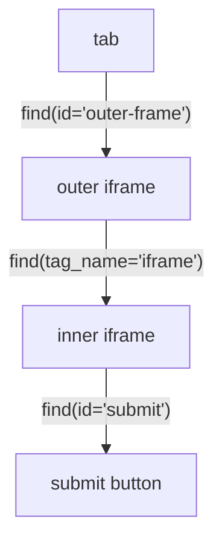

# Iframes

Pages embed other documents with `<iframe>`, and an iframe has its own DOM context. Pydoll routes searches into that context for you, so you find the iframe element once and then work inside it with the same `find()` and `query()` you use everywhere else. There is no frame to switch into and out of, and nothing to switch back from.

## Interact with an iframe

Find the `<iframe>` like any element, then call `find()` or `query()` on it. Those calls run inside the frame automatically.

```python
import asyncio

from pydoll.browser.chromium import Chrome


async def main():
    async with Chrome() as browser:
        tab = await browser.start()
        await tab.go_to('https://the-internet.herokuapp.com/iframe')

        editor = await tab.find(tag_name='iframe')   # the embedded editor frame
        body = await editor.find(id='tinymce')        # an element inside the frame
        print(await body.text)

asyncio.run(main())
```

`tab.find()` and `tab.query()` only see the top-level document. To reach content inside a frame, start from the iframe element, not the tab.

## Nested iframes

A frame can contain another frame. Keep chaining: each search is scoped to the element you call it on.




```python
outer = await tab.find(id='outer-frame')
inner = await outer.find(tag_name='iframe')

submit = await inner.find(id='submit')
await submit.click()
```

The pattern is always the same: find the iframe element, use that element to keep searching, repeat for deeper levels. You never cache frame targets or open extra tabs.

## Run JavaScript inside a frame

`execute_script()` on an iframe element runs in the frame's own execution context, for same-origin and cross-origin frames alike.

```python
iframe = await tab.find(tag_name='iframe')
result = await iframe.execute_script('return document.title', return_by_value=True)
print(result['result']['result']['value'])
```

## Capture a frame's content

`tab.take_screenshot()` captures the top-level page only. To capture something inside a frame, screenshot an element within it:

```python
iframe = await tab.find(tag_name='iframe')
chart = await iframe.find(id='sales-chart')
await chart.take_screenshot('chart.png')
```

## Cross a frame boundary in one selector

Instead of finding each iframe and then searching inside it, you can write one selector that crosses frame boundaries. Pydoll detects `iframe` steps, splits the selector at each boundary, and walks the chain for you.

### With CSS

Use a combinator (`>` or a space) after an `iframe` compound:

```python
# cross one iframe
button = await tab.query('iframe > .submit-btn')

# match the iframe by attribute
pay = await tab.query('iframe[src*="checkout"] > #pay-button')

# nested iframes
content = await tab.query('iframe.outer > iframe.inner > div.content')

# iframe below the root, not at it
submit = await tab.query('div > iframe > button.submit')
```

### With XPath

Use `/` after an `iframe` step:

```python
# cross one iframe
button = await tab.query('//iframe/body/button[@id="submit"]')

# predicate on the iframe
heading = await tab.query('//iframe[@src*="cloudflare"]//h1')

# nested iframes
element = await tab.query('//iframe[@id="outer"]//iframe[@id="inner"]//div')
```

A crossing selector does exactly what the manual version does, in one call:

```python
# one call across the frame boundary
button = await tab.query('iframe[src*="checkout"] > form > button')

# the same thing, spelled out
iframe = await tab.find(tag_name='iframe', src='*checkout*')
button = await iframe.query('form > button')
```

The last segment honors `find_all=True`, returning every match inside the final frame:

```python
links = await tab.query('iframe > a', find_all=True)
```

!!! note "When the selector is not split"
    Splitting happens only when `iframe` is a **tag name**. These pass through unchanged, because none of them selects an iframe element: `.iframe > body` (class), `#iframe > body` (id), `div.iframe > body` (tag is `div`), `[data-type="iframe"] > body` (attribute), and a bare `iframe` or `//iframe` (nothing follows to search inside).

## Cross-origin frames and captchas

Widgets like Cloudflare Turnstile live in cross-origin iframes (out-of-process frames, or OOPIFs) and often hide their controls in a closed shadow root. `tab.find_shadow_roots(deep=True, timeout=...)` reaches into those frames. See [DOM traversal](dom-traversal.md) for the shadow-root API and [Captcha bypass](../stealth/captcha-bypass.md) for handling Turnstile end to end.

!!! note "Migrating from `tab.get_frame()`"
    Earlier versions converted an iframe into a separate object with `tab.get_frame()`. That method is deprecated and will be removed. Work with the iframe `WebElement` directly, as shown above.

## What's next

- [Element finding](element-finding.md): the `find()` and `query()` calls you use inside a frame.
- [DOM traversal](dom-traversal.md): shadow roots and cross-origin frame traversal.
- [Screenshots and PDFs](screenshots-and-pdfs.md): capturing element and page output.
