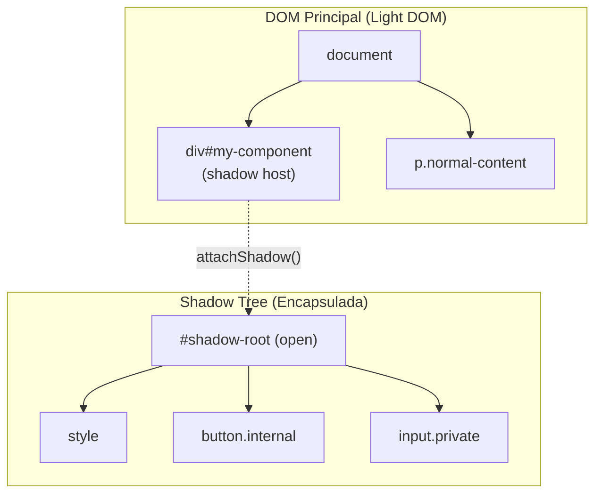
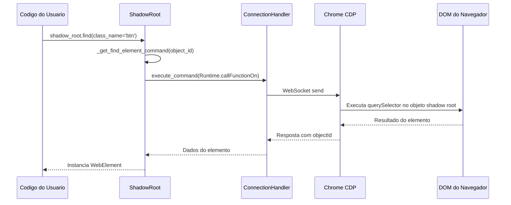
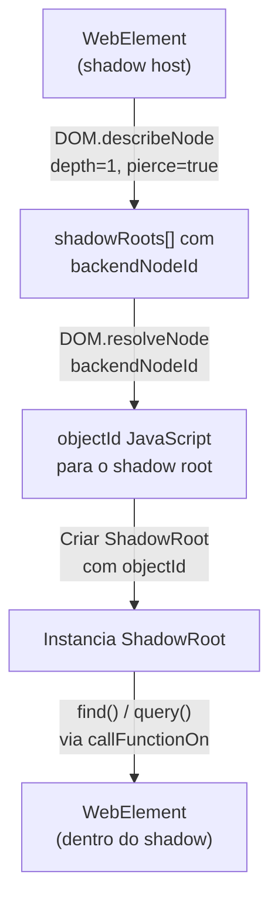
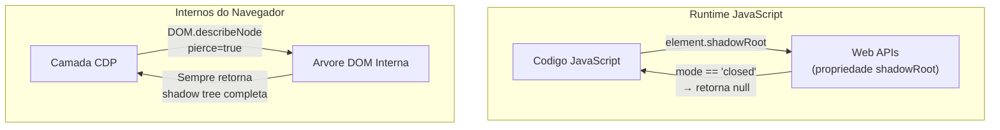
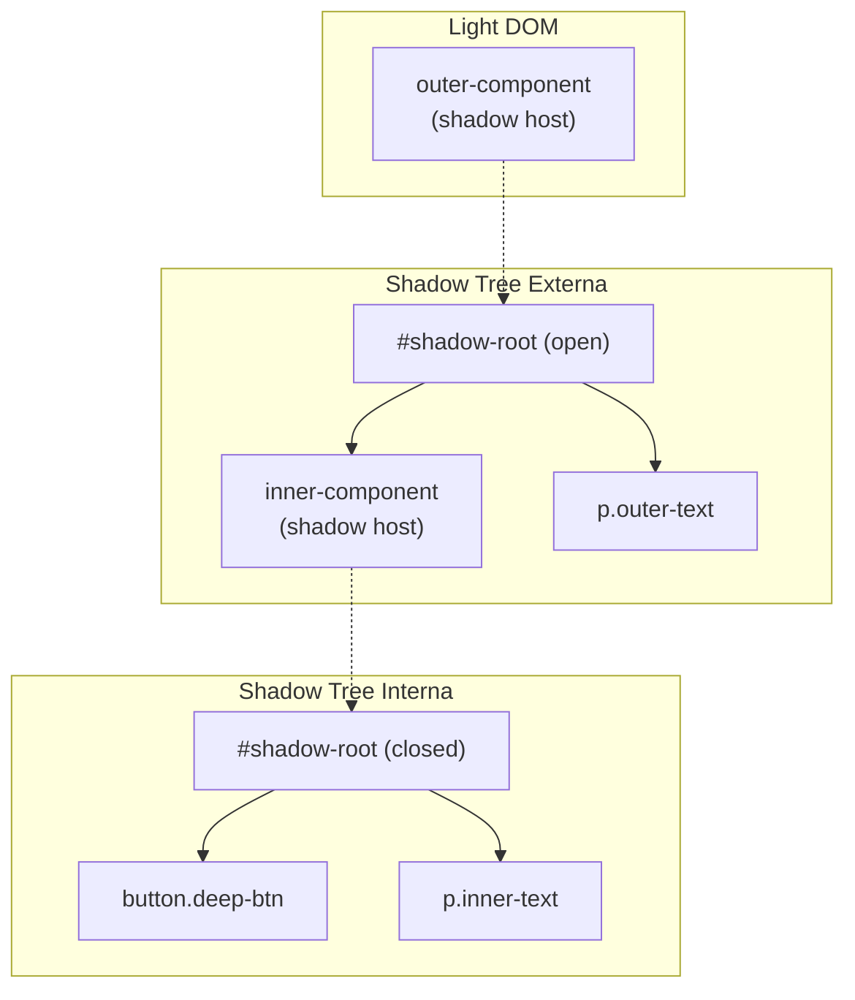

# Arquitetura do Shadow DOM

O Shadow DOM e um dos aspectos mais desafiadores da automacao web moderna. Elementos dentro de shadow trees sao invisiveis para consultas DOM regulares, o que quebra abordagens tradicionais de automacao. Este documento explica como o Shadow DOM funciona no nivel do navegador, por que ferramentas convencionais falham com shadow roots fechados, e como o Pydoll contorna essas restricoes atraves de acesso direto via CDP.

!!! info "Guia de Uso Pratico"
    Para exemplos de uso e padroes de inicio rapido, consulte o [Guia de Pesquisa de Elementos — secao Shadow DOM](../../features/element-finding.md#suporte-a-shadow-dom).

## O que e Shadow DOM?

Shadow DOM e um padrao web que permite **encapsulamento DOM**. Ele permite que um componente tenha sua propria arvore DOM isolada (a "shadow tree") anexada a um elemento DOM regular (o "shadow host"). Elementos dentro de uma shadow tree ficam ocultos das consultas do documento principal.



### Modos do Shadow Root

Quando um componente cria um shadow root via `attachShadow()`, ele especifica um **modo**:

| Modo | Acesso JavaScript | Acesso CDP | Uso Comum |
|------|-------------------|------------|-----------|
| `open` | `element.shadowRoot` retorna o root | Acesso total via `backendNodeId` | Web components customizados (Lit, Stencil) |
| `closed` | `element.shadowRoot` retorna `null` | Acesso total via `backendNodeId` | Componentes sensiveis, formularios de pagamento |
| `user-agent` | Nao acessivel via JS | Acesso limitado | UI interna do navegador (placeholders, controles de video) |

Essa distincao e critica: **o acesso no nivel JavaScript e restrito pelo modo, mas o acesso no nivel CDP nao e.**

### Por que a Automacao Tradicional Falha

Ferramentas de automacao tradicionais dependem da execucao de JavaScript no contexto da pagina:

```javascript
// Abordagem WebDriver / Selenium
document.querySelector('#my-component')        // ✓ Encontra o host
document.querySelector('#my-component button') // ✗ Nao cruza a fronteira do shadow
element.shadowRoot                             // ✗ Retorna null para roots fechados
```

A fronteira do shadow e imposta pelo motor JavaScript do navegador. Qualquer ferramenta de automacao que executa JavaScript para encontrar elementos vai encontrar essa barreira. Isso inclui Selenium, `page.evaluate()` do Playwright, e qualquer ferramenta usando `Runtime.evaluate()` com `document.querySelector()` no nivel do documento.

## Como o Pydoll Contorna as Fronteiras do Shadow

A abordagem do Pydoll funciona em uma camada **abaixo do JavaScript**: o Chrome DevTools Protocol. O CDP tem acesso direto a representacao interna do DOM do navegador, que ignora restricoes de modo do shadow completamente.

### A Vantagem do CDP



O insight chave esta em **como o objeto shadow root e obtido** e **como as consultas sao executadas contra ele**:

1. **Descoberta**: `DOM.describeNode` com `pierce=true` retorna nos de shadow root com seu `backendNodeId`, independente do modo
2. **Resolucao**: `DOM.resolveNode` converte um `backendNodeId` em um `objectId` JavaScript que referencia o shadow root diretamente
3. **Consulta**: `Runtime.callFunctionOn` executa `this.querySelector()` no `objectId` do shadow root; isso funciona porque a chamada e feita **no proprio objeto shadow root**, nao a partir do contexto do documento

### Passo a Passo: Acesso ao Shadow Root



#### Passo 1: Descrever o No Host

```python
# Pydoll envia este comando CDP:
{
    "method": "DOM.describeNode",
    "params": {
        "objectId": "<host-element-object-id>",
        "depth": 1,
        "pierce": true  # ← Esta e a flag chave
    }
}
```

O parametro `pierce` diz ao CDP para atravessar fronteiras do shadow ao descrever o no. A resposta inclui informacoes do shadow root independente do modo do shadow root:

```json
{
    "result": {
        "node": {
            "nodeName": "DIV",
            "shadowRoots": [
                {
                    "nodeId": 0,
                    "backendNodeId": 5,
                    "shadowRootType": "closed",
                    "childNodeCount": 4
                }
            ]
        }
    }
}
```

!!! warning "nodeId vs backendNodeId"
    Quando o dominio DOM nao esta explicitamente habilitado (que e o padrao do Pydoll para minimizar overhead), `nodeId` e sempre `0`. O `backendNodeId` e o identificador estavel e sempre disponivel. O Pydoll usa `backendNodeId` exclusivamente para resolucao de shadow root, e por isso funciona sem necessitar de `DOM.enable()`.

#### Passo 2: Resolver para Objeto JavaScript

```python
# Converter backendNodeId em um objectId utilizavel:
{
    "method": "DOM.resolveNode",
    "params": {
        "backendNodeId": 5
    }
}
```

A resposta fornece um `objectId`, um handle para o shadow root no espaco de objetos do JavaScript:

```json
{
    "result": {
        "object": {
            "objectId": "-2296764575741119861.1.3"
        }
    }
}
```

#### Passo 3: Consultar Dentro do Shadow Root

Com o `objectId` do shadow root, o Pydoll aproveita o mecanismo de busca relativa existente do `FindElementsMixin`:

```python
# Quando ShadowRoot.find(class_name='btn') e chamado:
{
    "method": "Runtime.callFunctionOn",
    "params": {
        "functionDeclaration": "function() { return this.querySelector(\".btn\"); }",
        "objectId": "-2296764575741119861.1.3"
    }
}
```

A funcao executa com `this` vinculado ao objeto shadow root. Como shadow roots implementam as interfaces `querySelector()` e `querySelectorAll()` nativamente, seletores CSS funcionam naturalmente dentro da fronteira do shadow.

## Arquitetura do ShadowRoot

### Decisao de Design: Reutilizar FindElementsMixin

A decisao arquitetural mais critica foi fazer `ShadowRoot` herdar de `FindElementsMixin`:

```python
class ShadowRoot(FindElementsMixin):
    def __init__(self, object_id, connection_handler, mode, host_element):
        self._object_id = object_id               # Referencia CDP do shadow root
        self._connection_handler = connection_handler  # Para comunicacao CDP
        self._mode = mode                          # Enum ShadowRootType
        self._host_element = host_element          # Referencia de volta ao host
```

**Por que isso funciona**: `FindElementsMixin._find_element()` verifica `hasattr(self, '_object_id')`. Quando presente, usa `RELATIVE_QUERY_SELECTOR`, que chama `this.querySelector()` no objeto referenciado. Como shadow roots suportam `querySelector()` nativamente, toda a API de busca de elementos funciona automaticamente sem nenhum codigo especifico para shadow.

```python
# Esta unica linha no FindElementsMixin habilita buscas em shadow root:
elif hasattr(self, '_object_id'):
    command = self._get_find_element_command(by, value, self._object_id)
```

Isso significa que `ShadowRoot` herda `find()`, `query()`, `find_or_wait_element()`, e todas as estrategias de seletor (CSS, XPath, ID, class name, tag name, atributos) gratuitamente.

!!! tip "Consistencia Arquitetural"
    Este e o mesmo mecanismo que faz `WebElement.find()` buscar dentro dos filhos de um elemento: o atributo `_object_id` sinaliza "busque relativo a mim" em vez de "busque no documento inteiro." `ShadowRoot`, `WebElement` e `Tab` compartilham comportamento identico de busca de elementos atraves do `FindElementsMixin`.

### Relacionamento entre Classes

| Classe | Tem `_object_id` | Tem `_connection_handler` | Escopo de Busca |
|--------|:-:|:-:|---|
| `Tab` | Nao | Sim | Documento inteiro |
| `WebElement` | Sim | Sim | Dentro da subarvore do elemento |
| `ShadowRoot` | Sim | Sim | Dentro da shadow tree |

Todos os tres herdam de `FindElementsMixin`. A presenca ou ausencia de `_object_id` determina se as buscas sao globais no documento ou com escopo para um no especifico.

### Resolvendo Shadow Roots: Estrategia backendNodeId

O Pydoll deliberadamente usa `backendNodeId` em vez de `nodeId` para resolucao de shadow root:

| Propriedade | `nodeId` | `backendNodeId` |
|-------------|----------|-----------------|
| Requer `DOM.enable()` | Sim | Nao |
| Estavel entre chamadas describe | Nao (0 quando DOM nao habilitado) | Sim |
| Funciona para resolucao de shadow root | Apenas com DOM habilitado | Sempre |
| Overhead de performance | Maior (rastreamento do dominio DOM) | Nenhum |

Ao confiar no `backendNodeId`, o Pydoll evita o overhead de habilitar o dominio DOM enquanto mantem acesso confiavel ao shadow root. Esta e uma escolha pragmatica: a maioria dos cenarios de automacao nao precisa do stream de eventos do dominio DOM, e habilita-lo adiciona overhead de memoria e processamento para rastrear cada mutacao do DOM.

## Shadow Roots Fechados: Por que o Acesso CDP Funciona

Esta e a pergunta mais frequente: **se `element.shadowRoot` retorna `null` para shadow roots fechados em JavaScript, como o CDP pode acessa-los?**

A resposta esta em entender a arquitetura do navegador:



**Acesso JavaScript** passa pela camada de Web API, que impoe a restricao de modo do shadow. Quando `mode='closed'`, a API retorna `null`; esta e uma fronteira de controle de acesso intencional para codigo de paginas web.

**Acesso CDP** opera abaixo da camada de Web API. Ele se comunica diretamente com a representacao interna do DOM do navegador. A restricao do modo `closed` e uma **politica no nivel JavaScript**, nao uma **restricao no nivel DOM**. A shadow tree ainda existe no DOM; ela apenas esta oculta da visao do JavaScript.

!!! info "Implicacoes de Seguranca"
    Isso e por design no DevTools Protocol. O CDP e destinado a ferramentas de depuracao e automacao que precisam de acesso total ao DOM. O modo `closed` protege conteudos do shadow de outros scripts na mesma pagina (ex: scripts de terceiros), nao da interface de depuracao do navegador. Esta e a mesma razao pela qual o DevTools do navegador consegue inspecionar shadow roots fechados no painel Elements.

### Verificacao Pratica

Voce pode verificar esse comportamento:

```python
import asyncio
from pydoll.browser.chromium import Chrome
from pydoll.protocol.dom.types import ShadowRootType

async def verify_closed_access():
    async with Chrome() as browser:
        tab = await browser.start()
        await tab.go_to('about:blank')

        # Criar um shadow root fechado via JavaScript
        await tab.execute_script("""
            const host = document.createElement('div');
            host.id = 'test-host';
            document.body.appendChild(host);
            const shadow = host.attachShadow({ mode: 'closed' });
            shadow.innerHTML = '<p class="secret">Conteudo oculto</p>';
        """)

        # JavaScript nao consegue acessar:
        result = await tab.execute_script(
            "return document.getElementById('test-host').shadowRoot",
            return_by_value=True,
        )
        js_value = result['result']['result'].get('value')
        print(f"JS shadowRoot: {js_value}")  # None

        # Mas o Pydoll consegue:
        host = await tab.find(id='test-host')
        shadow = await host.get_shadow_root()
        print(f"Modo do shadow: {shadow.mode}")  # ShadowRootType.CLOSED

        secret = await shadow.find(class_name='secret')
        text = await secret.text
        print(f"Conteudo: {text}")  # "Conteudo oculto"

asyncio.run(verify_closed_access())
```

## Shadow Roots Aninhados

Web components frequentemente compoem outros web components, criando shadow trees em multiplos niveis:



O Pydoll lida com isso naturalmente encadeando chamadas `get_shadow_root()`. Cada `ShadowRoot` produz instancias `WebElement` que podem ter seus proprios shadow roots:

```python
outer_host = await tab.find(tag_name='outer-component')
outer_shadow = await outer_host.get_shadow_root()        # open

inner_host = await outer_shadow.find(tag_name='inner-component')
inner_shadow = await inner_host.get_shadow_root()        # closed, ainda funciona

deep_button = await inner_shadow.find(class_name='deep-btn')
await deep_button.click()
```

Cada nivel segue o mesmo fluxo de resolucao CDP: `describeNode` depois `resolveNode` depois `ShadowRoot` com `_object_id` depois `querySelector` via `callFunctionOn`.

## Limitacoes e Casos Especiais

### XPath Dentro de Shadow Roots

Expressoes XPath funcionam dentro de shadow roots quando usam XPath relativo (que o Pydoll trata automaticamente). Porem, XPath absoluto a partir da raiz do documento nao consegue atravessar fronteiras do shadow:

```python
# Funciona: XPath relativo dentro do shadow root
element = await shadow_root.query('.//div[@class="content"]')

# Funciona: Pydoll auto-converte para relativo
element = await shadow_root.find(name='email')  # Usa XPath internamente

# Nao encontra conteudo shadow: XPath no nivel do documento
element = await tab.query('//div[@id="host"]//button')  # Nao cruza fronteira
```

### Shadow Roots User-Agent

Shadow roots internos do navegador (ex: estilizacao de placeholder de `<input>`, controles de `<video>`) sao do tipo `user-agent`. Eles sao acessiveis via CDP, mas sua estrutura interna varia entre versoes do navegador e nao faz parte de nenhum padrao web.

```python
input_element = await tab.find(tag_name='input')
try:
    ua_shadow = await input_element.get_shadow_root()
    # ua_shadow.mode == ShadowRootType.USER_AGENT
    # Estrutura interna e especifica do navegador
except ShadowRootNotFound:
    pass  # Nem todos os inputs tem shadow roots user-agent
```

!!! warning "Estabilidade de Shadow Roots User-Agent"
    Nao construa logica de automacao que dependa da estrutura interna de shadow roots user-agent. Sua estrutura DOM e um detalhe de implementacao que pode mudar entre versoes do navegador sem aviso.

### Referencias de Shadow Root Obsoletas

Se o elemento host for removido do DOM e re-adicionado (comum em aplicacoes single-page), o `objectId` do shadow root se torna obsoleto. A solucao e re-adquirir o shadow root:

```python
# Apos uma navegacao de pagina ou reconstrucao do DOM:
host = await tab.find(id='my-component', timeout=5)  # Re-encontrar o host
shadow = await host.get_shadow_root()                 # Shadow root atualizado
```

## Pontos-Chave

- **Encapsulamento Shadow DOM** oculta elementos do `querySelector()` no nivel do documento, quebrando automacao tradicional
- **CDP opera abaixo da camada de API JavaScript**, contornando restricoes de modo do shadow completamente
- **`backendNodeId`** e o identificador estavel usado para resolucao de shadow root, evitando a necessidade de habilitar o dominio DOM
- **`ShadowRoot` herda `FindElementsMixin`**, ganhando `find()`, `query()`, e todas as estrategias de seletor automaticamente atraves do mecanismo `_object_id`
- **Shadow roots fechados** sao totalmente acessiveis porque o modo `closed` e uma politica no nivel JavaScript, nao uma restricao no nivel DOM
- **Shadow roots aninhados** funcionam naturalmente encadeando chamadas `get_shadow_root()` em cada nivel

## Documentacao Relacionada

- **[Guia de Pesquisa de Elementos](../../features/element-finding.md)**: Uso pratico de `find()`, `query()`, e acesso a shadow root
- **[Arquitetura do FindElements Mixin](./find-elements-mixin.md)**: Como o mecanismo `_object_id` habilita buscas com escopo
- **[Dominio WebElement](./webelement-domain.md)**: Como elementos interagem com CDP
- **[Camada de Conexao](../fundamentals/connection-layer.md)**: Comunicacao WebSocket com o navegador
