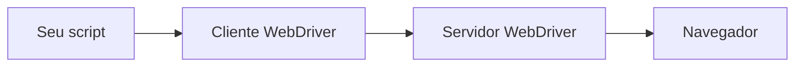
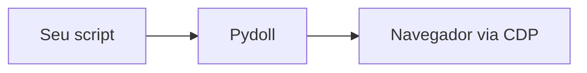

# Chrome DevTools Protocol

O Chrome DevTools Protocol (CDP) é a interface que o Pydoll usa para controlar o navegador. É o mesmo protocolo que o Chrome DevTools fala quando você inspeciona uma página, exposto como uma API programável. Entendê-lo explica de onde vêm as capacidades do Pydoll e por que não há webdriver na jogada.

## O que é o CDP

O CDP é um protocolo para controlar navegadores baseados em Chromium de forma programática. As mensagens são JSON, enviadas por um WebSocket, e organizadas em domínios que cobrem cada uma uma área do navegador: `Page` para navegação e ciclo de vida, `DOM` para a estrutura da página, `Network` para o tráfego, `Runtime` para JavaScript, `Input` para mouse e teclado, `Fetch` para interceptação de requisições, `Target` para abas e contextos, e outros.

O Google mantém o CDP e o estende a cada release do Chrome. Como foi construído para dirigir o próprio DevTools do Chrome, ele alcança fundo o navegador, e é por isso que se tornou a base para ferramentas de automação como Puppeteer, Playwright e Pydoll.

O Pydoll fala CDP diretamente, então suas capacidades são o que quer que o CDP exponha. Não há uma camada de automação separada decidindo o que você pode e não pode fazer.

## Como a conexão funciona

Inicie um navegador Chromium com a flag de depuração remota e ele abre um servidor WebSocket naquela porta:

```
chrome --remote-debugging-port=9222
```

O Pydoll conecta a esse WebSocket e mantém a conexão aberta durante toda a sessão. O canal é bidirecional: seu código envia comandos ao navegador, e o navegador empurra eventos de volta conforme eles acontecem, pela mesma conexão.

<iframe scrolling="no" src="/docs/resources/visuals/cdp-connection.html" aria-label="Pydoll and Chrome exchange framed JSON over one WebSocket: commands are matched to their responses by id and resolved inline, while unsolicited events flow through a separate queue drained to callbacks" style="width: 100%; height: 560px; border: 0;" loading="lazy"></iframe>

Um WebSocket persistente serve à automação melhor do que os endpoints HTTP de requisição/resposta que protocolos mais antigos usavam: o navegador te notifica no instante em que algo acontece, em vez de você ficar consultando para descobrir.

## Domínios

O CDP agrupa seus métodos e eventos em domínios. Os que você mais encontra em automação:

| Domínio | Cobre | Usos de exemplo |
|--------|--------|--------------|
| Browser | a aplicação do navegador | gerenciamento de janelas, criação de contextos de navegador |
| Page | o ciclo de vida da página | navegação, execução de JavaScript, frames |
| DOM | a estrutura da página | consultar elementos, ler e definir atributos |
| Network | o tráfego | observar requisições e respostas, cache |
| Runtime | o motor JavaScript | avaliar expressões, chamar funções |
| Input | entrada do usuário | movimento de mouse, teclado, toque |
| Target | abas e contextos | abrir abas, alcançar iframes, lidar com popups |
| Fetch | interceptação de baixo nível | modificar requisições, mockar respostas, autenticação |

O Pydoll mapeia esses domínios para uma API mais amigável, então `tab.go_to(...)` envia um comando `Page.navigate` e `tab.find(...)` usa consultas `DOM`, sem você montar as mensagens cruas.

## Comandos e eventos

Toda interação de CDP é um de dois tipos de mensagem.

Um **comando** é uma requisição que você envia: um método de domínio com parâmetros. O navegador o executa e responde com um resultado, associado à sua mensagem por um id. `Page.navigate`, `DOM.getDocument` e `Input.dispatchMouseEvent` são comandos.

Um **evento** é uma notificação que o navegador envia por conta própria, uma vez que você habilita o domínio dele. `Page.loadEventFired`, `Network.requestWillBeSent` e `Fetch.requestPaused` são eventos. Você se inscreve com um callback e reage quando ele dispara:

```python
from functools import partial

from pydoll.protocol.network.events import NetworkEvent


async def on_request(tab, event):
    url = event['params']['request']['url']
    print(f'request to: {url}')


await tab.enable_network_events()
await tab.on(NetworkEvent.REQUEST_WILL_BE_SENT, partial(on_request, tab))
```

Eventos são o motivo de a automação sobre CDP poder reagir no instante em que o navegador muda de estado, em vez de dormir e torcer. Veja [Eventos](../guides/events.md) para o guia prático.

## Targets e sessões

O CDP chama cada coisa à qual você pode se conectar de **target**: o próprio navegador, cada aba, e iframes fora do processo são targets separados. Conectar-se a um target abre uma **sessão**, e os comandos para aquele target carregam o `sessionId` dele para que o navegador saiba para onde roteá-los.

É assim que uma única conexão WebSocket dirige muitas abas ao mesmo tempo, e como comandos alcançam um elemento dentro de um iframe cross-origin. O Pydoll cuida do roteamento de target e sessão para você, então um objeto `Tab` funciona sem você rastrear ids de sessão.

## Por que não existe webdriver

Ferramentas tradicionais de webdriver colocam um servidor de tradução entre seu código e o navegador:



O servidor traduz o protocolo WebDriver para as chamadas nativas do navegador, que é a peça que você precisa instalar e casar a versão com o seu navegador. O Pydoll fala com o navegador diretamente:



Não há um driver separado para baixar ou manter em sincronia, e a conexão é o mesmo canal orientado a eventos que o navegador usa internamente. Veja [Conceitos centrais](../guides/core-concepts.md) para o que isso significa quando você escreve scripts.

## Relacionado

- [Visão geral do Deep Dive](index.md): os outros assuntos de fundo.
- [Conceitos centrais](../guides/core-concepts.md): o modelo de aba e navegador em nível prático.
- [Eventos](../guides/events.md): assinar eventos do CDP na prática.
- [Especificação do CDP](https://chromedevtools.github.io/devtools-protocol/): a referência completa de domínios e métodos.
