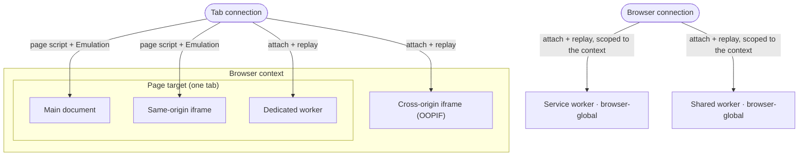

# Workers e iframes cross-origin

Um script de fingerprinting não lê a sua identidade uma única vez. Ele a relê dentro de cada iframe e Web Worker que a página consegue gerar, e cada um desses é um realm JavaScript separado com o próprio `navigator`. Se a página reporta a identidade Windows injetada mas um worker reporta o macOS real, essa divergência é a denúncia.

Então uma identidade injetada tem que se sustentar em *todos* os realms, não apenas no documento de topo. Esta página é o mecanismo por trás da nota de [Injeção de fingerprint](../../stealth/fingerprint-injection.md) de que os overrides são "replicados em workers", e a forma geral do vazamento de tela cross-origin do [Cloudflare](cloudflare-challenge.md). Ela cobre o que é um realm, por que alguns overrides alcançam todos os realms de graça enquanto outros alcançam apenas um, e como o Pydoll replica a identidade nos realms que ele precisa alcançar manualmente.

## Um realm é uma cópia nova do ambiente do navegador

Um realm é um global JavaScript independente: o próprio `window` ou `self`, o próprio `navigator`, a própria cadeia de prototypes. O documento principal é um realm. Cada iframe é outro. Cada Web Worker é outro. Um getter que você redefine em `Navigator.prototype` na página principal não existe em um worker ou em um iframe cross-origin, porque aquele realm foi construído a partir de uma cópia nova dos prototypes.

Os sistemas de detecção usam isso diretamente. Eles leem o fingerprint na página, geram um segundo realm, leem o fingerprint inteiro de novo ali, e comparam os dois. O [CreepJS](https://abrahamjuliot.github.io/creepjs/) roda o fingerprint inteiro uma segunda vez dentro de um Web Worker. O Cloudflare roda o challenge dele dentro de um iframe cross-origin. Um override instalado apenas no realm principal vaza os valores reais naquele segundo realm, e a incompatibilidade é o que é pontuado.

  

O CreepJS lê o fingerprint uma segunda vez dentro de um worker. Aqui ele reporta a identidade injetada, não o Mac real.

O mapa interativo abaixo aplica um perfil de Windows num Mac real e lê `navigator.platform` em cada realm. Alterne entre um hook ingênuo de página de topo e a replicação por realm do Pydoll:

<iframe scrolling="no" src="/docs/resources/visuals/realm-coverage.html" aria-label="Um perfil de Windows aplicado num Mac; navigator.platform lido no documento principal, num iframe same-origin, num OOPIF cross-origin, e em dedicated, shared e service workers. Um hook de página de topo combina apenas com o documento principal; a replicação do Pydoll combina com todos os realms." style="width: 100%; height: 430px; border: 0;" loading="lazy"></iframe>

## Dois overrides alcançam de graça todo realm do mesmo processo

Dois dos mecanismos do Pydoll cruzam as fronteiras de realm por conta própria, mas apenas dentro de um único processo:

- **Overrides de CDP `Emulation`** (`setUserAgentOverride`, `setHardwareConcurrencyOverride`, `setTimezoneOverride`, `setLocaleOverride`, `setDeviceMetricsOverride`, `setEmulatedMedia`) são aplicados pelo navegador no nível do target, abaixo do JavaScript. Eles cobrem o documento principal e todo frame no mesmo processo.
- **`Page.addScriptToEvaluateOnNewDocument`** roda um script em todo frame do target da página antes que os próprios scripts daquele frame rodem. Ele cobre o realm principal e todo iframe same-origin (dentro do processo).

Juntos, eles cobrem o documento principal e os iframes same-origin sem nenhum trabalho extra. Um iframe filho same-origin lê o `platform`, o `hardwareConcurrency` e o User-Agent injetados, não os da máquina host.

O que eles não alcançam é um realm que vive no **próprio target**. Um Web Worker e um iframe cross-origin têm, cada um, uma sessão CDP separada, e nenhum dos mecanismos acima cruza essa fronteira.

| Realm | Alcançado pelo script da página | Alcançado por um override de Emulation | Target CDP próprio |
|---|---|---|---|
| Documento principal | sim | sim | não |
| Iframe same-origin | sim | sim | não |
| Iframe cross-origin (OOPIF) | não | não | sim |
| Web Worker (de qualquer tipo) | não | não | sim |

## Web Workers rodam em um realm com o próprio navigator

Um Web Worker é um script em segundo plano sem DOM e com o próprio global, `self`. Existem três tipos:

- **Dedicated worker** (`new Worker(...)`): pertence a um documento, morre com ele.
- **Shared worker** (`new SharedWorker(...)`): uma única instância compartilhada por todo documento same-origin.
- **Service worker**: um worker em segundo plano que pode controlar a rede de uma origem e sobrevive à página que o registrou.

Cada um expõe um `WorkerNavigator` com o próprio `userAgent`, `platform`, `hardwareConcurrency`, `deviceMemory` e `languages`. Um detector sobe um worker, relê esses valores, e os compara com a página. Se o worker reporta a máquina real, a sessão é sinalizada.

O Pydoll alcança um worker anexando-se a ele antes que ele rode. Ele habilita `Target.setAutoAttach` com `waitForDebuggerOnStart`, então todo worker anexa **pausado** na criação. Ao anexar, o Pydoll replica os overrides de CDP de User-Agent e `hardwareConcurrency` e avalia o script de fingerprint do worker naquela sessão, e depois retoma o worker. Ele começa já vestindo a identidade, então a sua primeira leitura já é a injetada.

## Escopo de aba e escopo de navegador

Nem todo worker responde pela mesma conexão CDP, e essa divisão é a razão de o Pydoll configurá-los em dois lugares.

- Um **dedicated worker** é um filho do target da página. A sessão dele é alcançável pela própria conexão da aba, então o Pydoll o configura uma vez por aba.
- Um **service ou shared worker** é um target global do navegador. Ele não pertence a nenhuma página específica, e a sessão dele responde apenas pela conexão de nível de navegador, não pela de uma aba. O Pydoll registra esse handler uma vez por contexto de navegador, na conexão do navegador, e o restringe por `browserContextId` para que um worker em um contexto nunca receba a identidade de outro contexto.

Como os service e shared workers são compartilhados por toda aba em um contexto, um contexto de navegador guarda uma única identidade. Aplicar um segundo fingerprint, diferente, a um contexto que já tem um levanta `FingerprintContextConflict` (veja [Múltiplos fingerprints entre contextos](../../stealth/fingerprint-injection.md#multiple-fingerprints-across-contexts)).

## Iframes cross-origin rodam em outro processo

Um iframe same-origin compartilha o processo e o target da página, então ele já está coberto, e o mesmo vale para um iframe cross-origin no mesmo site, porque o isolamento de sites do Chrome divide por domínio registrável, não por origem. Um iframe **cross-site** é diferente: o Chrome o renderiza em um **processo separado** com o próprio target e a própria sessão CDP, um out-of-process iframe (OOPIF). O script da página e os overrides de Emulation da página param na fronteira do processo, então o OOPIF lê a identidade real: o User-Agent, o fuso horário, o hardware e a GPU reais.

Essa é a brecha de um detector. Ele pode hospedar a sonda dele em um iframe cross-origin justamente porque um hook de página de topo não consegue alcançá-la. O managed challenge do Cloudflare roda dentro de `challenges.cloudflare.com`; em headless ele lia ali a tela `800x600` crua enquanto a página reportava a tela do perfil, e as duas discordavam (veja [O managed challenge do Cloudflare](cloudflare-challenge.md)).

O Pydoll alcança um OOPIF com o mesmo anexar-e-replicar que ele usa para os workers, aplicado a targets de iframe pela conexão da aba. Um OOPIF é um filho do target da página, então ele anexa ali, pausado, não na conexão do navegador. A tela virtual global do navegador já é tornada coerente para todo frame, OOPIFs incluídos, através de `Emulation.updateScreen` (veja [Modo headless](../../stealth/fingerprint-injection.md#headless-mode)). Alcançar a identidade de `navigator` e WebGL por OOPIF significa replicar o conjunto completo de overrides na própria sessão do iframe (User-Agent, `hardwareConcurrency`, fuso horário, locale, geolocalização, media features e, depois de habilitar o domínio Page naquela sessão, o script da página), e depois retomar o target por último para que nada rode antes de a identidade estar no lugar.

!!! note "A injeção em OOPIF tem escopo, não é irrestrita"
    Uma página pode embutir dezenas de iframes de terceiros para anúncios e analytics. Anexar-se a cada um e injetar em cada um é custoso e pode travar a página, então a cobertura de identidade em OOPIF é direcionada aos frames que de fato leem um fingerprint, como um widget de challenge ou captcha, em vez de aplicada a todo frame cross-origin.

## Sempre retome um realm anexado

O `waitForDebuggerOnStart` pausa todo target anexado antes da primeira linha dele, que é exatamente o que permite ao Pydoll instalar a identidade a tempo. Ele carrega uma regra rígida: um target que é anexado mas nunca retomado trava para sempre, e para um iframe isso trava a página inteira que o embute.

!!! warning "Retome todo target anexado, injetado ou não"
    O Pydoll retoma todo worker e iframe anexado em um `finally`, tenha ele injetado nele ou não. Um iframe de terceiro que foi pulado ainda é retomado; apenas a injeção nele é pulada. Um único resume esquecido basta para congelar a página em um captcha em branco ou em um challenge que fica girando.

## Todo realm, e como o Pydoll o alcança

| Realm | Sessão CDP própria | Como o Pydoll o alcança | Configurado por |
|---|---|---|---|
| Documento principal | não | script da página + Emulation | aba |
| Iframe same-origin | não | script da página + Emulation | aba |
| Dedicated worker | sim | anexar + replicar | aba |
| Iframe cross-origin (OOPIF) | sim | anexar + replicar | aba |
| Shared worker | sim | anexar + replicar | contexto de navegador |
| Service worker | sim | anexar + replicar | contexto de navegador |

A regra por baixo da tabela: um override alcança um realm de graça apenas enquanto ele compartilha o processo da página. Todo realm no próprio target tem que ser anexado, replicado e retomado, e os service e shared workers são os dois que respondem pela conexão do navegador em vez da conexão da aba.

## Relacionado

- [Injeção de fingerprint](../../stealth/fingerprint-injection.md): aplicando uma identidade coerente, e o item de checklist sobre a replicação em workers.
- [Fingerprinting de navegador](browser-fingerprinting.md): os sinais de `navigator`, WebGL e tela que cada realm expõe.
- [O managed challenge do Cloudflare](cloudflare-challenge.md): o realm do OOPIF como um estudo de caso ao vivo.
- [Contextos de navegador](../../guides/browser-contexts.md): por que um contexto guarda uma identidade.
