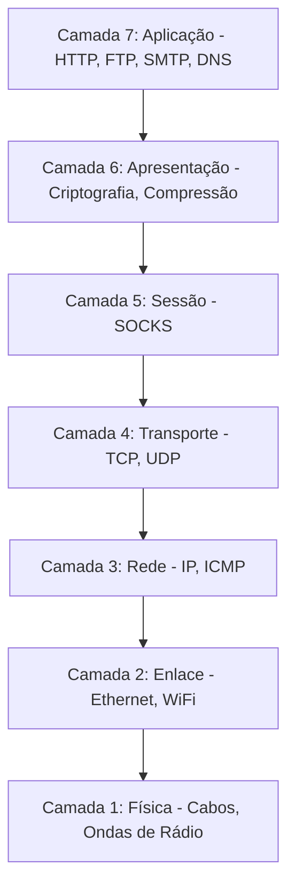
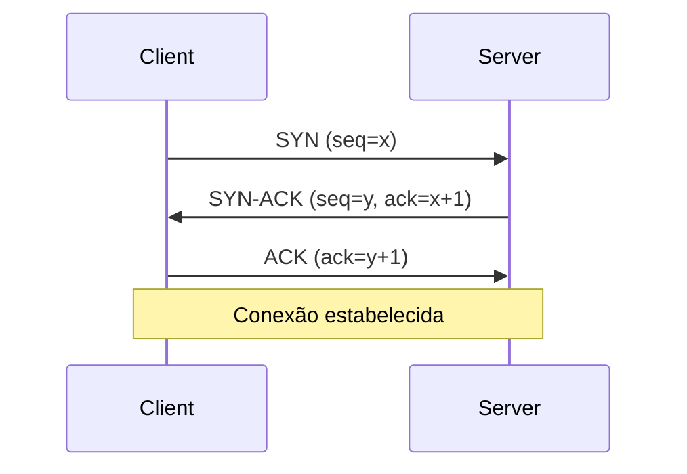
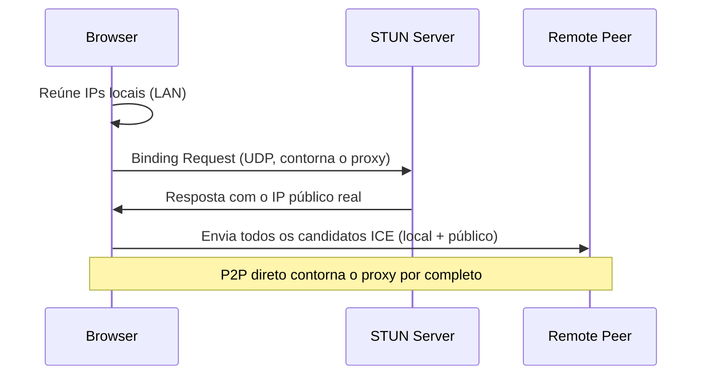

# Fundamentos de rede

Toda requisição que seu navegador faz percorre uma pilha de rede em camadas, e cada camada decide o que um proxy pode ver, mudar ou esconder, e o que ainda pode vazar sua identidade real. Entender a pilha é o que torna o comportamento do proxy previsível em vez de misterioso. Esta página percorre as camadas, os protocolos TCP e UDP, e o WebRTC, a fonte mais comum de vazamentos de IP em automação com proxy.

Para a configuração prática, veja [Proxies](../../guides/proxies.md). Para como essas camadas inferiores viram um fingerprint, veja [Fingerprinting de rede](../fingerprinting/network-fingerprinting.md).

## A pilha de rede

Proxies operam em camadas diferentes, e a camada determina seu alcance. Características de camadas inferiores podem fazer o fingerprint do seu sistema real mesmo através de um proxy impecável em camada superior, então ajuda ver onde cada protocolo fica.

O modelo OSI (7 camadas) é uma referência didática; redes reais rodam o modelo TCP/IP (4 camadas). A terminologia do OSI ainda é como as pessoas descrevem onde um proxy opera, então vale conhecê-la.



As camadas que importam para automação:

- **Camada 7, Aplicação.** HTTP, HTTPS, FTP, SMTP, DNS. Os dados de fato com os quais seu código se importa. Proxies HTTP ficam aqui, com visibilidade completa sobre requisições e respostas.
- **Camada 6, Apresentação.** Criptografia e compressão. O TLS é associado a esta camada, embora na prática ele fique entre as camadas 4 e 6.
- **Camada 5, Sessão.** Proxies SOCKS ficam aqui, abaixo da camada de aplicação, o que os torna agnósticos ao protocolo.
- **Camada 4, Transporte.** TCP (confiável) e UDP (rápido). Portas, controle de fluxo, correção de erros. Todo proxy depende desta camada para mover dados.
- **Camada 3, Rede.** Endereçamento e roteamento IP. Seu IP real vive aqui, e é o que um proxy substitui.
- **Camada 2, Enlace.** Ethernet e Wi-Fi, endereços MAC. Visíveis apenas no segmento local, não para servidores remotos (embora o SLAAC do IPv6 possa embutir o MAC no endereço).
- **Camada 1, Física.** Cabos e rádio. Raramente relevante para automação.

### Como a camada decide o que um proxy pode fazer

Um proxy HTTP/HTTPS na Camada 7 entende HTTP, então pode ler e reescrever URLs, headers, cookies e corpos, cachear por semântica HTTP, e injetar headers. Em troca, ele só fala HTTP, e inspecionar HTTPS significa terminar o TLS (descriptografar, recriptografar).

Um proxy SOCKS na Camada 5 fica abaixo da aplicação, então é agnóstico ao protocolo: encaminha qualquer protocolo da Camada 7 sem tocar, passa HTTPS criptografado de ponta a ponta, e o SOCKS5 pode ainda carregar UDP. O custo é não ter visibilidade na camada de aplicação: ele pode filtrar por IP e porta, não por URL ou conteúdo.

!!! note "O trade-off"
    Camadas superiores dão mais controle sobre o conteúdo, mas menos flexibilidade de protocolo; camadas inferiores dão o inverso. Escolha um proxy HTTP para controle de conteúdo, um proxy SOCKS para flexibilidade de protocolo ou criptografia ponta a ponta.

### O problema do vazamento por camada

Nem mesmo um proxy perfeito na Camada 7 consegue mudar o que camadas inferiores revelam. A pilha TCP do seu sistema operacional na Camada 4 tem um fingerprint (tamanho de janela, ordem das opções, TTL), e os campos do header IP na Camada 3 revelam o SO e a topologia. Se você apresenta um User-Agent do Windows enquanto o fingerprint TCP do seu kernel Linux diz outra coisa, um sistema que correlaciona os dois sinaliza a divergência. É por isso que o [fingerprinting de rede](../fingerprinting/network-fingerprinting.md) é perigoso: ele opera abaixo do proxy.

## TCP e UDP

Na Camada 4, dois protocolos dominam, com prioridades opostas: confiabilidade versus velocidade.

O TCP é orientado a conexão, como uma ligação telefônica: você estabelece uma conexão, troca dados com cada byte confirmado e ordenado, e então a encerra. O UDP é sem conexão: você envia um datagrama e torce para que chegue, sem handshake e sem garantias, com o mínimo de overhead.

| Recurso | TCP | UDP |
|---------|-----|-----|
| Conexão | Orientado a conexão (handshake) | Sem conexão (sem handshake) |
| Confiabilidade | Garantida, ordenada | Melhor esforço, pode descartar |
| Velocidade | Mais lento (overhead de confiabilidade) | Mais rápido (overhead mínimo) |
| Casos de uso | Web, transferência de arquivos, e-mail | Streaming, DNS, jogos, WebRTC |
| Tamanho do header | 20 bytes (até 60) | 8 bytes fixos |
| Controle de fluxo/congestão | Sim | Não |
| Ordenação / retransmissão | Sim | Não |

Todos os protocolos de proxy (HTTP, HTTPS, SOCKS4, SOCKS5) usam TCP para seu canal de controle, porque autenticação e sequências de comando precisam de entrega garantida. O SOCKS5 pode adicionalmente fazer proxy de UDP, o que SOCKS4 e proxies HTTP não conseguem.

### O handshake TCP de três vias

Antes de qualquer dado se mover, o TCP realiza um handshake de três vias para sincronizar números de sequência e o estado da conexão.



O cliente envia um SYN com um Initial Sequence Number aleatório e suas opções TCP (tamanho de janela, MSS, timestamps, SACK). O servidor responde com um SYN-ACK: seu próprio ISN aleatório mais uma confirmação do ISN do cliente. O cliente envia um ACK final, e a conexão está aberta nos dois sentidos. O ISN é aleatorizado (RFC 6528) para impedir que um atacante injete pacotes adivinhando números de sequência.

### Fingerprinting de TCP

O handshake expõe valores específicos do SO: tamanho de janela inicial, ordem das opções, TTL e window scale. O kernel define esses valores, não o navegador, então um proxy não pode mudá-los. Padrões ilustrativos (eles variam por versão e ajuste):

```
Windows 10/11:  Window 65535,  TTL 128,  Options: MSS, NOP, WS, NOP, NOP, SACK_PERM
Linux 5.x+:     Window 29200,  TTL 64,   Options: MSS, SACK_PERM, TS, NOP, WS
macOS:          Window 65535,  TTL 64
```

!!! warning "Um proxy não pode esconder seu fingerprint TCP"
    Proxies HTTP e SOCKS ficam acima do TCP, então o fingerprint TCP do seu SO chega ao proxy e a qualquer observador entre você e ele. Só roteamento em nível de VPN ou ajuste da pilha no nível do SO o altera. O handshake TLS logo em seguida adiciona outro fingerprint (JA3/JA4); veja [Fingerprinting de rede](../fingerprinting/network-fingerprinting.md).

### UDP, DNS e QUIC

O UDP é dispare-e-esqueça: um header de 8 bytes, sem conexão, sem confiabilidade. Ele cai bem em mídia em tempo real (WebRTC, VoIP), jogos e DNS, onde a aplicação cuida de qualquer retentativa. O DNS usa UDP porque as consultas são pequenas e se beneficiam de zero overhead de handshake.

A preocupação em automação é que a maioria dos proxies só carrega TCP, então o tráfego UDP pode contornar o proxy e expor seu IP real:

| Tipo de proxy | Suporte a UDP |
|------------|-------------|
| HTTP / HTTPS (CONNECT) | Não (apenas túneis TCP) |
| SOCKS4 | Não |
| SOCKS5 | Sim (via `UDP ASSOCIATE`) |
| VPN | Sim (encapsula todo o tráfego IP) |

O Chrome moderno também usa QUIC (RFC 9000), o transporte baseado em UDP por trás do HTTP/3, que compartilha o mesmo risco de contorno e tem seu próprio fingerprint. Em automação, você pode forçar HTTP/2 sobre TCP com `--disable-quic` para que todo o tráfego web siga seu proxy.

## WebRTC e vazamento de IP

O WebRTC habilita áudio, vídeo e dados ponto a ponto diretamente entre navegadores. Ele otimiza para baixa latência em detrimento da privacidade, e é a fonte isolada mais comum de vazamentos de IP em automação com proxy: pode revelar seu IP real mesmo quando toda a camada HTTP está com proxy corretamente.

Para montar uma conexão P2P, o WebRTC descobre seu IP público através de servidores STUN sobre UDP. Essas consultas contornam um proxy que só carrega TCP, o IP acaba nos candidatos ICE da conexão, e o JavaScript na página pode ler os candidatos e enviar seu IP real a um servidor.

### ICE, STUN e os candidatos que vazam

O WebRTC usa ICE (RFC 8445) para reunir possíveis caminhos de conexão, chamados candidatos, e essa reunião é o que expõe sua rede.



Três tipos de candidato são reunidos:

- **Host candidates**: seus IPs locais de LAN. O Chrome 75+ os substitui por nomes mDNS efêmeros (`a1b2c3d4.local`) a menos que a permissão de câmera/microfone seja concedida, então esse vazamento está em grande parte mitigado.
- **Server-reflexive candidates**: seu IP público como um servidor STUN o vê. Este é o vazamento a que todos se referem: o proxy mostra um IP, o WebRTC revela o seu verdadeiro.
- **Relay candidates**: um endereço de relay TURN usado quando o P2P direto falha; o campo `raddr` ainda pode carregar seu IP real.

O STUN (RFC 8489) é uma simples requisição/resposta sobre UDP: o cliente pergunta "qual IP você enxerga", e o servidor retorna o IP e a porta públicos em um `XOR-MAPPED-ADDRESS` (com XOR contra um magic cookie fixo por compatibilidade com NAT, não por segurança). Os navegadores já vêm com servidores STUN públicos como `stun.l.google.com:19302`.

Um proxy não consegue impedir isso porque o WebRTC usa UDP (que a maioria dos proxies não carrega), opera abaixo da camada HTTP contra a pilha de rede do SO diretamente, e enumera cada interface. Qualquer página pode disparar isso e ler o resultado:

```javascript
const pc = new RTCPeerConnection({ iceServers: [{ urls: 'stun:stun.l.google.com:19302' }] });
pc.createDataChannel('');
pc.createOffer().then(offer => pc.setLocalDescription(offer));
pc.onicecandidate = (event) => {
  if (!event.candidate) return;
  const ip = event.candidate.candidate.match(/([0-9]{1,3}(\.[0-9]{1,3}){3})/);
  if (ip) fetch(`/track?real_ip=${ip[1]}`);
};
```

### Prevenindo vazamentos de WebRTC

A correção recomendada é a opção embutida do Pydoll, que define a política de tratamento de IP do WebRTC para que o UDP que pularia o proxy seja bloqueado:

```python
from pydoll.browser.chromium import Chrome
from pydoll.browser.options import ChromiumOptions

options = ChromiumOptions()
options.webrtc_leak_protection = True   # --force-webrtc-ip-handling-policy=disable_non_proxied_udp
```

Alternativas, dependendo do que você precisa:

- Defina a mesma política através de `options.browser_preferences = {'webrtc': {'ip_handling_policy': 'disable_non_proxied_udp', 'multiple_routes_enabled': False, 'nonproxied_udp_enabled': False}}`.
- Roteie o WebRTC através de um proxy SOCKS5 que suporte relay de UDP (`--proxy-server=socks5://host:1080`), o que nem todos suportam.
- Desabilite o WebRTC por completo com `--disable-features=WebRTC` se você nunca precisa dele (isso quebra videoconferência; teste o nome da flag contra a sua versão do Chrome).

!!! warning "Sempre verifique"
    Nunca presuma que o proxy impede vazamentos de WebRTC. Carregue [browserleaks.com/webrtc](https://browserleaks.com/webrtc) ou [ipleak.net](https://ipleak.net) através da sua configuração e confirme que apenas o IP do proxy aparece. Um único vazamento expõe sua localização real, seu ISP e sua topologia de uma vez.

## Relacionado

- [Proxies HTTP/HTTPS](http-proxies.md): proxying na camada de aplicação em profundidade.
- [Proxies SOCKS](socks-proxies.md): proxying na camada de sessão, agnóstico ao protocolo (incluindo os detalhes de UDP e autenticação do SOCKS5).
- [Detecção de proxy](proxy-detection.md): os sinais que entregam um proxy.
- [Fingerprinting de rede](../fingerprinting/network-fingerprinting.md): como TCP/TLS/HTTP2 viram uma assinatura.
- [Proxies](../../guides/proxies.md): a configuração prática no Pydoll.

## Referências

- RFC 793 (TCP), RFC 768 (UDP), RFC 6528 (aleatorização de ISN)
- RFC 8489 (STUN), RFC 8445 (ICE), RFC 8656 (TURN)
- RFC 9000 (QUIC), W3C WebRTC 1.0
