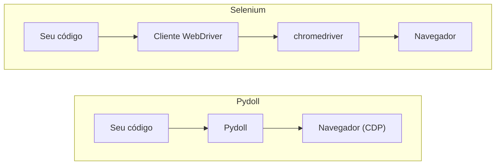

# Conceitos centrais

O Pydoll é construído sobre algumas decisões de design que moldam como você escreve cada script: sem webdriver, uma API assíncrona, interações humanizadas e um sistema de eventos. Esta página explica cada uma delas em um nível prático, para que os guias de tarefas a seguir façam sentido.

## Sem webdriver

O Pydoll se conecta diretamente ao navegador pelo Chrome DevTools Protocol (CDP), o mesmo protocolo que move o Chrome DevTools quando você abre o inspetor. Não há um executável webdriver no meio, então não há nada para baixar e nenhum "o chromedriver só suporta o Chrome versão X" para depurar.



Quando você inicia um navegador, o Pydoll lança o Chrome que você já tem instalado com uma porta de depuração remota e abre um WebSocket para o endpoint CDP dele:

```python
import asyncio

from pydoll.browser.chromium import Chrome


async def main():
    async with Chrome() as browser:
        tab = await browser.start()
        await tab.go_to('https://quotes.toscrape.com')

asyncio.run(main())
```

Você não gerencia a porta, a conexão nem o processo do navegador; `start()` faz isso, e o bloco `async with` para o navegador quando você termina.

## Os objetos browser e tab

Dois objetos cobrem a maior parte do que você faz. O **browser** (`Chrome` ou `Edge`) é o processo que você lança. A **tab**, retornada por `browser.start()`, é o que você controla: navegação, busca de elementos, screenshots, tudo na página acontece através dela.

```python
async with Chrome() as browser:
    tab = await browser.start()          # a primeira aba
    await tab.go_to('https://quotes.toscrape.com')

    second = await browser.new_tab()     # abra mais abas a partir do browser
    await second.go_to('https://books.toscrape.com')
```

Veja [Abas](tabs.md) para gerenciar várias abas ao mesmo tempo, e [Contextos de navegador](browser-contexts.md) para isolar sessões.

## Tudo é assíncrono

Toda chamada do Pydoll é uma corrotina, então você usa `await` dentro de uma função `async def` e inicia o programa com `asyncio.run()`. Isso não é uma camada de compatibilidade acoplada depois; é assim que o Pydoll controla várias abas e navegadores ao mesmo tempo. Como navegação e esperas por elementos passam a maior parte do tempo ociosas, `asyncio.gather` as executa concorrentemente em vez de uma após a outra:

```python
import asyncio

from pydoll.browser.chromium import Chrome


async def title_of(browser, url):
    tab = await browser.new_tab(url)
    title = await tab.title
    await tab.close()
    return title


async def main():
    urls = [
        'https://quotes.toscrape.com/page/1/',
        'https://quotes.toscrape.com/page/2/',
        'https://quotes.toscrape.com/page/3/',
    ]
    async with Chrome() as browser:
        await browser.start()
        titles = await asyncio.gather(*(title_of(browser, url) for url in urls))
        print(titles)

asyncio.run(main())
```

As três páginas carregam concorrentemente, então tudo leva mais ou menos o tempo da página mais lenta sozinha, não a soma das três.

!!! note "Novo em Python assíncrono?"
    Se `async`, `await` e `gather` não são familiares, leia [Python assíncrono na prática](../basics/async-python.md) primeiro. Ele cobre apenas o suficiente de asyncio para você ficar confortável com o restante destes guias.

## Interações humanizadas

Por padrão, um clique cai no centro de um elemento e a digitação segue um ritmo fixo. Passe `humanize=True` e o Pydoll move o cursor por um caminho curvo antes de clicar e digita com timing variável, incluindo o eventual erro de digitação corrigido:

```python
search = await tab.find(id='search')
await search.type_text('web scraping', humanize=True)
await search.click(humanize=True)
```

A humanização é opcional por interação, então você a usa onde um site observa o comportamento e a dispensa onde velocidade pura importa. Veja [Interações parecidas com humanas](../stealth/human-like-interactions.md) para o modelo de timing, e [Teclado](keyboard.md) e [Mouse](mouse.md) para as APIs de entrada completas.

## Orientado a eventos

Em vez de consultar a página em um loop, você pode assinar eventos do navegador e executar um callback quando eles disparam. É assim que você captura tráfego de rede, reage a navegações ou espera por uma requisição específica:

```python
import asyncio
from functools import partial

from pydoll.browser.chromium import Chrome
from pydoll.protocol.network.events import NetworkEvent


async def on_request(tab, event):
    url = event['params']['request']['url']
    if '/api/' in url:
        print(f'API call: {url}')


async def main():
    async with Chrome() as browser:
        tab = await browser.start()

        await tab.enable_network_events()
        await tab.on(NetworkEvent.REQUEST_WILL_BE_SENT, partial(on_request, tab))

        await tab.go_to('https://quotes.toscrape.com')
        await asyncio.sleep(2)

asyncio.run(main())
```

Ative apenas os domínios de evento que você usa, e desative-os quando terminar. Veja [Eventos](events.md) para o modelo completo e [Monitoramento de rede](network-monitoring.md) para captura de tráfego.

## Funciona em todos os navegadores Chromium

A mesma API controla qualquer navegador Chromium. O Chrome é o alvo principal; o Edge tem suporte completo; outras builds Chromium funcionam apontando `binary_location` para elas.

```python
from pydoll.browser.chromium import Chrome, Edge
from pydoll.browser.options import ChromiumOptions

# Chrome
async with Chrome() as browser:
    tab = await browser.start()

# Edge
async with Edge() as browser:
    tab = await browser.start()

# Qualquer outra build Chromium (Brave, Vivaldi, Opera, ...)
options = ChromiumOptions()
options.binary_location = '/path/to/brave-browser'
async with Chrome(options=options) as browser:
    tab = await browser.start()
```

## Próximos passos

- [Encontrar elementos](element-finding.md): localize elementos com `find()` e `query()`.
- [Extração estruturada](structured-extraction.md): obtenha dados tipados de uma página com um modelo.
- [Eventos](events.md): reaja a eventos de página e de rede conforme disparam.
- [Chrome DevTools Protocol](../deep-dive/cdp.md): o protocolo que o Pydoll fala com o navegador, em profundidade.
