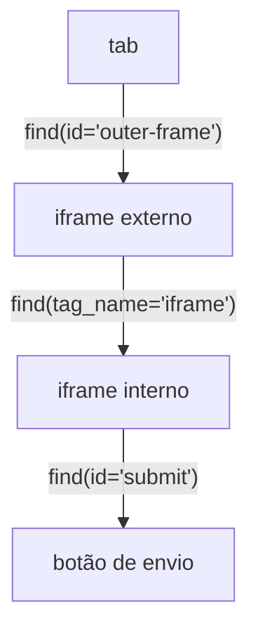

# Iframes

Páginas embutem outros documentos com `<iframe>`, e um iframe tem seu próprio contexto de DOM. O Pydoll direciona as buscas para dentro desse contexto por você, então você encontra o elemento iframe uma vez e depois trabalha dentro dele com os mesmos `find()` e `query()` que você usa em todo lugar. Não há frame para entrar e sair, e nada de que voltar.

## Interagir com um iframe

Encontre o `<iframe>` como qualquer elemento, depois chame `find()` ou `query()` nele. Essas chamadas rodam dentro do frame automaticamente.

```python
import asyncio

from pydoll.browser.chromium import Chrome


async def main():
    async with Chrome() as browser:
        tab = await browser.start()
        await tab.go_to('https://the-internet.herokuapp.com/iframe')

        editor = await tab.find(tag_name='iframe')   # o frame do editor embutido
        body = await editor.find(id='tinymce')        # um elemento dentro do frame
        print(await body.text)

asyncio.run(main())
```

`tab.find()` e `tab.query()` só enxergam o documento de nível superior. Para alcançar conteúdo dentro de um frame, comece pelo elemento iframe, não pela aba.

## Iframes aninhados

Um frame pode conter outro frame. Continue encadeando: cada busca tem escopo no elemento em que você a chama.




```python
outer = await tab.find(id='outer-frame')
inner = await outer.find(tag_name='iframe')

submit = await inner.find(id='submit')
await submit.click()
```

O padrão é sempre o mesmo: encontre o elemento iframe, use esse elemento para continuar buscando, repita para níveis mais profundos. Você nunca faz cache de alvos de frame nem abre abas extras.

## Executar JavaScript dentro de um frame

`execute_script()` em um elemento iframe roda no próprio contexto de execução do frame, tanto para frames de mesma origem quanto de origem cruzada.

```python
iframe = await tab.find(tag_name='iframe')
result = await iframe.execute_script('return document.title', return_by_value=True)
print(result['result']['result']['value'])
```

## Capturar o conteúdo de um frame

`tab.take_screenshot()` captura apenas a página de nível superior. Para capturar algo dentro de um frame, faça a captura de tela de um elemento dentro dele:

```python
iframe = await tab.find(tag_name='iframe')
chart = await iframe.find(id='sales-chart')
await chart.take_screenshot('chart.png')
```

## Cruzar a fronteira de um frame em um único seletor

Em vez de encontrar cada iframe e depois buscar dentro dele, você pode escrever um único seletor que cruza fronteiras de frame. O Pydoll detecta passos `iframe`, divide o seletor em cada fronteira, e percorre a cadeia por você.

### Com CSS

Use um combinador (`>` ou um espaço) depois de um composto `iframe`:

```python
# cruza um iframe
button = await tab.query('iframe > .submit-btn')

# corresponde ao iframe por atributo
pay = await tab.query('iframe[src*="checkout"] > #pay-button')

# iframes aninhados
content = await tab.query('iframe.outer > iframe.inner > div.content')

# iframe abaixo da raiz, não nela
submit = await tab.query('div > iframe > button.submit')
```

### Com XPath

Use `/` depois de um passo `iframe`:

```python
# cruza um iframe
button = await tab.query('//iframe/body/button[@id="submit"]')

# predicado no iframe
heading = await tab.query('//iframe[@src*="cloudflare"]//h1')

# iframes aninhados
element = await tab.query('//iframe[@id="outer"]//iframe[@id="inner"]//div')
```

Um seletor que cruza faz exatamente o que a versão manual faz, em uma única chamada:

```python
# uma chamada através da fronteira do frame
button = await tab.query('iframe[src*="checkout"] > form > button')

# a mesma coisa, detalhada
iframe = await tab.find(tag_name='iframe', src='*checkout*')
button = await iframe.query('form > button')
```

O último segmento respeita `find_all=True`, retornando toda correspondência dentro do frame final:

```python
links = await tab.query('iframe > a', find_all=True)
```

!!! note "Quando o seletor não é dividido"
    A divisão só acontece quando `iframe` é um **nome de tag**. Estes passam sem alteração, porque nenhum deles seleciona um elemento iframe: `.iframe > body` (classe), `#iframe > body` (id), `div.iframe > body` (a tag é `div`), `[data-type="iframe"] > body` (atributo), e um `iframe` ou `//iframe` sozinho (nada vem depois para buscar dentro).

## Frames de origem cruzada e captchas

Widgets como o Cloudflare Turnstile vivem em iframes de origem cruzada (frames fora do processo, ou OOPIFs) e muitas vezes escondem seus controles em um shadow root fechado. `tab.find_shadow_roots(deep=True, timeout=...)` alcança esses frames. Veja [Percorrer o DOM](dom-traversal.md) para a API de shadow root e [Contornar captcha](../stealth/captcha-bypass.md) para lidar com o Turnstile de ponta a ponta.

!!! note "Migrando de `tab.get_frame()`"
    Versões anteriores convertiam um iframe em um objeto separado com `tab.get_frame()`. Esse método está obsoleto e será removido. Trabalhe diretamente com o `WebElement` do iframe, como mostrado acima.

## Próximos passos

- [Encontrar elementos](element-finding.md): as chamadas `find()` e `query()` que você usa dentro de um frame.
- [Percorrer o DOM](dom-traversal.md): shadow roots e navegação por frames de origem cruzada.
- [Capturas de tela e PDFs](screenshots-and-pdfs.md): capturar a saída de elementos e da página.
