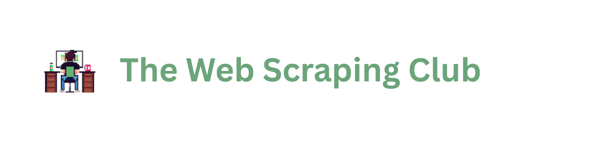

<p align="center">
     <br><br>
</p>

<p align="center">
    <a href="https://codecov.io/gh/autoscrape-labs/pydoll">
        
    </a>
    
    
    
    
</p>


# Bem-vindo ao Pydoll

Olá! Obrigado por conferir o Pydoll, a próxima geração de automação de navegadores para Python. Se você está cansado de lidar com webdrivers e procura uma maneira mais suave e confiável de automatizar navegadores, você está no lugar certo.

## O que é o Pydoll?

O Pydoll está revolucionando a automação de navegadores, **eliminando completamente a necessidade de webdrivers**! Ao contrário de outras soluções que dependem de dependências externas, o Pydoll se conecta diretamente aos navegadores usando o Chrome DevTools Protocol, proporcionando uma experiência de automação perfeita e confiável com desempenho assíncrono nativo.

Seja para extrair dados, [testar aplicativos web](https://www.lambdatest.com/web-testing) ou automatizar tarefas repetitivas, o Pydoll torna tudo surpreendentemente fácil com sua API intuitiva e recursos poderosos. 

## Instalação

Crie e ative um [ambiente virtual](https://docs.python.org/3/tutorial/venv.html) primeiro e, em seguida, instale o Pydoll:

<div class="termy">
```bash
$ pip install pydoll-python

---> 100%
```
</div>

Para a versão de desenvolvimento mais recente, você pode instalar diretamente do GitHub:

```bash
$ pip install git+https://github.com/autoscrape-labs/pydoll.git
```

## Por que escolher o Pydoll?

- **Simplicidade Genuína**: Não queremos que você perca tempo configurando drivers ou lidando com problemas de compatibilidade. Com o Pydoll, você instala e está pronto para automatizar.
- **Interações Verdadeiramente Humanas**: Nossos algoritmos simulam padrões de comportamento humano reais, desde o tempo entre os cliques até a forma como o mouse se move pela tela.
- **Desempenho Assíncrono Nativo**: Construído do zero com `asyncio`, o Pydoll não apenas suporta operações assíncronas, mas foi projetado para elas.
- **Inteligência Integrada**: Bypass automático de captchas Cloudflare Turnstile e reCAPTCHA v3, sem serviços externos ou configurações complexas.
- **Monitoramento de Rede Poderoso**: Intercepte, modifique e analise todo o tráfego de rede com facilidade, dando a você controle total sobre as requisições.
- **Arquitetura Orientada a Eventos**: Reaja a eventos da página, requisições de rede e interações do usuário em tempo real.
- **Localização de Elementos Intuitiva**: Métodos modernos `find()` e `query()` que fazem sentido e funcionam como você esperaria.
- **Segurança de Tipos Robusta**: Sistema de tipos abrangente para melhor suporte da IDE e prevenção de erros.


Pronto para começar? As páginas a seguir guiarão você pela instalação, uso básico e recursos avançados para ajudá-lo a aproveitar ao máximo o Pydoll.

Vamos começar a automatizar a web, da maneira certa! 🚀

## Guia de Início Rápido: Um exemplo simples

Vamos começar com um exemplo prático. O script a seguir abrirá o repositório Pydoll no GitHub e o marcará como favorito:

```python
import asyncio
from pydoll.browser.chromium import Chrome

async def main():
    async with Chrome() as browser:
        tab = await browser.start()
        await tab.go_to('https://github.com/autoscrape-labs/pydoll')

        star_button = await tab.find(
            tag_name='button',
            timeout=5,
            raise_exc=False
        )
        if not star_button:
            print("Ops! O botão não foi encontrado.")
            return

        await star_button.click()
        await asyncio.sleep(3)

asyncio.run(main())
```

Este exemplo demonstra como navegar até um site, esperar que um elemento apareça e interagir com ele. Você pode adaptar esse padrão para automatizar diversas tarefas web.

??? note "Ou use sem o gerenciador de contexto..."
    Se preferir não usar o padrão de gerenciador de contexto, você pode gerenciar a instância do navegador manualmente:
    ```python
    import asyncio
    from pydoll.browser.chromium import Chrome

    async def main():
        browser = Chrome()
        tab = await browser.start()
        await tab.go_to('https://github.com/autoscrape-labs/pydoll')

        star_button = await tab.find(
            tag_name='button',
            timeout=5,
            raise_exc=False
        )
        if not star_button:
            print("Ops! O botão não foi encontrado.")
            return

        await star_button.click()
        await asyncio.sleep(3)
        await browser.stop()

    asyncio.run(main())
    ```
    Observe que, ao não usar o gerenciador de contexto, você precisará chamar explicitamente `browser.stop()` para liberar os recursos.


## Exemplo Estendido: Configuração personalizada do navegador

Para cenários de uso mais avançados, o Pydoll permite personalizar a configuração do seu navegador usando a classe `ChromiumOptions`. Isso é útil quando você precisa:

- Executar em modo headless (sem janela do navegador visível)
- Especificar um caminho personalizado para o executável do navegador
- Configurar proxies, user agents ou outras configurações do navegador
- Definir as dimensões da janela ou argumentos de inicialização

Aqui está um exemplo mostrando como usar opções personalizadas para o Chrome:

```python hl_lines="8-12 30-32 34-38"
import asyncio
import os
from pydoll.browser.chromium import Chrome
from pydoll.browser.options import ChromiumOptions

async def main():
    options = ChromiumOptions()
    options.binary_location = '/usr/bin/google-chrome-stable'
    options.add_argument('--headless=new')
    options.add_argument('--start-maximized')
    options.add_argument('--disable-notifications')

    async with Chrome(options=options) as browser:
        tab = await browser.start()
        await tab.go_to('https://github.com/autoscrape-labs/pydoll')

        star_button = await tab.find(
            tag_name='button',
            timeout=5,
            raise_exc=False
        )
        if not star_button:
            print("Ops! O botão não foi encontrado.")
            return

        await star_button.click()
        await asyncio.sleep(3)

        screenshot_path = os.path.join(os.getcwd(), 'pydoll_repo.png')
        await tab.take_screenshot(path=screenshot_path)
        print(f"Captura de tela salva em: {screenshot_path}")

        base64_screenshot = await tab.take_screenshot(as_base64=True)

        repo_description_element = await tab.find(
            class_name='f4.my-3'
        )
        repo_description = await repo_description_element.text
        print(f"Descrição do repositório: {repo_description}")

if __name__ == "__main__":
    asyncio.run(main())
```

Este exemplo estendido demonstra:

1. Criação e configuração de opções do navegador
2. Definição de um caminho personalizado para o binário do Chrome
3. Habilitação do modo headless para operação invisível
4. Definição de sinalizadores adicionais do navegador
5. Captura de tela (especialmente útil em modo headless) modo)

??? info "Sobre as Opções do Chromium"
    O método `options.add_argument()` permite que você passe qualquer argumento de linha de comando do Chromium para personalizar o comportamento do navegador. Existem centenas de opções disponíveis para controlar tudo, desde rede até comportamento de renderização. 

    Opções comuns do Chrome

    ```python
    # Opções de Desempenho e Comportamento
    options.add_argument('--headless=new')         # Executar o Chrome em modo headless
    options.add_argument('--disable-gpu')          # Desabilitar a aceleração de hardware da GPU
    options.add_argument('--no-sandbox')           # Desabilitar o sandbox (use com cuidado)
    options.add_argument('--disable-dev-shm-usage') # Superar problemas de recursos limitados

    # Opções de Aparência
    options.add_argument('--start-maximized')      # Iniciar com a janela maximizada
    options.add_argument('--window-size=1920,1080') # Definir tamanho específico da janela
    options.add_argument('--hide-scrollbars')      # Ocultar barras de rolagem

    # Opções de Rede
    options.add_argument('--proxy-server=socks5://127.0.0.1:9050') # Usar proxy
    options.add_argument('--disable-extensions')   # Desabilitar extensões
    options.add_argument('--disable-notifications') # Desabilitar notificações

    # Privacidade e Segurança
    options.add_argument('--incognito')            # Executar em modo anônimo
    options.add_argument('--disable-infobars')     # Desabilitar barras de informações
    ```

    Guias de Referência Completos

    Para obter uma lista completa de todos os argumentos de linha de comando do Chrome disponíveis, consulte estes recursos:

    - [Opções de Linha de Comando do Chromium](https://peter.sh/experiments/chromium-command-line-switches/) - Lista de referência completa
    - [Flags do Chrome](chrome://flags) - Digite isso na barra de endereço do seu navegador Chrome para ver os recursos experimentais
    - [Flags do Código-Fonte do Chromium](https://source.chromium.org/chromium/chromium/src/+/main:chrome/common/chrome_switches.cc) - Referência direta ao código-fonte

    Lembre-se de que algumas opções podem se comportar de maneira diferente em diferentes versões do Chrome, portanto, é uma boa prática testar sua configuração ao atualizar o Chrome. 

Com essas configurações, você pode executar o Pydoll em diversos ambientes, incluindo pipelines de CI/CD, servidores sem interface gráfica ou contêineres Docker.

Continue lendo a documentação para explorar os recursos poderosos do Pydoll para lidar com captchas, trabalhar com várias abas, interagir com elementos e muito mais.

## Dependências Mínimas

Uma das vantagens do Pydoll é sua leveza. Ao contrário de outras ferramentas de automação de navegador que exigem inúmeras dependências, o Pydoll foi projetado intencionalmente para ser minimalista, mantendo recursos poderosos.

### Dependências Principais

O Pydoll depende de apenas alguns pacotes cuidadosamente selecionados:

```
python = "^3.10"
websockets = "^13.1"
aiohttp = "^3.9.5"
aiofiles = "^23.2.1"
bs4 = "^0.0.2"
```

É só isso! Essa dependência mínima do Pydoll significa:

- **Instalação mais rápida** - Sem árvore de dependências complexa para resolver
- **Menos conflitos** - Menor chance de conflitos de versão com outros pacotes
- **Menor consumo de recursos** - Menor uso de espaço em disco
- **Melhor segurança** - Menor superfície de ataque e vulnerabilidades relacionadas a dependências
- **Atualizações mais fáceis** - Manutenção mais simples e menos alterações que quebram a compatibilidade

O pequeno número de dependências também contribui para a confiabilidade e o desempenho do Pydoll, pois há menos fatores externos que podem impactar seu funcionamento.

## Top Sponsors

<a href="https://substack.thewebscraping.club/p/pydoll-webdriver-scraping?utm_source=github&utm_medium=repo&utm_campaign=pydoll" target="_blank" rel="noopener nofollow sponsored">
  
</a>

<sub>Leia uma review completa do Pydoll no <b><a href="https://substack.thewebscraping.club/p/pydoll-webdriver-scraping?utm_source=github&utm_medium=repo&utm_campaign=pydoll" target="_blank" rel="noopener nofollow sponsored">The Web Scraping Club</a></b>, a newsletter #1 dedicada a web scraping.</sub>

## Patrocinadores

O apoio dos patrocinadores é essencial para manter o projeto vivo, em constante evolução e acessível a toda a comunidade. Cada parceria ajuda a cobrir custos, impulsionar novos recursos e garantir o desenvolvimento contínuo. Somos muito gratos a todos que acreditam e apoiam o projeto!

<div class="sponsors-grid">
  <a href="https://www.thordata.com/?ls=github&lk=pydoll" target="_blank" rel="noopener nofollow sponsored">
    
  </a>
  <a href="https://www.testmuai.com/?utm_medium=sponsor&utm_source=pydoll" target="_blank" rel="noopener nofollow sponsored">
    
  </a>
  <a href="https://dashboard.capsolver.com/passport/register?inviteCode=WPhTbOsbXEpc" target="_blank" rel="noopener nofollow sponsored">
    
  </a>
</div>

<p>
  <a href="https://github.com/sponsors/thalissonvs" target="_blank" rel="noopener">Seja um patrocinador</a>
</p>


## Licença

O Pydoll é lançado sob a Licença MIT, que lhe dá a liberdade de usar, modificar e distribuir o código com restrições mínimas. Esta licença permissiva torna o Pydoll adequado para projetos pessoais e comerciais.

??? info "Ver o texto completo da Licença MIT"
    ```
    MIT License
    
    Copyright (c) 2023 Pydoll Contributors
    
    Permission is hereby granted, free of charge, to any person obtaining a copy
    of this software and associated documentation files (the "Software"), to deal
    in the Software without restriction, including without limitation the rights
    to use, copy, modify, merge, publish, distribute, sublicense, and/or sell
    copies of the Software, and to permit persons to whom the Software is
    furnished to do so, subject to the following conditions:
    
    The above copyright notice and this permission notice shall be included in all
    copies or substantial portions of the Software.
    
    THE SOFTWARE IS PROVIDED "AS IS", WITHOUT WARRANTY OF ANY KIND, EXPRESS OR
    IMPLIED, INCLUDING BUT NOT LIMITED TO THE WARRANTIES OF MERCHANTABILITY,
    FITNESS FOR A PARTICULAR PURPOSE AND NONINFRINGEMENT. IN NO EVENT SHALL THE
    AUTHORS OR COPYRIGHT HOLDERS BE LIABLE FOR ANY CLAIM, DAMAGES OR OTHER
    LIABILITY, WHETHER IN AN ACTION OF CONTRACT, TORT OR OTHERWISE, ARISING FROM,
    OUT OF OR IN CONNECTION WITH THE SOFTWARE OR THE USE OR OTHER DEALINGS IN THE
    SOFTWARE.
    ```