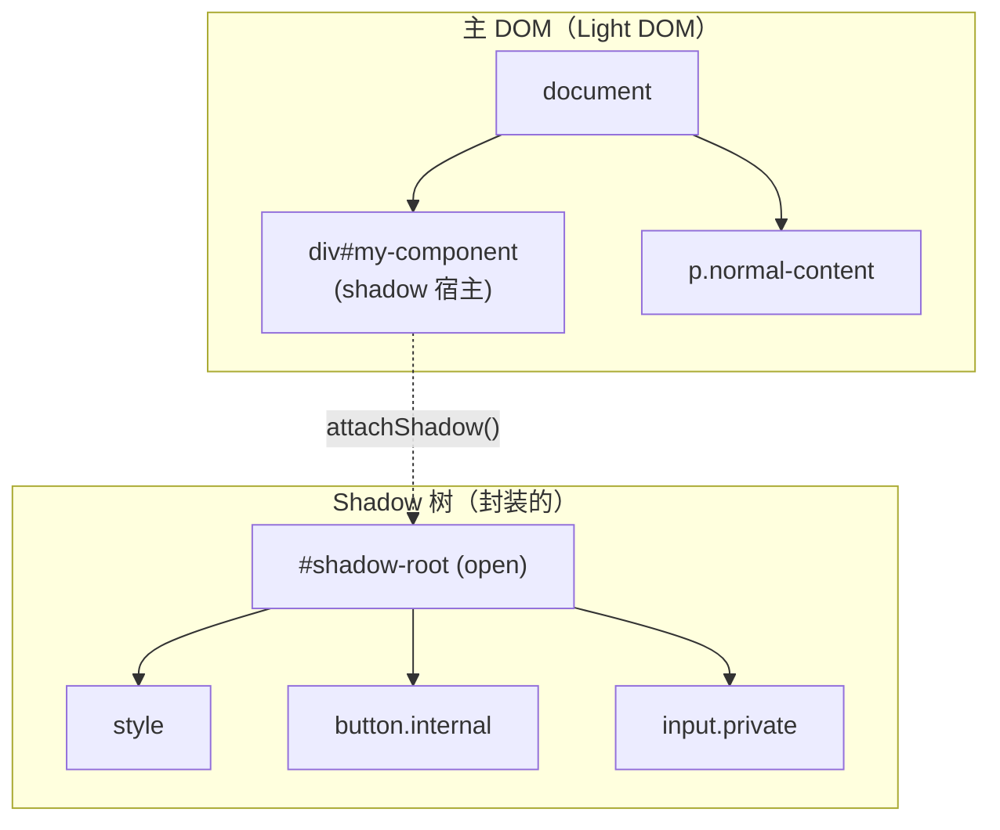
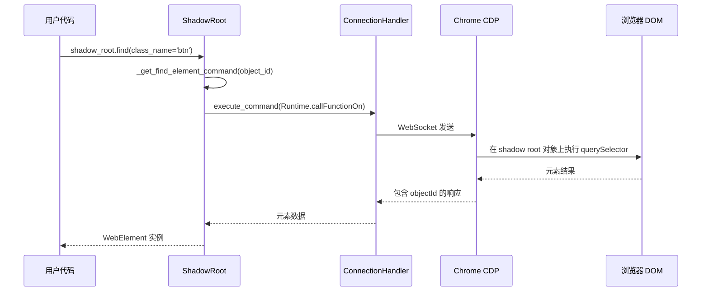
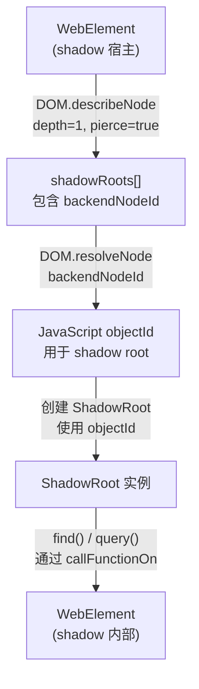
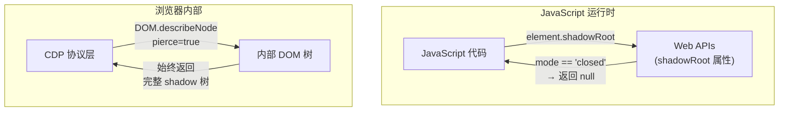
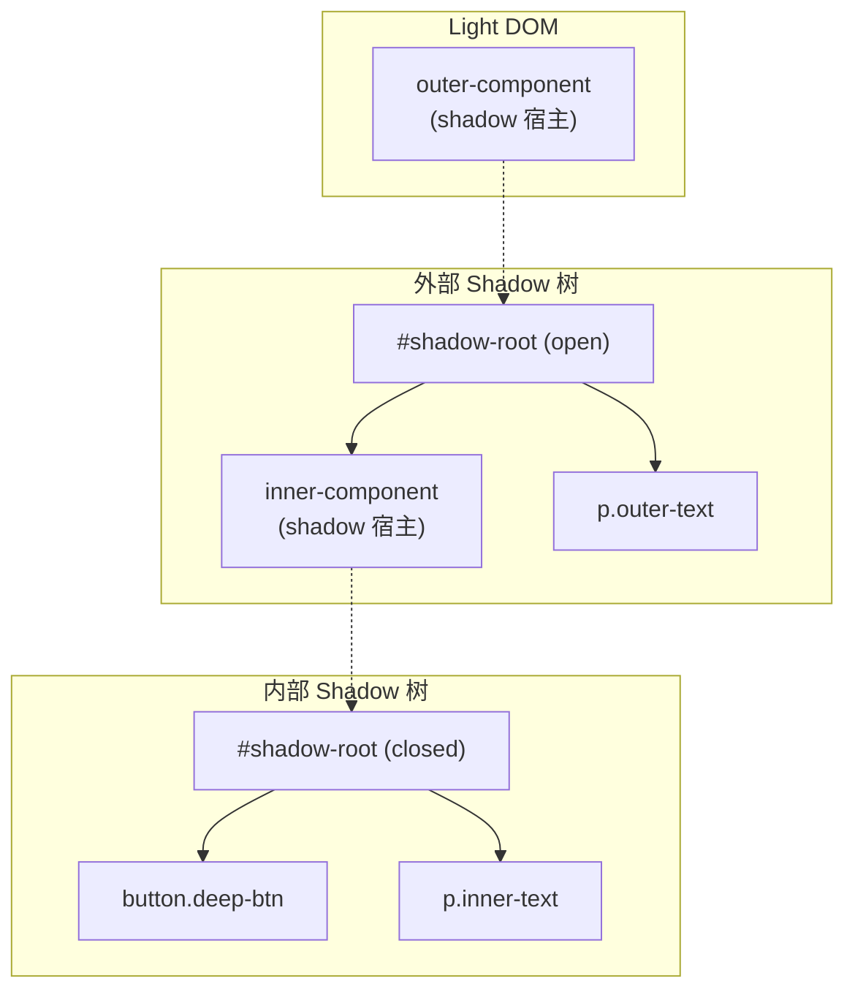
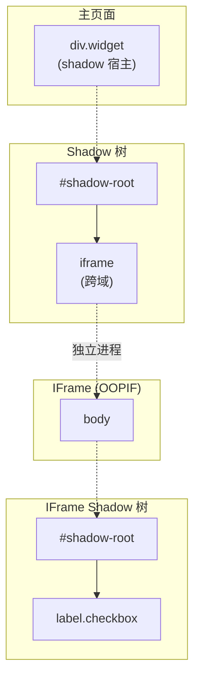

# Shadow DOM 架构

Shadow DOM 是现代 Web 自动化中最具挑战性的方面之一。Shadow 树内的元素对常规 DOM 查询不可见，这打破了传统的自动化方法。本文档解释了 Shadow DOM 在浏览器层面的工作原理，为什么传统工具无法处理封闭的 shadow root，以及 Pydoll 如何通过直接的 CDP 访问绕过这些限制。

!!! info "实用指南"
    有关使用示例和快速入门模式，请参阅 [元素查找指南 — Shadow DOM 部分](../../features/element-finding.md#shadow-dom-支持)。

## 什么是 Shadow DOM？

Shadow DOM 是一项实现 **DOM 封装** 的 Web 标准。它允许组件拥有自己的隔离 DOM 树（"shadow 树"），附加到常规 DOM 元素（"shadow 宿主"）上。Shadow 树内的元素对主文档的查询是隐藏的。



### Shadow Root 模式

当组件通过 `attachShadow()` 创建 shadow root 时，它指定一个 **模式**：

| 模式 | JavaScript 访问 | CDP 访问 | 常见用途 |
|------|-----------------|----------|----------|
| `open` | `element.shadowRoot` 返回根节点 | 通过 `backendNodeId` 完全访问 | 自定义 Web 组件（Lit、Stencil） |
| `closed` | `element.shadowRoot` 返回 `null` | 通过 `backendNodeId` 完全访问 | 安全敏感组件、支付表单 |
| `user-agent` | 无法通过 JS 访问 | 有限访问 | 浏览器内部 UI（输入占位符、视频控件） |

这个区别至关重要：**JavaScript 级别的访问受模式限制，但 CDP 级别的访问不受限制。**

### 为什么传统自动化会失败

传统自动化工具依赖于在页面上下文中执行 JavaScript：

```javascript
// WebDriver / Selenium 方法
document.querySelector('#my-component')        // ✓ 找到宿主
document.querySelector('#my-component button') // ✗ 无法穿越 shadow 边界
element.shadowRoot                             // ✗ 对封闭根返回 null
```

Shadow 边界由浏览器的 JavaScript 引擎强制执行。任何通过执行 JavaScript 来查找元素的自动化工具都会遇到这道墙。这包括 Selenium、Playwright 的 `page.evaluate()`，以及任何在文档级别使用 `Runtime.evaluate()` 配合 `document.querySelector()` 的工具。

## Pydoll 如何绕过 Shadow 边界

Pydoll 的方法在 **JavaScript 之下** 的层级工作：Chrome DevTools Protocol。CDP 可以直接访问浏览器的内部 DOM 表示，完全忽略 shadow 模式限制。

### CDP 优势



关键洞察在于 **shadow root 对象如何获取** 以及 **查询如何对其执行**：

1. **发现**：`DOM.describeNode` 配合 `pierce=true` 返回 shadow root 节点及其 `backendNodeId`，无论模式如何
2. **解析**：`DOM.resolveNode` 将 `backendNodeId` 转换为直接引用 shadow root 的 JavaScript `objectId`
3. **查询**：`Runtime.callFunctionOn` 在 shadow root 的 `objectId` 上执行 `this.querySelector()`；这之所以有效，是因为调用是在 **shadow root 对象本身** 上进行的，而不是从文档上下文

### 逐步解析：Shadow Root 访问



#### 步骤 1：描述宿主节点

```python
# Pydoll 发送此 CDP 命令：
{
    "method": "DOM.describeNode",
    "params": {
        "objectId": "<host-element-object-id>",
        "depth": 1,
        "pierce": true  # ← 这是关键标志
    }
}
```

`pierce` 参数告诉 CDP 在描述节点时穿越 shadow 边界。响应包含 shadow root 信息，无论 shadow root 的模式如何：

```json
{
    "result": {
        "node": {
            "nodeName": "DIV",
            "shadowRoots": [
                {
                    "nodeId": 0,
                    "backendNodeId": 5,
                    "shadowRootType": "closed",
                    "childNodeCount": 4
                }
            ]
        }
    }
}
```

!!! warning "nodeId 与 backendNodeId"
    当 DOM 域未显式启用时（这是 Pydoll 的默认设置以最小化开销），`nodeId` 始终为 `0`。`backendNodeId` 是稳定的、始终可用的标识符。Pydoll 专门使用 `backendNodeId` 进行 shadow root 解析，这就是为什么它不需要 `DOM.enable()` 就能工作。

#### 步骤 2：解析为 JavaScript 对象

```python
# 将 backendNodeId 转换为可用的 objectId：
{
    "method": "DOM.resolveNode",
    "params": {
        "backendNodeId": 5
    }
}
```

响应提供一个 `objectId`，即 JavaScript 对象空间中 shadow root 的句柄：

```json
{
    "result": {
        "object": {
            "objectId": "-2296764575741119861.1.3"
        }
    }
}
```

#### 步骤 3：在 Shadow Root 内查询

有了 shadow root 的 `objectId`，Pydoll 利用 `FindElementsMixin` 现有的相对搜索机制：

```python
# 当调用 ShadowRoot.find(class_name='btn') 时：
{
    "method": "Runtime.callFunctionOn",
    "params": {
        "functionDeclaration": "function() { return this.querySelector(\".btn\"); }",
        "objectId": "-2296764575741119861.1.3"
    }
}
```

函数以 `this` 绑定到 shadow root 对象运行。由于 shadow root 原生实现了 `querySelector()` 和 `querySelectorAll()` 接口，CSS 选择器在 shadow 边界内自然工作。

## ShadowRoot 架构

### 设计决策：复用 FindElementsMixin

最关键的架构决策是让 `ShadowRoot` 继承 `FindElementsMixin`：

```python
class ShadowRoot(FindElementsMixin):
    def __init__(self, object_id, connection_handler, mode, host_element):
        self._object_id = object_id               # Shadow root CDP 引用
        self._connection_handler = connection_handler  # 用于 CDP 通信
        self._mode = mode                          # ShadowRootType 枚举
        self._host_element = host_element          # 返回宿主的引用
```

**为什么这能工作**：`FindElementsMixin._find_element()` 检查 `hasattr(self, '_object_id')`。当存在时，它使用 `RELATIVE_QUERY_SELECTOR`，即在引用的对象上调用 `this.querySelector()`。由于 shadow root 原生支持 `querySelector()`，整个元素查找 API 自动工作，无需任何 shadow 特定代码。

```python
# FindElementsMixin 中的这一行启用了 shadow root 搜索：
elif hasattr(self, '_object_id'):
    command = self._get_find_element_command(by, value, self._object_id)
```

这意味着 `ShadowRoot` 免费继承了 `find()`、`query()`、`find_or_wait_element()` 以及所有选择器策略（CSS、XPath、ID、class name、tag name、属性）。

!!! tip "架构一致性"
    这与 `WebElement.find()` 在元素子节点内搜索的机制相同：`_object_id` 属性表示"相对于我搜索"而不是"搜索整个文档"。`ShadowRoot`、`WebElement` 和 `Tab` 通过 `FindElementsMixin` 共享完全相同的元素查找行为。

### 类关系

| 类 | 有 `_object_id` | 有 `_connection_handler` | 查找范围 |
|----|:-:|:-:|---|
| `Tab` | 否 | 是 | 整个文档 |
| `WebElement` | 是 | 是 | 元素子树内 |
| `ShadowRoot` | 是 | 是 | Shadow 树内 |

三者都继承自 `FindElementsMixin`。`_object_id` 的存在与否决定搜索是文档全局的还是限定在特定节点。

### 解析 Shadow Root：backendNodeId 策略

Pydoll 故意使用 `backendNodeId` 而不是 `nodeId` 进行 shadow root 解析：

| 属性 | `nodeId` | `backendNodeId` |
|------|----------|-----------------|
| 需要 `DOM.enable()` | 是 | 否 |
| 跨 describe 调用稳定 | 否（DOM 未启用时为 0） | 是 |
| 适用于 shadow root 解析 | 仅在 DOM 启用时 | 始终 |
| 性能开销 | 较高（DOM 域跟踪） | 无 |

通过依赖 `backendNodeId`，Pydoll 避免了启用 DOM 域的开销，同时保持可靠的 shadow root 访问。这是一个务实的选择：大多数自动化场景不需要 DOM 域的事件流，启用它会增加内存和处理开销来跟踪每次 DOM 变更。

## 封闭的 Shadow Root：为什么 CDP 访问有效

这是最常被问到的问题：**如果 `element.shadowRoot` 在 JavaScript 中对封闭的 shadow root 返回 `null`，CDP 怎么能访问它们？**

答案在于理解浏览器的架构：



**JavaScript 访问** 经过 Web API 层，该层强制执行 shadow 模式限制。当 `mode='closed'` 时，API 返回 `null`；这是对网页代码的有意访问控制边界。

**CDP 访问** 在 Web API 层之下运行。它直接与浏览器的内部 DOM 表示通信。`closed` 模式限制是 **JavaScript 级别的策略**，不是 **DOM 级别的限制**。Shadow 树仍然存在于 DOM 中；它只是对 JavaScript 的视图隐藏了。

!!! info "安全影响"
    这是 DevTools Protocol 的设计意图。CDP 面向需要完全 DOM 访问的调试和自动化工具。`closed` 模式保护 shadow 内容免受同一页面上其他脚本（如第三方脚本）的访问，而不是来自浏览器调试接口的访问。这与浏览器 DevTools 能够在 Elements 面板中检查封闭 shadow root 的原因相同。

### 实际验证

你可以自己验证这个行为：

```python
import asyncio
from pydoll.browser.chromium import Chrome
from pydoll.protocol.dom.types import ShadowRootType

async def verify_closed_access():
    async with Chrome() as browser:
        tab = await browser.start()
        await tab.go_to('about:blank')

        # 通过 JavaScript 创建封闭的 shadow root
        await tab.execute_script("""
            const host = document.createElement('div');
            host.id = 'test-host';
            document.body.appendChild(host);
            const shadow = host.attachShadow({ mode: 'closed' });
            shadow.innerHTML = '<p class="secret">隐藏内容</p>';
        """)

        # JavaScript 无法访问：
        result = await tab.execute_script(
            "return document.getElementById('test-host').shadowRoot",
            return_by_value=True,
        )
        js_value = result['result']['result'].get('value')
        print(f"JS shadowRoot: {js_value}")  # None

        # 但 Pydoll 可以：
        host = await tab.find(id='test-host')
        shadow = await host.get_shadow_root()
        print(f"Shadow 模式: {shadow.mode}")  # ShadowRootType.CLOSED

        secret = await shadow.find(class_name='secret')
        text = await secret.text
        print(f"内容: {text}")  # "隐藏内容"

asyncio.run(verify_closed_access())
```

## 嵌套 Shadow Root

Web 组件经常组合其他 Web 组件，创建多级 shadow 树：



Pydoll 通过链式 `get_shadow_root()` 调用自然处理这种情况。每个 `ShadowRoot` 产生的 `WebElement` 实例本身也可以有 shadow root：

```python
outer_host = await tab.find(tag_name='outer-component')
outer_shadow = await outer_host.get_shadow_root()        # open

inner_host = await outer_shadow.find(tag_name='inner-component')
inner_shadow = await inner_host.get_shadow_root()        # closed，仍然有效

deep_button = await inner_shadow.find(class_name='deep-btn')
await deep_button.click()
```

每个层级遵循相同的 CDP 解析流程：`describeNode` 然后 `resolveNode` 然后带有 `_object_id` 的 `ShadowRoot` 然后通过 `callFunctionOn` 执行 `querySelector`。

## IFrame 内的 Shadow Root

一个常见的实际场景涉及跨域 iframe 内的 shadow root——例如 Cloudflare Turnstile 验证码。这结合了两种隔离机制：iframe 边界和 shadow 边界。



Pydoll 通过 **iframe 上下文传播** 透明地处理这种情况。当创建 `ShadowRoot` 时，它从宿主元素继承 iframe 路由上下文：

```python
# 完整链：主页面 → shadow root → iframe → shadow root → 元素
shadow_host = await tab.find(id='widget-container')
first_shadow = await shadow_host.get_shadow_root()

iframe = await first_shadow.find(tag_name='iframe')
body = await iframe.find(tag_name='body')
second_shadow = await body.get_shadow_root()

# click() 正确工作——鼠标事件通过 OOPIF 会话路由
button = await second_shadow.query('label.checkbox')
await button.click()
```

### 上下文传播如何工作

跨域 iframe 在浏览器的独立进程中运行（Out-of-Process IFrame，即 OOPIF）。这些 iframe 的 CDP 命令必须通过专用的 `sessionId` 路由。Pydoll 自动在整个链中传播此路由上下文：

1. **IFrame 解析其上下文**：`iframe.find()` 建立包含 `session_id` 和 `session_handler` 的 `IFrameContext`
2. **子元素继承上下文**：在 iframe 内找到的元素接收 `IFrameContext`
3. **Shadow root 从宿主继承**：`ShadowRoot` 复制其宿主元素的 `_iframe_context`
4. **Shadow 内的元素从 shadow root 继承**：通过 `shadow.find()` 找到的元素接收传播的上下文
5. **命令正确路由**：`_execute_command()` 检测继承的上下文，并通过 OOPIF 会话路由 CDP 命令（包括 `click()` 的 `Input.dispatchMouseEvent`）

这意味着来自 `DOM.getBoxModel` 的坐标（相对于 iframe 视口）与发送到同一 OOPIF 会话的鼠标事件正确配对。

## 查找 Shadow Root：find_shadow_roots()

`Tab.find_shadow_roots()` 遍历整个 DOM 树以收集页面上找到的所有 shadow root。

### 工作原理

```
Tab.find_shadow_roots()
  ├─ DOM.getDocument(depth=-1, pierce=true)
  │   └─ 返回包含 shadowRoots 数组的完整 DOM 树
  ├─ 递归树遍历：_collect_shadow_roots_from_tree()
  │   ├─ 收集包含宿主 backendNodeId 的 shadowRoots 条目
  │   ├─ 递归遍历子节点
  │   └─ 遍历 contentDocument（同源 iframe）
  ├─ 对于每个 shadow root 条目：
  │   ├─ DOM.resolveNode(backendNodeId) → objectId
  │   └─ 解析宿主元素（尽力而为）
  └─ 返回 list[ShadowRoot] 包含宿主引用
```

### 超时：等待 Shadow Root

Shadow 宿主通常是异步注入的。`Tab.find_shadow_roots()` 接受 `timeout` 参数，每 0.5 秒轮询一次，直到找到至少一个 shadow root 或超时到期（抛出 `WaitElementTimeout`）。同样，`WebElement.get_shadow_root()` 也支持 `timeout` 来等待特定元素的 shadow root：

```python
# 等待最多 10 秒让 shadow root 出现
shadow_roots = await tab.find_shadow_roots(timeout=10)

# 等待特定元素的 shadow root
shadow = await element.get_shadow_root(timeout=5)
```

### 关键细节

- `DOM.getDocument` 中的 **`pierce=True`** 使浏览器在节点描述中包含 `shadowRoots` 数组，允许发现所有 shadow root 而无需逐个导航到每个宿主。
- **同源 iframe 内容** 通过 `contentDocument` 节点包含在树中。遍历会处理这些。
- 每个返回的 `ShadowRoot` 都有对其 `host_element` 的引用（通过 `DOM.resolveNode` 尽力解析）。

### 深度遍历：跨域 IFrame（OOPIF）

默认情况下，跨域 iframe（OOPIF）**不**包含在 DOM 树中——其内容存在于浏览器的独立进程中。传入 `deep=True` 以同时发现 OOPIF 内的 shadow root：

```python
shadow_roots = await tab.find_shadow_roots(deep=True, timeout=10)
```

当设置 `deep=True` 时，该方法执行额外步骤：

```
Tab.find_shadow_roots(deep=True)
  ├─ ...（如上所述的主文档遍历）...
  └─ _collect_oopif_shadow_roots()
      ├─ 浏览器级别的 ConnectionHandler（无 page_id → 浏览器端点）
      ├─ Target.getTargets() → 过滤 type='iframe'
      └─ 对于每个 iframe 目标：
          ├─ Target.attachToTarget(targetId, flatten=True) → sessionId
          ├─ DOM.getDocument(depth=-1, pierce=True) 带 sessionId
          ├─ _collect_shadow_roots_from_tree() 在 OOPIF DOM 上执行
          └─ 对于找到的每个 shadow root：
              ├─ DOM.resolveNode(backendNodeId) 带 sessionId
              ├─ 解析宿主元素（尽力而为）带 sessionId
              ├─ 创建 IFrameContext(frame_id, session_handler, session_id)
              └─ 在宿主元素上设置 IFrameContext（或直接在 ShadowRoot 上设置）
```

返回的 `ShadowRoot` 对象携带 OOPIF 路由上下文（`IFrameContext`），因此通过 `shadow_root.find()` 找到的元素会自动通过正确的 OOPIF 会话路由 CDP 命令。这对于 Cloudflare Turnstile 验证码等场景至关重要，其中复选框位于跨域 iframe 内的封闭 shadow root 中。

## 限制和边界情况

### Shadow Root 内的选择器策略

!!! warning "在 Shadow Root 内优先使用 CSS 选择器"
    始终在 shadow root 内使用 `query()` 或基于 CSS 的 `find()` 方法（`id`、`class_name`、`tag_name`）。基于 XPath 的搜索可能找到元素但返回不完整的属性元数据。

Shadow root 原生实现了 `querySelector()` 和 `querySelectorAll()`，使 CSS 选择器成为自然且可靠的选择：

| 方法 | Shadow Root 内 | 说明 |
|------|:--:|---|
| `query('css选择器')` | 完全支持 | 推荐方法 |
| `find(id='...')` | 完全支持 | 内部转换为 CSS `#id` |
| `find(class_name='...')` | 完全支持 | 内部转换为 CSS `.class` |
| `find(tag_name='...')` | 完全支持 | 标签名是有效的 CSS 选择器 |
| `find(xpath='...')` | 不可靠 | 可找到元素但属性可能不完整 |
| `find(name='...')` | 不支持 | 在作用域搜索中不工作 |

```python
shadow = await host.get_shadow_root()

# ✓ 推荐：CSS 选择器
button = await shadow.query('button.submit')
email = await shadow.find(id='email-input')
items = await shadow.find(class_name='item', find_all=True)

# ✗ 避免：shadow root 内的 XPath
button = await shadow.find(xpath='.//button')  # 可能有空属性
```

### XPath 无法穿越 Shadow 边界

从文档根开始的 XPath 表达式无法穿越 shadow 边界。这是 XPath 的根本限制，因为它在 Shadow DOM 出现之前就被设计了：

```python
# 无法找到 shadow 内容：文档级 XPath 无法穿越边界
element = await tab.find(xpath='//div[@id="host"]//button')
```

### User-Agent Shadow Root

浏览器内部的 shadow root（如 `<input>` 占位符样式、`<video>` 控件）类型为 `user-agent`。它们可以通过 CDP 访问，但其内部结构因浏览器版本而异，不属于任何 Web 标准。

```python
input_element = await tab.find(tag_name='input')
try:
    ua_shadow = await input_element.get_shadow_root()
    # ua_shadow.mode == ShadowRootType.USER_AGENT
    # 内部结构是浏览器特定的
except ShadowRootNotFound:
    pass  # 并非所有 input 都有 user-agent shadow root
```

!!! warning "User-Agent Shadow Root 稳定性"
    不要构建依赖 user-agent shadow root 内部结构的自动化逻辑。它们的 DOM 结构是实现细节，可能在浏览器版本之间无通知地更改。

### 过期的 Shadow Root 引用

如果宿主元素从 DOM 中移除后重新添加（在单页应用中很常见），shadow root 的 `objectId` 将变为过期。解决方案是重新获取 shadow root：

```python
# 页面导航或 DOM 重建后：
host = await tab.find(id='my-component', timeout=5)  # 重新查找宿主
shadow = await host.get_shadow_root()                 # 新的 shadow root
```

## 关键要点

- **Shadow DOM 封装** 隐藏元素不被文档级 `querySelector()` 发现，破坏传统自动化
- **CDP 在 JavaScript API 层之下运行**，完全绕过 shadow 模式限制
- **`backendNodeId`** 是用于 shadow root 解析的稳定标识符，避免了启用 DOM 域的需要
- **`ShadowRoot` 继承 `FindElementsMixin`**，通过 `_object_id` 机制自动获得 `find()`、`query()` 和所有选择器策略
- **封闭的 shadow root** 完全可访问，因为 `closed` 模式是 JavaScript 级别的策略，不是 DOM 级别的限制
- **嵌套 shadow root** 通过在每个层级链式调用 `get_shadow_root()` 自然工作
- **IFrame 内的 shadow root** 通过自动 iframe 上下文传播透明地工作
- **使用 CSS 选择器**（`query()`、`find(id=...)`、`find(class_name=...)`）在 shadow root 内查找元素；避免使用 XPath
- **`find_shadow_roots()`** 发现页面上的所有 shadow root；支持 `timeout` 进行轮询和 `deep=True` 用于跨域 iframe（OOPIF）
- **`get_shadow_root(timeout)`** 等待特定元素的 shadow root 出现

## 相关文档

- **[元素查找指南](../../features/element-finding.md)**：`find()`、`query()` 和 shadow root 访问的实际用法
- **[IFrame 与上下文](../fundamentals/iframes-and-contexts.md)**：Pydoll 如何解析和路由命令到 iframe，包括 OOPIF 处理
- **[FindElements Mixin 架构](./find-elements-mixin.md)**：`_object_id` 机制如何实现作用域搜索
- **[WebElement 域](./webelement-domain.md)**：元素如何与 CDP 交互
- **[连接层](../fundamentals/connection-layer.md)**：与浏览器的 WebSocket 通信
