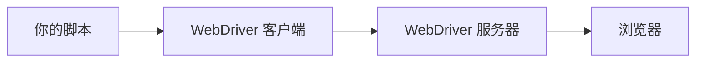
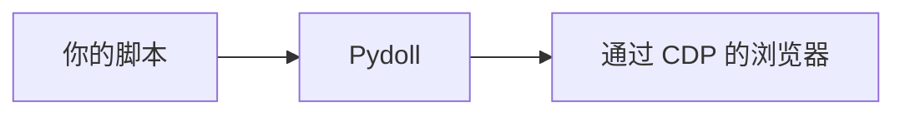

# Chrome DevTools Protocol

Chrome DevTools Protocol（CDP）是 Pydoll 用来控制浏览器的接口。它就是当你检视一个页面时 Chrome DevTools 所使用的同一套协议，只不过以可编程的 API 形式暴露出来。理解它，就能明白 Pydoll 的各项能力从何而来，以及为什么这里根本没有 webdriver。

## CDP 是什么

CDP 是一套以编程方式控制基于 Chromium 的浏览器的协议。消息是 JSON，通过 WebSocket 发送，并按 domain 组织，每个 domain 各自覆盖浏览器的一个领域：`Page` 负责导航与生命周期，`DOM` 负责页面结构，`Network` 负责流量，`Runtime` 负责 JavaScript，`Input` 负责鼠标和键盘，`Fetch` 负责请求拦截，`Target` 负责标签页和上下文，等等。

CDP 由 Google 维护，并随每个 Chrome 版本不断扩展。因为它是为驱动 Chrome 自家的 DevTools 而生的，所以它深入浏览器内部，这也正是它成为 Puppeteer、Playwright 和 Pydoll 等自动化工具基石的原因。

Pydoll 直接讲 CDP，所以它的能力就是 CDP 所暴露的一切。没有一个单独的自动化层来决定你能做什么、不能做什么。

## 连接是如何工作的

用远程调试标志启动一个 Chromium 浏览器，它就会在该端口上打开一个 WebSocket 服务器：

```
chrome --remote-debugging-port=9222
```

Pydoll 连接到那个 WebSocket，并在整个会话期间保持连接打开。这个通道是双向的：你的代码向浏览器发送命令，浏览器则在事件发生的瞬间通过同一条连接把它们推回给你。

<iframe scrolling="no" src="/docs/resources/visuals/cdp-connection.html" aria-label="Pydoll and Chrome exchange framed JSON over one WebSocket: commands are matched to their responses by id and resolved inline, while unsolicited events flow through a separate queue drained to callbacks" style="width: 100%; height: 560px; border: 0;" loading="lazy"></iframe>

对自动化而言，一条持久的 WebSocket 比旧协议所用的请求/响应式 HTTP 端点更合适：浏览器会在事情发生的那一刻通知你，而不用你去轮询才能知道。

## Domain

CDP 把它的方法和事件按 domain 分组。在自动化中你最常遇到的有：

| Domain | 覆盖范围 | 示例用途 |
|--------|--------|--------------|
| Browser | 浏览器应用本身 | 窗口管理、创建浏览器上下文 |
| Page | 页面生命周期 | 导航、运行 JavaScript、frame |
| DOM | 页面结构 | 查询元素、读取和设置属性 |
| Network | 流量 | 观察请求和响应、缓存 |
| Runtime | JavaScript 引擎 | 求值表达式、调用函数 |
| Input | 用户输入 | 鼠标移动、键盘、触摸 |
| Target | 标签页和上下文 | 打开标签页、访问 iframe、处理弹窗 |
| Fetch | 底层拦截 | 修改请求、模拟响应、认证 |

Pydoll 把这些 domain 映射为一套更友好的 API，所以 `tab.go_to(...)` 会发送一条 `Page.navigate` 命令，`tab.find(...)` 会使用 `DOM` 查询，而无需你去拼装原始消息。

## 命令与事件

每一次 CDP 交互都是两种消息类型之一。

**命令（command）** 是你发出的一个请求：一个带参数的 domain 方法。浏览器执行它，并回复一个结果，通过 id 与你的消息匹配。`Page.navigate`、`DOM.getDocument` 和 `Input.dispatchMouseEvent` 都是命令。

**事件（event）** 是浏览器在你启用其 domain 之后主动发送的一个通知。`Page.loadEventFired`、`Network.requestWillBeSent` 和 `Fetch.requestPaused` 都是事件。你用一个回调来订阅它，并在它触发时作出反应：

```python
from functools import partial

from pydoll.protocol.network.events import NetworkEvent


async def on_request(tab, event):
    url = event['params']['request']['url']
    print(f'request to: {url}')


await tab.enable_network_events()
await tab.on(NetworkEvent.REQUEST_WILL_BE_SENT, partial(on_request, tab))
```

正是事件让基于 CDP 的自动化能在浏览器状态改变的那一刻作出反应，而不是靠睡眠等待再碰运气。可用的工作指南见 [事件](../guides/events.md)。

## Target 与 session

CDP 把你能附着的每样东西称作一个 **target**：浏览器本身、每个标签页，以及进程外的 iframe，都是各自独立的 target。附着到一个 target 会打开一个 **session**，而针对该 target 的命令会携带它的 `sessionId`，好让浏览器知道该把它们路由到哪里。

这就是一条 WebSocket 连接如何同时驱动众多标签页的方式，也是命令如何到达一个跨源 iframe 内部元素的方式。Pydoll 为你处理好了 target 和 session 的路由，所以一个 `Tab` 对象无需你追踪 session id 就能工作。

## 为什么这里没有 webdriver

传统的 webdriver 工具在你的代码和浏览器之间放了一个翻译服务器：



这个服务器把 WebDriver 协议翻译成浏览器的原生调用，而它正是你必须安装、并要与你的浏览器版本对齐的那一块。Pydoll 则直接与浏览器对话：



没有一个单独的驱动需要下载或保持同步，而且这条连接就是浏览器内部使用的、同一条事件驱动的通道。这对你编写脚本意味着什么，见 [核心概念](../guides/core-concepts.md)。

## 相关内容

- [深入探究总览](index.md)：其他背景主题。
- [核心概念](../guides/core-concepts.md)：在可用层面的标签页与浏览器模型。
- [事件](../guides/events.md)：在实践中订阅 CDP 事件。
- [CDP 规范](https://chromedevtools.github.io/devtools-protocol/)：完整的 domain 和方法参考。
