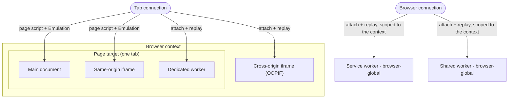

# Worker 与跨源 iframe

一个 fingerprinting 脚本不会只读取一次你的身份。它会在页面能够派生出的每一个 iframe 和 Web Worker 内部反复读取，而其中每一个都是一个独立的 JavaScript realm，拥有它自己的 `navigator`。如果页面报告的是注入的 Windows 身份，而某个 worker 报告的却是真实的 macOS，那个不一致就是破绽。

所以一个注入的身份必须在*每一个* realm 中都成立，而不只是在顶层文档中。本页就是 [Fingerprint 注入](../../stealth/fingerprint-injection.md) 中那句覆盖会“在 worker 中被重放”背后的机制，也是 [Cloudflare](cloudflare-challenge.md) 跨源屏幕泄露的一般形式。它讲解 realm 是什么，为什么有些覆盖能免费触及每一个 realm 而另一些只能触及其中一个，以及 Pydoll 如何手动把身份重放到它必须触及的那些 realm 中。

## realm 是浏览器环境的一份全新副本

一个 realm 是一个独立的 JavaScript 全局环境：它自己的 `window` 或 `self`，它自己的 `navigator`，它自己的 prototype 链。主文档是一个 realm。每一个 iframe 是另一个。每一个 Web Worker 又是另一个。你在主页面里于 `Navigator.prototype` 上重新定义的一个 getter，在一个 worker 或一个跨源 iframe 中并不存在，因为那个 realm 是从 prototype 的一份全新副本构建出来的。

检测系统会直接利用这一点。它们在页面中读取 fingerprint，派生出第二个 realm，在那里再次读取整个 fingerprint，然后把两者做比较。[CreepJS](https://abrahamjuliot.github.io/creepjs/) 会在一个 Web Worker 内部把它的整个 fingerprint 再跑一遍。Cloudflare 则在一个跨源 iframe 内部运行它的挑战。一个只安装在主 realm 中的覆盖，会在那第二个 realm 里泄露真实值，而这个不匹配正是被打分的东西。

  

CreepJS 在一个 worker 内部第二次读取 fingerprint。这里它报告的是注入的身份，而不是真实的 Mac。

下面这张交互式地图在一台真实的 Mac 上应用一个 Windows profile，并在每一个 realm 中读取 `navigator.platform`。在一个幼稚的顶层页面 hook 和 Pydoll 的逐 realm 重放之间切换：

<iframe src="/docs/resources/visuals/realm-coverage.html" aria-label="一个 Windows profile 应用在一台 Mac 上；在主文档、一个同源 iframe、一个跨源 OOPIF，以及 dedicated、shared 和 service worker 中读取 navigator.platform。一个顶层页面 hook 只匹配主文档；Pydoll 的重放匹配每一个 realm。" style="width: 100%; height: 430px; border: 0;" loading="lazy"></iframe>

## 两种覆盖能免费触及每一个同进程 realm

Pydoll 的两种机制会自行跨越 realm 边界，但仅限于单个进程之内：

- **CDP `Emulation` 覆盖**（`setUserAgentOverride`、`setHardwareConcurrencyOverride`、`setTimezoneOverride`、`setLocaleOverride`、`setDeviceMetricsOverride`、`setEmulatedMedia`）由浏览器在 target 层面、也就是 JavaScript 之下应用。它们覆盖主文档以及同一进程中的每一个 frame。
- **`Page.addScriptToEvaluateOnNewDocument`** 会在页面 target 的每一个 frame 中，先于该 frame 自己的脚本运行一段脚本。它覆盖主 realm 以及每一个同源（同进程）iframe。

这两者合起来，无需任何额外工作就覆盖了主文档和同源 iframe。一个同源的子 iframe 读取的是注入的 `platform`、`hardwareConcurrency` 和 User-Agent，而不是宿主机器的。

它们触及不到的，是一个存在于它**自己的 target**中的 realm。一个 Web Worker 和一个跨源 iframe 各自拥有一个独立的 CDP 会话，而上面这两种机制都不会跨越那道边界。

| Realm | 页面脚本可触及 | Emulation 覆盖可触及 | 拥有自己的 CDP target |
|---|---|---|---|
| 主文档 | 是 | 是 | 否 |
| 同源 iframe | 是 | 是 | 否 |
| 跨源 iframe（OOPIF） | 否 | 否 | 是 |
| Web Worker（任意类型） | 否 | 否 | 是 |

## Web Worker 运行在一个拥有自己 navigator 的 realm 中

一个 Web Worker 是一段没有 DOM、拥有自己全局对象 `self` 的后台脚本。它有三种类型：

- **Dedicated worker**（`new Worker(...)`）：由一个文档所拥有，随它一起消亡。
- **Shared worker**（`new SharedWorker(...)`）：一个实例，被每一个同源文档所共享。
- **Service worker**：一个后台 worker，能控制一个源的网络，并且比注册它的那个页面活得更久。

每一种都暴露一个 `WorkerNavigator`，带有它自己的 `userAgent`、`platform`、`hardwareConcurrency`、`deviceMemory` 和 `languages`。一个检测器会启动一个 worker，重新读取这些值，并把它们与页面做比较。如果 worker 报告的是真实的机器，这次会话就会被标记。

Pydoll 通过在一个 worker 运行之前附加到它来触及它。它启用 `Target.setAutoAttach` 并配合 `waitForDebuggerOnStart`，所以每一个 worker 在创建时都会以**暂停**状态附加。在附加时，Pydoll 会重放 User-Agent 和 `hardwareConcurrency` 这两个 CDP 覆盖，并在那个会话上执行 worker fingerprint 脚本，然后恢复这个 worker。它一启动就已经穿戴好了身份，所以它的第一次读取就已经是注入的那个。

## 标签页作用域与浏览器作用域

并不是每一个 worker 都通过同一个 CDP 连接来应答，而这种区分正是 Pydoll 要在两个地方设置它们的原因。

- 一个 **dedicated worker** 是页面 target 的一个子级。它的会话可以通过标签页自己的连接触及，所以 Pydoll 会为每个标签页设置一次。
- 一个 **service 或 shared worker** 是一个浏览器全局的 target。它不被任何单个页面所拥有，它的会话只通过浏览器级别的连接来应答，而不是某个标签页的连接。Pydoll 会在浏览器连接上，为每个浏览器 context 注册一次那个处理器，并按 `browserContextId` 对它做作用域限定，这样一个 context 中的 worker 永远不会收到另一个 context 的身份。

因为 service worker 和 shared worker 会被一个 context 中的每一个标签页所共享，所以一个浏览器 context 只持有单一身份。对一个已经拥有 fingerprint 的 context 再应用另一个不同的 fingerprint，会抛出 `FingerprintContextConflict`（参见 [跨 context 使用多个 fingerprint](../../stealth/fingerprint-injection.md#multiple-fingerprints-across-contexts)）。

## 跨源 iframe 运行在另一个进程中

一个同源 iframe 共享页面的进程和 target，所以它已经被覆盖了；一个同站的跨源 iframe 也是如此，因为 Chrome 的 site isolation 是按可注册域（registrable domain）来划分的，而不是按源来划分。一个**跨站** iframe 则不同：Chrome 会在一个**独立的进程**中渲染它，配上它自己的 target 和 CDP 会话，也就是一个进程外 iframe（OOPIF）。页面脚本和页面的 Emulation 覆盖都在进程边界处止步，所以这个 OOPIF 读取的是真实的身份：真实的 User-Agent、时区、硬件和 GPU。

这就是检测器的一个可乘之机。它之所以能把自己的探针托管在一个跨源 iframe 里，恰恰是因为一个顶层页面 hook 触及不到它。Cloudflare 的托管挑战运行在 `challenges.cloudflare.com` 内部；在 headless 下，它在那里读到的是原始的 `800x600` 屏幕，而页面报告的却是 profile 的屏幕，两者互相矛盾（参见 [Cloudflare 的托管挑战](cloudflare-challenge.md)）。

Pydoll 用它对付 worker 时所用的同一套附加并重放（attach-and-replay），通过标签页连接应用到 iframe target 上，来触及一个 OOPIF。一个 OOPIF 是页面 target 的一个子级，所以它是以暂停状态在那里附加的，而不是在浏览器连接上。浏览器全局的虚拟屏幕已经通过 `Emulation.updateScreen` 为每一个 frame（包括 OOPIF）做到了一致（参见 [Headless 模式](../../stealth/fingerprint-injection.md#headless-mode)）。要触及每个 OOPIF 各自的 `navigator` 和 WebGL 身份，意味着要在这个 iframe 自己的会话上重放整套覆盖（User-Agent、`hardwareConcurrency`、时区、locale、地理位置、媒体特性，以及在那个会话上启用 Page 域之后的页面脚本），然后最后再恢复这个 target，这样在身份就位之前就不会有任何东西运行。

!!! note "OOPIF 注入是有作用域的，而不是一刀切"
    一个页面可能为广告和分析嵌入数十个第三方 iframe。附加到并注入每一个都很昂贵，而且可能拖住页面，所以 OOPIF 的身份覆盖瞄准的是那些真正会读取 fingerprint 的 frame，比如一个挑战或验证码（captcha）小组件，而不是应用到每一个跨源 frame。

## 始终恢复一个已附加的 realm

`waitForDebuggerOnStart` 会在每一个已附加 target 的第一行之前把它暂停，而这恰恰是让 Pydoll 能及时装好身份的原因。它带着一条硬性规则：一个已附加但从未被恢复的 target 会永远挂起，而对于一个 iframe，这会拖住整个嵌入它的页面。

!!! warning "无论是否注入，都要恢复每一个已附加的 target"
    Pydoll 会在一个 `finally` 中恢复每一个已附加的 worker 和 iframe，无论它是否向其中注入过。一个被跳过的第三方 iframe 仍然会被恢复；被跳过的只是对它的注入。仅仅漏掉一次恢复，就足以让页面卡在一个空白的验证码或一个不停转圈的挑战上。

## 每一个 realm，以及 Pydoll 如何触及它

| Realm | 自己的 CDP 会话 | Pydoll 如何触及它 | 设置粒度 |
|---|---|---|---|
| 主文档 | 否 | 页面脚本 + Emulation | 标签页 |
| 同源 iframe | 否 | 页面脚本 + Emulation | 标签页 |
| Dedicated worker | 是 | 附加 + 重放 | 标签页 |
| 跨源 iframe（OOPIF） | 是 | 附加 + 重放 | 标签页 |
| Shared worker | 是 | 附加 + 重放 | 浏览器 context |
| Service worker | 是 | 附加 + 重放 | 浏览器 context |

这张表底下的规则：一个覆盖只有在它与页面共享同一个进程时，才能免费触及一个 realm。每一个位于它自己 target 中的 realm 都必须被附加、重放和恢复，而 service worker 和 shared worker 就是那两个通过浏览器连接（而不是标签页的连接）来应答的。

## 相关

- [Fingerprint 注入](../../stealth/fingerprint-injection.md)：应用一个连贯的身份，以及那条 worker 重放的检查清单条目。
- [Browser fingerprinting](browser-fingerprinting.md)：每个 realm 所暴露的 `navigator`、WebGL 和屏幕信号。
- [Cloudflare 的托管挑战](cloudflare-challenge.md)：作为一个实时案例研究的 OOPIF realm。
- [浏览器上下文](../../guides/browser-contexts.md)：为什么一个 context 只持有一个身份。
