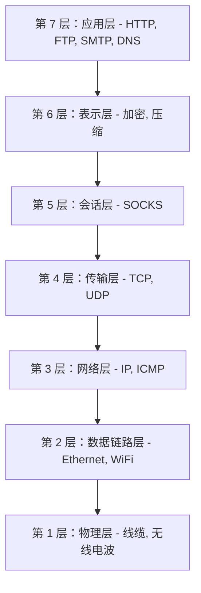
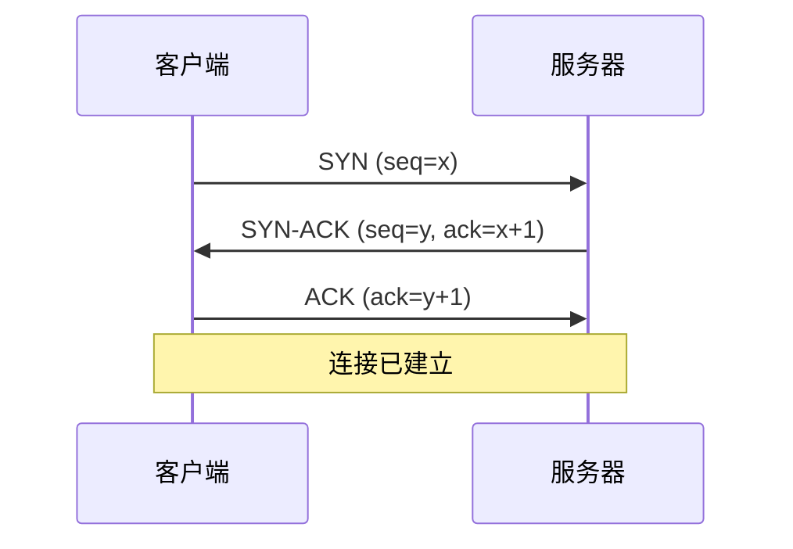
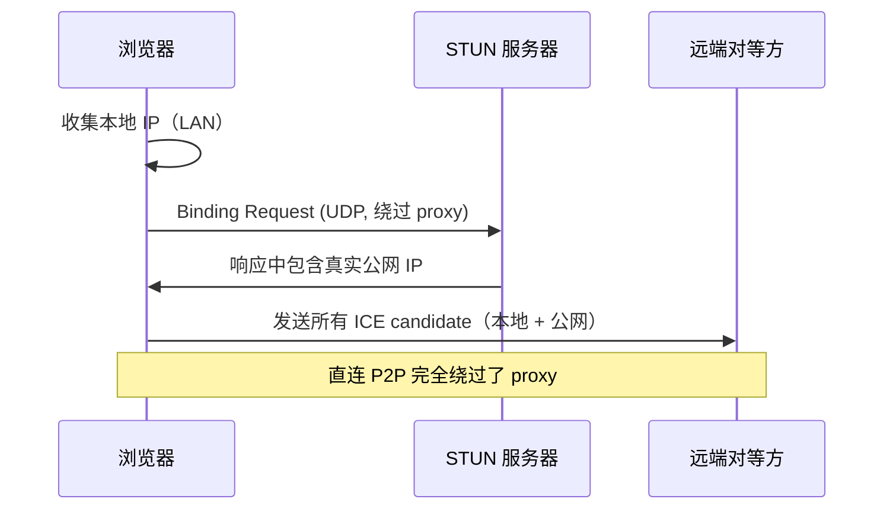

# 网络基础

你的浏览器发出的每一个请求，都会穿过一个分层的网络栈，而每一层都决定了一个 proxy 能看到、改变或隐藏什么，以及什么仍会泄露你真实的身份。理解这个栈，才能让 proxy 的行为变得可预测，而不再神秘。本页会走一遍这些层、TCP 和 UDP 协议，以及 WebRTC，也就是在被代理的自动化中最常见的 IP 泄露源头。

实际配置见 [Proxy](../../guides/proxies.md)。这些底层如何被转化为一个指纹，见 [网络指纹](../fingerprinting/network-fingerprinting.md)。

## 网络栈

Proxy 工作在不同的层上，而所在的层决定了它的触及范围。即便隔着一个完美无缺的高层 proxy，更底层的特征仍能给你的真实系统留下指纹，所以搞清楚每个协议所处的位置会很有帮助。

OSI 模型（7 层）是一个教学参考；真实网络运行的是 TCP/IP 模型（4 层）。但 OSI 术语仍是人们描述一个 proxy 工作在哪里时的通用说法，所以值得了解。



对自动化重要的那些层：

- **第 7 层，应用层。** HTTP、HTTPS、FTP、SMTP、DNS。你的代码真正关心的实际数据。HTTP proxy 位于此处，对请求和响应有完整的可见性。
- **第 6 层，表示层。** 加密和压缩。TLS 与这一层相关联，尽管实际上它横跨第 4 到第 6 层。
- **第 5 层，会话层。** SOCKS proxy 位于此处，在应用层之下，这使它们与协议无关。
- **第 4 层，传输层。** TCP（可靠）和 UDP（快速）。端口、流控、纠错。每一个 proxy 都依赖这一层来搬运数据。
- **第 3 层，网络层。** IP 寻址和路由。你的真实 IP 就在这里，也正是 proxy 所替换掉的东西。
- **第 2 层，数据链路层。** Ethernet 和 Wi-Fi，MAC 地址。只在本地网段可见，远端服务器看不到（不过 IPv6 SLAAC 可能会把 MAC 嵌入地址中）。
- **第 1 层，物理层。** 线缆和无线电。与自动化很少相关。

### 层如何决定一个 proxy 能做什么

第 7 层的 HTTP/HTTPS proxy 理解 HTTP，所以它可以读取和重写 URL、header、cookie 和 body，按 HTTP 语义缓存，并注入 header。作为交换，它只讲 HTTP，而检视 HTTPS 意味着要终结 TLS（解密、再加密）。

第 5 层的 SOCKS proxy 位于应用层之下，所以它与协议无关：它原封不动地转发任何第 7 层协议，让 HTTPS 端到端加密地穿过，而且 SOCKS5 还能承载 UDP。代价是没有应用层的可见性：它能按 IP 和端口过滤，但不能按 URL 或内容过滤。

!!! note "取舍"
    更高的层给你更多内容控制，但更少的协议灵活性；更低的层则反过来。要内容控制就选 HTTP proxy，要协议灵活性或端到端加密就选 SOCKS proxy。

### 层泄露问题

即便是一个完美的第 7 层 proxy，也无法改变更底层所暴露的东西。你操作系统在第 4 层的 TCP 栈有一个指纹（窗口大小、选项顺序、TTL），而第 3 层的 IP header 字段会暴露操作系统和网络拓扑。如果你呈现一个 Windows 的 User-Agent，而你 Linux 内核的 TCP 指纹却另有说法，那么一个把两者关联起来的系统就会标记出这处不一致。这正是 [网络指纹](../fingerprinting/network-fingerprinting.md) 危险之处：它工作在 proxy 之下。

## TCP 与 UDP

在第 4 层，有两个协议占主导地位，它们的优先取向恰好相反：可靠性对速度。

TCP 是面向连接的，就像打电话：你建立一个连接，交换数据时每个字节都被确认并保序，然后关闭它。UDP 是无连接的：你发出一个数据报，然后寄希望于它能送达，没有握手也没有任何保证，换来的是最小的开销。

| 特性 | TCP | UDP |
|---------|-----|-----|
| 连接 | 面向连接（有握手） | 无连接（无握手） |
| 可靠性 | 保证送达、保序 | 尽力而为，可能丢包 |
| 速度 | 较慢（可靠性开销） | 较快（开销极小） |
| 使用场景 | Web、文件传输、邮件 | 流媒体、DNS、游戏、WebRTC |
| Header 大小 | 20 字节（最多 60） | 固定 8 字节 |
| 流控/拥塞控制 | 有 | 无 |
| 保序/重传 | 有 | 无 |

所有 proxy 协议（HTTP、HTTPS、SOCKS4、SOCKS5）都用 TCP 作为它们的控制通道，因为认证和命令序列需要有保证的送达。SOCKS5 额外还能代理 UDP，而这是 SOCKS4 和 HTTP proxy 做不到的。

### TCP 三次握手

在任何数据传输之前，TCP 会进行一次三次握手，以同步序列号和连接状态。



客户端发送一个 SYN，携带一个随机的初始序列号（Initial Sequence Number）和它的 TCP 选项（窗口大小、MSS、时间戳、SACK）。服务器回复一个 SYN-ACK：它自己的随机 ISN，外加对客户端 ISN 的确认。客户端发送最后一个 ACK，连接便在双向上都打开了。ISN 被随机化（RFC 6528），以防止攻击者靠猜测序列号来注入数据包。

### TCP 指纹

握手会暴露操作系统特有的值：初始窗口大小、选项顺序、TTL 和窗口缩放。这些由内核设定，而非浏览器，所以 proxy 无法改变它们。示意性的默认值（会随版本和调优而变化）：

```
Windows 10/11:  Window 65535,  TTL 128,  Options: MSS, NOP, WS, NOP, NOP, SACK_PERM
Linux 5.x+:     Window 29200,  TTL 64,   Options: MSS, SACK_PERM, TS, NOP, WS
macOS:          Window 65535,  TTL 64
```

!!! warning "proxy 无法隐藏你的 TCP 指纹"
    HTTP 和 SOCKS proxy 都位于 TCP 之上，所以你操作系统的 TCP 指纹会一直到达 proxy，以及你和它之间的任何观察者。只有 VPN 层级的路由，或操作系统层级的栈调优，才能改变它。紧随其后的 TLS 握手又会加上另一个指纹（JA3/JA4）；见 [网络指纹](../fingerprinting/network-fingerprinting.md)。

### UDP、DNS 与 QUIC

UDP 是发了就不管：一个 8 字节的 header，没有连接，没有可靠性。它适合实时媒体（WebRTC、VoIP）、游戏和 DNS，这些场景由应用自己来处理任何重试。DNS 使用 UDP，是因为查询很小，且能从零握手开销中获益。

自动化上的顾虑在于，大多数 proxy 只承载 TCP，所以 UDP 流量可能绕过 proxy 而暴露你的真实 IP：

| Proxy 类型 | UDP 支持 |
|------------|-------------|
| HTTP / HTTPS (CONNECT) | 否（仅 TCP 隧道） |
| SOCKS4 | 否 |
| SOCKS5 | 是（通过 `UDP ASSOCIATE`） |
| VPN | 是（隧道承载所有 IP 流量） |

现代 Chrome 还会使用 QUIC（RFC 9000），也就是 HTTP/3 背后基于 UDP 的传输，它带有同样的绕过风险，并有它自己的指纹。在自动化中，你可以用 `--disable-quic` 强制走 TCP 上的 HTTP/2，让所有 web 流量都遵循你的 proxy。

## WebRTC 与 IP 泄露

WebRTC 让浏览器之间可以直接进行点对点的音频、视频和数据传输。它以低延迟为优化目标而非隐私，是被代理的自动化中最常见的单一 IP 泄露源头：即便每一个 HTTP 层都被正确代理，它仍能暴露你的真实 IP。

为了建立一个 P2P 连接，WebRTC 会通过 STUN 服务器经由 UDP 发现你的公网 IP。这些查询会绕过只走 TCP 的 proxy，IP 便落进了连接的 ICE candidate 里，而页面上的 JavaScript 可以读取这些 candidate 并把你的真实 IP 发给服务器。

### ICE、STUN，以及会泄露的那些 candidate

WebRTC 使用 ICE（RFC 8445）来收集可能的连接路径，称为 candidate，而正是这个收集过程暴露了你的网络。



会收集三种类型的 candidate：

- **Host candidate**：你的本地 LAN IP。Chrome 75+ 会用临时的 mDNS 名称（`a1b2c3d4.local`）替换它们，除非授予了摄像头/麦克风权限，所以这类泄露已基本被缓解。
- **Server-reflexive candidate**：STUN 服务器所看到的你的公网 IP。这就是大家所说的那种泄露：proxy 显示一个 IP，WebRTC 却暴露了你真实的那个。
- **Relay candidate**：当直连 P2P 失败时使用的 TURN 中继地址；其 `raddr` 字段可能仍携带你的真实 IP。

STUN（RFC 8489）是一个简单的 UDP 上的请求/响应：客户端问“你看到的 IP 是什么”，服务器则在一个 `XOR-MAPPED-ADDRESS` 中返回公网 IP 和端口（为 NAT 兼容性而与一个固定的 magic cookie 做异或，并非出于安全考虑）。浏览器出厂就自带公共 STUN 服务器，例如 `stun.l.google.com:19302`。

proxy 无法阻止这一切，因为 WebRTC 使用 UDP（大多数 proxy 并不承载），它工作在 HTTP 层之下、直接面对操作系统的网络栈，并且会枚举每一个网络接口。任何页面都可以触发它并读取结果：

```javascript
const pc = new RTCPeerConnection({ iceServers: [{ urls: 'stun:stun.l.google.com:19302' }] });
pc.createDataChannel('');
pc.createOffer().then(offer => pc.setLocalDescription(offer));
pc.onicecandidate = (event) => {
  if (!event.candidate) return;
  const ip = event.candidate.candidate.match(/([0-9]{1,3}(\.[0-9]{1,3}){3})/);
  if (ip) fetch(`/track?real_ip=${ip[1]}`);
};
```

### 防止 WebRTC 泄露

推荐的修复是 Pydoll 内置的选项，它会设置 WebRTC 的 IP 处理策略，从而阻止那些本会跳过 proxy 的 UDP：

```python
from pydoll.browser.chromium import Chrome
from pydoll.browser.options import ChromiumOptions

options = ChromiumOptions()
options.webrtc_leak_protection = True   # --force-webrtc-ip-handling-policy=disable_non_proxied_udp
```

其他替代方案，视你的需要而定：

- 通过 `options.browser_preferences = {'webrtc': {'ip_handling_policy': 'disable_non_proxied_udp', 'multiple_routes_enabled': False, 'nonproxied_udp_enabled': False}}` 设置同样的策略。
- 让 WebRTC 走一个支持 UDP 中继的 SOCKS5 proxy（`--proxy-server=socks5://host:1080`），但并非所有 SOCKS5 都支持。
- 如果你从不需要 WebRTC，就用 `--disable-features=WebRTC` 彻底禁用它（这会破坏视频会议；请针对你的 Chrome 版本测试该标志名）。

!!! warning "务必验证"
    永远不要假设 proxy 会阻止 WebRTC 泄露。用你的配置加载 [browserleaks.com/webrtc](https://browserleaks.com/webrtc) 或 [ipleak.net](https://ipleak.net)，确认只出现 proxy 的 IP。哪怕一次泄露，也会同时暴露你真实的位置、ISP 和网络拓扑。

## 相关内容

- [HTTP/HTTPS proxy](http-proxies.md)：深入讲应用层代理。
- [SOCKS proxy](socks-proxies.md)：会话层、与协议无关的代理（包括 SOCKS5 的 UDP 和认证细节）。
- [Proxy 检测](proxy-detection.md)：暴露 proxy 的那些信号。
- [网络指纹](../fingerprinting/network-fingerprinting.md)：TCP/TLS/HTTP2 如何成为一个签名。
- [Proxy](../../guides/proxies.md)：Pydoll 的实践配置。

## 参考资料

- RFC 793 (TCP), RFC 768 (UDP), RFC 6528 (ISN randomization)
- RFC 8489 (STUN), RFC 8445 (ICE), RFC 8656 (TURN)
- RFC 9000 (QUIC), W3C WebRTC 1.0
