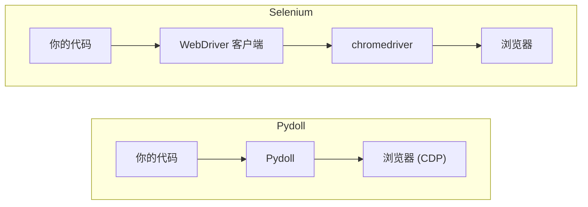

# 核心概念

Pydoll 建立在几个设计决策之上，它们塑造了你编写每个脚本的方式：无 webdriver、异步 API、拟人化交互，以及事件系统。本页在可动手的层面上解释每一项，好让后续的任务指南更容易理解。

## 无 webdriver

Pydoll 通过 Chrome DevTools Protocol（CDP）直接连接浏览器，这正是你打开检查器时驱动 Chrome DevTools 的同一套协议。中间没有 webdriver 可执行文件，所以没有东西需要下载，也不用去排查“chromedriver 只支持 Chrome 版本 X”这类不匹配的问题。



当你启动浏览器时，Pydoll 会用一个远程调试端口拉起你已经安装的那个 Chrome，并向它的 CDP 端点打开一个 WebSocket：

```python
import asyncio

from pydoll.browser.chromium import Chrome


async def main():
    async with Chrome() as browser:
        tab = await browser.start()
        await tab.go_to('https://quotes.toscrape.com')

asyncio.run(main())
```

你不用管理端口、连接或浏览器进程；`start()` 会做这些，而 `async with` 代码块会在你用完后停止浏览器。

## browser 和 tab 对象

两个对象覆盖了你大部分的操作。**browser**（`Chrome` 或 `Edge`）是你启动的进程。由 `browser.start()` 返回的 **tab** 才是你实际操作的对象：导航、元素查找、截图，页面上的一切都通过它进行。

```python
async with Chrome() as browser:
    tab = await browser.start()          # 第一个 tab
    await tab.go_to('https://quotes.toscrape.com')

    second = await browser.new_tab()     # 从 browser 打开更多 tab
    await second.go_to('https://books.toscrape.com')
```

管理多个标签页请看 [标签页](tabs.md)，隔离会话请看 [浏览器上下文](browser-contexts.md)。

## 一切皆异步

每个 Pydoll 调用都是一个协程，所以你要在 `async def` 函数里 `await` 它，并用 `asyncio.run()` 启动程序。这不是外挂上去的兼容层；它正是 Pydoll 同时驱动多个标签页和多个浏览器的方式。由于导航和元素等待大部分时间都处于空闲，`asyncio.gather` 会让它们并发运行，而不是一个接一个：

```python
import asyncio

from pydoll.browser.chromium import Chrome


async def title_of(browser, url):
    tab = await browser.new_tab(url)
    title = await tab.title
    await tab.close()
    return title


async def main():
    urls = [
        'https://quotes.toscrape.com/page/1/',
        'https://quotes.toscrape.com/page/2/',
        'https://quotes.toscrape.com/page/3/',
    ]
    async with Chrome() as browser:
        await browser.start()
        titles = await asyncio.gather(*(title_of(browser, url) for url in urls))
        print(titles)

asyncio.run(main())
```

三个页面并发加载，所以整体耗时大约等于最慢的单个页面，而不是三者之和。

!!! note "刚接触异步 Python？"
    如果对 `async`、`await` 和 `gather` 还不熟悉，请先读 [异步 Python 实战](../basics/async-python.md)。它只讲够用的 asyncio，足以让你从容读完这些指南的其余部分。

## 拟人化交互

默认情况下，点击会落在元素中心，输入以固定的节奏进行。传入 `humanize=True`，Pydoll 就会让光标沿一条曲线路径移动后再点击，并以可变的节奏输入，其中偶尔还会出现被纠正的手误：

```python
search = await tab.find(id='search')
await search.type_text('web scraping', humanize=True)
await search.click(humanize=True)
```

拟人化是逐次交互按需开启的，所以你可以在会盯着行为看的站点上启用它，而在只看重原始速度的地方跳过它。计时模型请看 [拟人化交互](../stealth/human-like-interactions.md)，完整的输入 API 请看 [键盘](keyboard.md) 和 [鼠标](mouse.md)。

## 事件驱动

你可以订阅浏览器事件、在它们触发时运行回调，而不必在循环里轮询页面。这正是你捕获网络流量、对导航做出反应，或等待某个特定请求的方式：

```python
import asyncio
from functools import partial

from pydoll.browser.chromium import Chrome
from pydoll.protocol.network.events import NetworkEvent


async def on_request(tab, event):
    url = event['params']['request']['url']
    if '/api/' in url:
        print(f'API call: {url}')


async def main():
    async with Chrome() as browser:
        tab = await browser.start()

        await tab.enable_network_events()
        await tab.on(NetworkEvent.REQUEST_WILL_BE_SENT, partial(on_request, tab))

        await tab.go_to('https://quotes.toscrape.com')
        await asyncio.sleep(2)

asyncio.run(main())
```

只启用你用到的事件域，用完就把它们关掉。完整的模型请看 [事件](events.md)，流量捕获请看 [网络监控](network-monitoring.md)。

## 适用于各种 Chromium 浏览器

同一套 API 可以驱动任何 Chromium 浏览器。Chrome 是首要目标；Edge 有完整支持；其他 Chromium 构建则通过把 `binary_location` 指向它们来使用。

```python
from pydoll.browser.chromium import Chrome, Edge
from pydoll.browser.options import ChromiumOptions

# Chrome
async with Chrome() as browser:
    tab = await browser.start()

# Edge
async with Edge() as browser:
    tab = await browser.start()

# 任何其他 Chromium 构建（Brave、Vivaldi、Opera ……）
options = ChromiumOptions()
options.binary_location = '/path/to/brave-browser'
async with Chrome(options=options) as browser:
    tab = await browser.start()
```

## 下一步

- [元素查找](element-finding.md)：用 `find()` 和 `query()` 定位元素。
- [结构化提取](structured-extraction.md)：用模型从页面中提取带类型的数据。
- [事件](events.md)：在页面和网络事件触发时做出反应。
- [Chrome DevTools Protocol](../deep-dive/cdp.md)：深入了解 Pydoll 与浏览器对话所用的协议。
