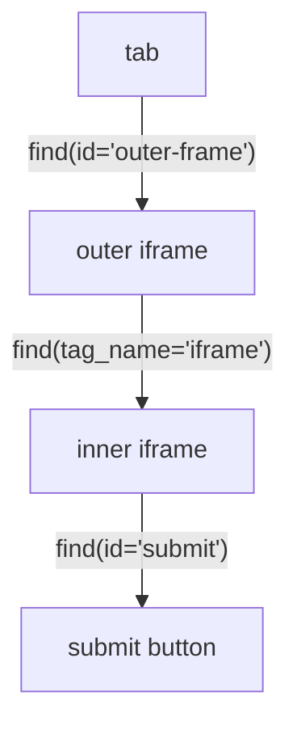

# Iframes

页面通过 `<iframe>` 嵌入其他文档，而 iframe 有它自己的 DOM 上下文。Pydoll 会替你把搜索路由进那个上下文，因此你只需找到 iframe 元素一次，然后就用平时到处都在用的同样的 `find()` 和 `query()` 在里面工作。没有需要切入切出的框架，也没有需要切回来的东西。

## 与 iframe 交互

像找任何元素那样找到 `<iframe>`，然后在它上面调用 `find()` 或 `query()`。这些调用会自动在框架内部运行。

```python
import asyncio

from pydoll.browser.chromium import Chrome


async def main():
    async with Chrome() as browser:
        tab = await browser.start()
        await tab.go_to('https://the-internet.herokuapp.com/iframe')

        editor = await tab.find(tag_name='iframe')   # 嵌入的编辑器框架
        body = await editor.find(id='tinymce')        # 框架内部的一个元素
        print(await body.text)

asyncio.run(main())
```

`tab.find()` 和 `tab.query()` 只能看到顶层文档。要触及框架内部的内容，从 iframe 元素开始，而不是从 tab 开始。

## 嵌套的 iframe

一个框架可以包含另一个框架。继续串联即可：每次搜索都限定在你调用它的那个元素上。




```python
outer = await tab.find(id='outer-frame')
inner = await outer.find(tag_name='iframe')

submit = await inner.find(id='submit')
await submit.click()
```

模式始终一样：找到 iframe 元素，用那个元素继续搜索，对更深的层级重复这一过程。你永远不用缓存框架目标或打开额外的标签页。

## 在框架内部运行 JavaScript

在 iframe 元素上调用 `execute_script()` 会在框架自己的执行上下文中运行，同源和跨源框架都一样。

```python
iframe = await tab.find(tag_name='iframe')
result = await iframe.execute_script('return document.title', return_by_value=True)
print(result['result']['result']['value'])
```

## 捕获一个框架的内容

`tab.take_screenshot()` 只捕获顶层页面。要捕获框架内部的东西，对框架内的一个元素截图：

```python
iframe = await tab.find(tag_name='iframe')
chart = await iframe.find(id='sales-chart')
await chart.take_screenshot('chart.png')
```

## 在一个选择器里跨越框架边界

除了先找到每个 iframe 再在里面搜索，你还可以写一个跨越框架边界的选择器。Pydoll 会检测 `iframe` 步进，在每个边界处把选择器拆开，替你沿着链条走下去。

### 用 CSS

在一个 `iframe` 复合选择器之后使用组合器（`>` 或空格）：

```python
# 跨越一个 iframe
button = await tab.query('iframe > .submit-btn')

# 按属性匹配 iframe
pay = await tab.query('iframe[src*="checkout"] > #pay-button')

# 嵌套的 iframe
content = await tab.query('iframe.outer > iframe.inner > div.content')

# iframe 位于根之下，而非就在根处
submit = await tab.query('div > iframe > button.submit')
```

### 用 XPath

在一个 `iframe` 步进之后使用 `/`：

```python
# 跨越一个 iframe
button = await tab.query('//iframe/body/button[@id="submit"]')

# 对 iframe 加谓词
heading = await tab.query('//iframe[@src*="cloudflare"]//h1')

# 嵌套的 iframe
element = await tab.query('//iframe[@id="outer"]//iframe[@id="inner"]//div')
```

一个跨越式选择器在一次调用中所做的，正是手动版本所做的：

```python
# 一次调用跨越框架边界
button = await tab.query('iframe[src*="checkout"] > form > button')

# 同样的事情，逐步写出来
iframe = await tab.find(tag_name='iframe', src='*checkout*')
button = await iframe.query('form > button')
```

最后一段遵循 `find_all=True`，返回最终框架内部的每一个匹配项：

```python
links = await tab.query('iframe > a', find_all=True)
```

!!! note "选择器何时不会被拆分"
    只有当 `iframe` 是一个**标签名**时才会拆分。下面这些会原样通过，因为其中没有一个选中的是 iframe 元素：`.iframe > body`（class）、`#iframe > body`（id）、`div.iframe > body`（标签是 `div`）、`[data-type="iframe"] > body`（属性），以及一个孤立的 `iframe` 或 `//iframe`（后面没有可供搜索的内容）。

## 跨源框架和验证码

像 Cloudflare Turnstile 这样的组件存在于跨源 iframe（进程外框架，即 OOPIF）中，并且常常把它们的控件藏在一个封闭的 shadow 根里。`tab.find_shadow_roots(deep=True, timeout=...)` 能触及那些框架。关于 shadow 根 API 参见 [DOM 遍历](dom-traversal.md)，关于端到端处理 Turnstile 参见[验证码绕过](../stealth/captcha-bypass.md)。

!!! note "从 `tab.get_frame()` 迁移"
    早期版本用 `tab.get_frame()` 把 iframe 转换成一个单独的对象。该方法已弃用，将被移除。请直接使用 iframe 的 `WebElement`，如上所示。

## 下一步

- [查找元素](element-finding.md)：你在框架内部使用的 `find()` 和 `query()` 调用。
- [DOM 遍历](dom-traversal.md)：shadow 根和跨源框架遍历。
- [截图和 PDF](screenshots-and-pdfs.md)：捕获元素和页面输出。
